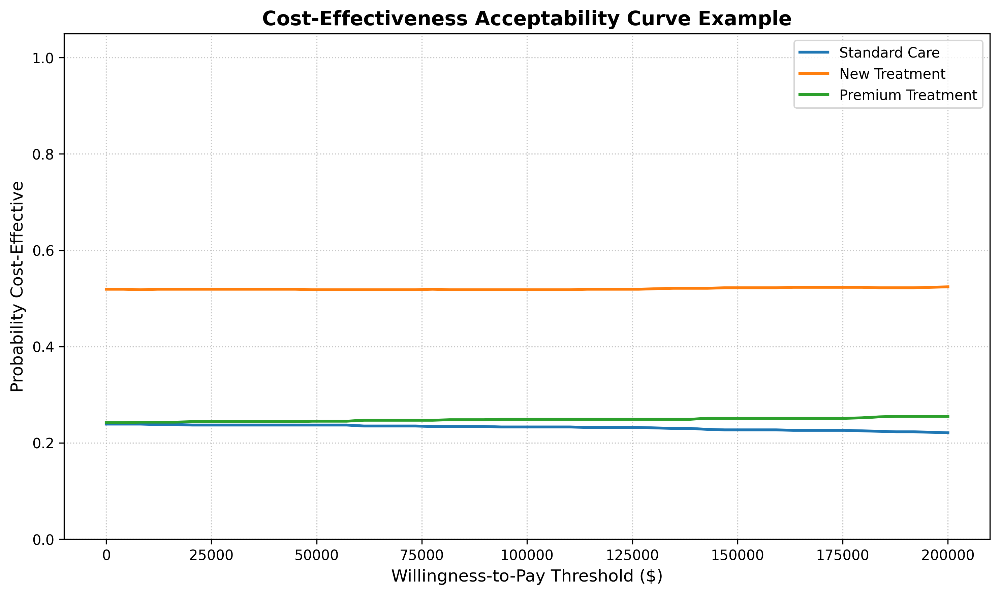
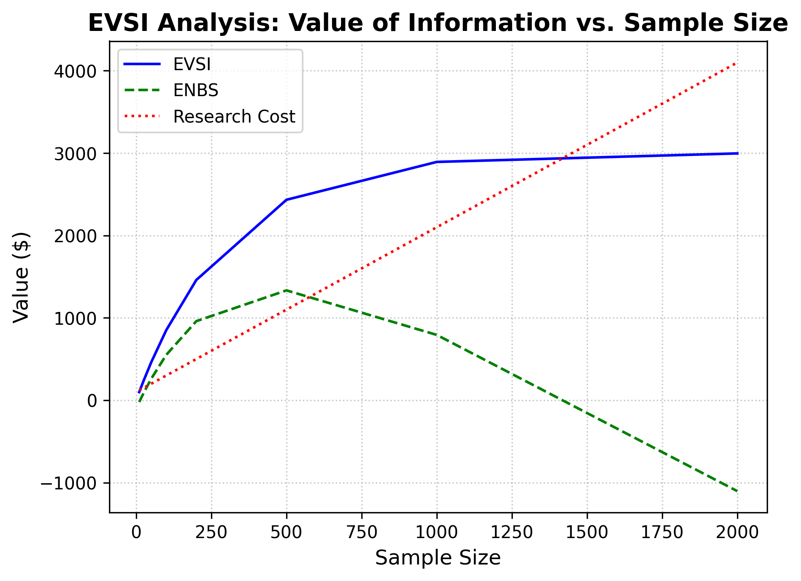
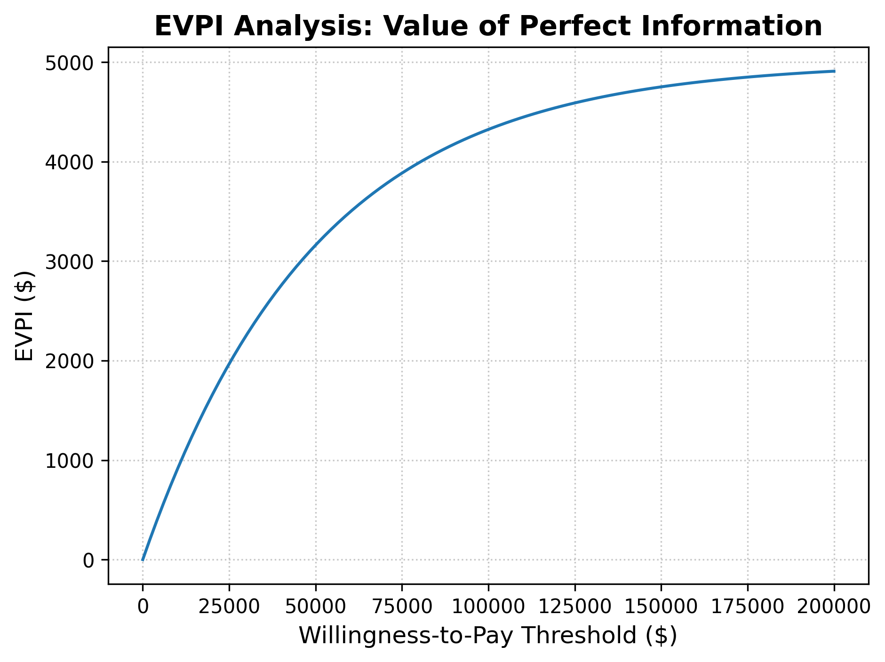

# voiage: A Python Library for Value of Information Analysis

[](https://badge.fury.io/py/voiage)
[](https://github.com/edithatogo/voiage/actions/workflows/ci.yml)
[](https://opensource.org/licenses/MIT)

`voiage` is a Python library for Value of Information (VOI) analysis, designed to provide a comprehensive, open-source toolkit for researchers and decision-makers.

## Branch Architecture

This repository uses a separated branch architecture:
- **Main branch**: Contains only the core software library code
- **Paper branch**: Contains the academic paper and related documentation

This separation ensures a clean development environment for software changes while allowing focused development of the academic paper.

## Background: The Need for a Comprehensive VOI Tool in Python

Value of Information (VOI) analysis is a powerful set of techniques used to estimate the value of collecting additional data to reduce uncertainty in decision-making. While several tools for VOI analysis exist, the current landscape has some significant gaps:

*   **Limited Python Support:** The Python ecosystem lacks a mature, comprehensive VOI library. Most existing tools are written in R or are commercial, closed-source products.
*   **Fragmented Features:** Existing tools, even in the R ecosystem, are fragmented. Different packages support different VOI methods, and none of them offer a complete toolkit.
*   **Lack of Advanced Methods:** Many advanced and specialized VOI methods, such as those for adaptive trial designs, network meta-analyses, or structural uncertainty, are not available in any off-the-shelf tool.

`voiage` aims to fill these gaps by providing a single, powerful, and easy-to-use library for a wide range of VOI analyses in Python.

## Feature Comparison

The following table compares the features of `voiage` with other common VOI software.

| VOI Analysis                                  | `voiage` (Python) | `BCEA` (R) | `dampack` (R) | `voi` (R) | Commercial Tools | Notes                                                                                              |
| :-------------------------------------------- | :---------------: | :--------: | :-----------: | :-------: | :--------------: | :------------------------------------------------------------------------------------------------- |
| **Core Methods**                              |                   |            |               |           |                  |                                                                                                    |
| Expected Value of Perfect Information (EVPI)  |         ✔️         |     ✔️      |       ✔️       |     ✔️     |        ✔️         | The most fundamental VOI metric. Fully implemented with CLI support.                               |
| Expected Value of Partial Perfect Info (EVPPI) |         ✔️         |     ✔️      |       ✔️       |     ✔️     |        ✔️         | `voiage` supports modern, efficient algorithms with CLI interface.                                 |
| Expected Value of Sample Information (EVSI)   |         ✔️         |     ❌      |       ✔️       |     ✔️     |        ✔️         | `voiage` provides two methods: two-loop Monte Carlo and regression-based approaches.              |
| Expected Net Benefit of Sampling (ENBS)       |         ✔️         |     ❌       |       ❌       |     ✔️     |        ❌         | Fully implemented to optimize research design decisions.                                           |
| **Advanced & Specialized Methods**            |                   |            |               |           |                  |                                                                                                    |
| Structural Uncertainty VOI                    |         🚧         |     ❌      |       ❌       |     ❌     |        ❌         | For comparing different model structures. In development.                                          |
| Network Meta-Analysis VOI                     |         🚧         |     ❌      |       ❌       |     ❌     |        ❌         | For synthesizing evidence from multiple studies. Framework in place.                               |
| Adaptive Design VOI                           |         🚧         |     ❌      |       ❌       |     ❌     |        ❌         | For trials with pre-planned adaptations. Interface defined.                                        |
| Portfolio Optimization                        |         🚧         |     ❌      |       ❌       |     ❌     |        ❌         | For prioritizing multiple research opportunities. Interface defined.                               |
| Value of Heterogeneity                        |         🚧         |     ❌      |       ❌       |     ❌     |        ❌         | For understanding the value of learning about subgroup effects. Planned for future.               |

**Legend:**
*   ✔️: Implemented
*   🚧: In Progress / Planned
*   ❌: Not Supported

## Academic Paper

The academic paper describing the `voiage` library is maintained in the `paper` branch of this repository. For detailed methodological information, mathematical foundations, and comprehensive validation, please refer to:

- Paper source files in the `paper` branch 
- Published version in the Journal of Statistical Software (forthcoming)

## Installation

You can install `voiage` via pip:

```bash
pip install voiage
```

## Getting Started

Here's a simple example of how to use `voiage` to calculate the EVPI:

```python
import numpy as np
from voiage.analysis import evpi

# Your model inputs and outputs
psa_inputs = {
    'param1': np.random.rand(1000),
    'param2': np.random.rand(1000),
}
psa_outputs = np.random.rand(1000, 2) # 1000 simulations, 2 strategies

# Calculate the EVPI
evpi_value = evpi(psa_inputs, psa_outputs)
print(f"EVPI: {evpi_value}")
```

## Visual Examples

`voiage` provides comprehensive visualization capabilities for VOI analysis:

### Cost-Effectiveness Acceptability Curve (CEAC)

*CEAC showing the probability each treatment strategy is cost-effective across different willingness-to-pay thresholds*

### Expected Value of Sample Information (EVSI)

*EVSI analysis showing how the value of additional data varies with sample size, including Expected Net Benefit of Sampling (ENBS) and research costs. `voiage` provides both two-loop Monte Carlo and regression-based methods for EVSI calculation.*

### Expected Value of Perfect Information (EVPI)

*EVPI analysis showing how the value of perfect information changes with willingness-to-pay thresholds*

## Command-Line Interface

`voiage` provides a powerful CLI for batch analysis and integration into workflows:

```bash
# Calculate EVPI from CSV data
voiage calculate-evpi net_benefits.csv --population 100000 --time_horizon 10 --discount-rate 0.03

# Calculate EVPI and save to file
voiage calculate-evpi example_net_benefits.csv --output evpi_result.txt

# Calculate EVPPI for specific parameters
voiage calculate-evppi example_net_benefits.csv example_parameters.csv --population 100000

# Full EVPPI analysis with all options
voiage calculate-evppi example_net_benefits.csv example_parameters.csv \
    --population 100000 --time_horizon 15 --discount-rate 0.035 --output results.txt
```

### Example Data Format

**Net Benefits CSV** (`example_net_benefits.csv`):
```csv
Standard_Care,Treatment_A,Treatment_B
95.23,108.45,102.67
87.91,115.23,98.34
...
```

**Parameters CSV** (`example_parameters.csv`):
```csv
effectiveness,cost_multiplier
0.234,1.123
0.187,0.987
...
```

### Sample CLI Output
```bash
$ voiage calculate-evpi example_net_benefits.csv
EVPI: 5.457500

$ voiage calculate-evppi example_net_benefits.csv example_parameters.csv
EVPPI: 0.020708
```

## Current Implementation Status

### ✅ Fully Implemented (v0.3)
- **EVPI (Expected Value of Perfect Information)**: Complete with CLI support
- **EVPPI (Expected Value of Partial Perfect Information)**: Full implementation with regression-based methods
- **EVSI (Expected Value of Sample Information)**: Two methods implemented - two-loop Monte Carlo and regression-based
- **ENBS (Expected Net Benefit of Sampling)**: Complete implementation for research optimization
- **Plotting Suite**: CEAC, EVSI curves, EVPI analysis with matplotlib integration
- **CLI Interface**: Complete command-line tools for batch processing
- **Data I/O**: CSV import/export for net benefits and parameters

### 🚧 In Development (Future Releases)
- **Network Meta-Analysis VOI**: Basic structure implemented
- **Adaptive Trial VOI**: Interface defined, implementation in progress
- **Portfolio Optimization**: Data structures defined
- **Structural Uncertainty VOI**: Framework in place

### 📋 Roadmap
- **v0.4**: Complete advanced methods (structural uncertainty, network NMA)
- **v0.5**: Portfolio optimization and sequential decisions
- **v0.6**: Enhanced plotting and visualization capabilities
- **v1.0**: Full feature parity with commercial tools

For more detailed examples and tutorials, please see the [documentation](https://edithatogo.github.io/voiage).

## Contributing

`voiage` is an open-source project, and we welcome contributions from the community. If you'd like to contribute, please see our [contributing guidelines](CONTRIBUTING.md).

## License

`voiage` is licensed under the MIT License. See the [LICENSE](LICENSE) file for more details.
