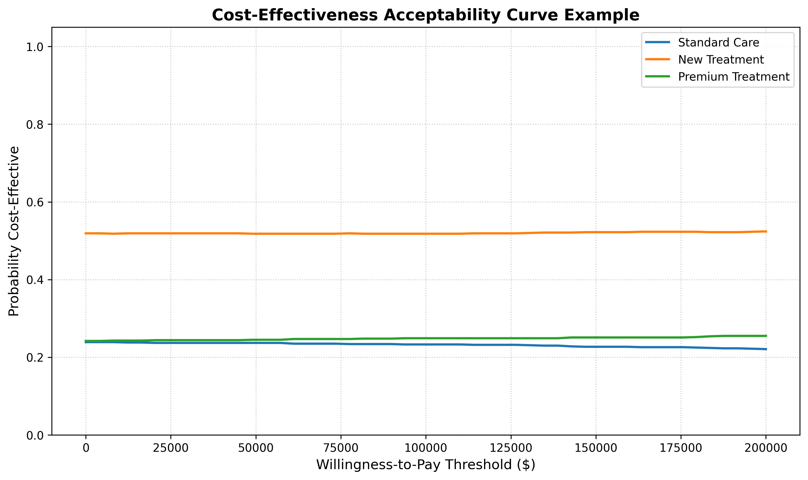
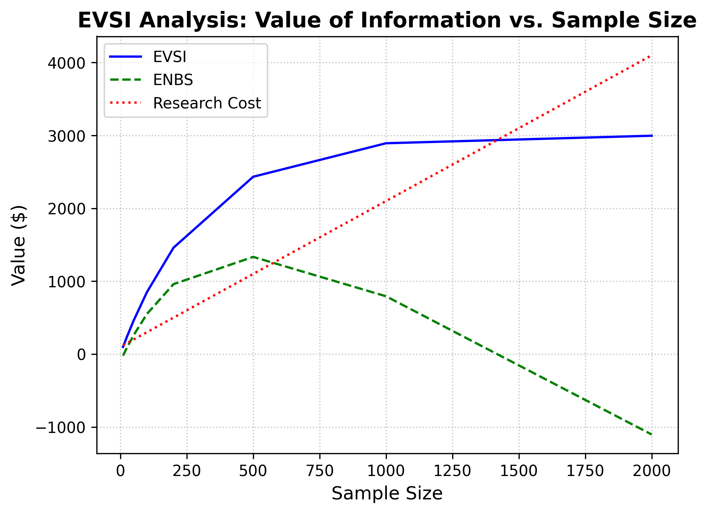
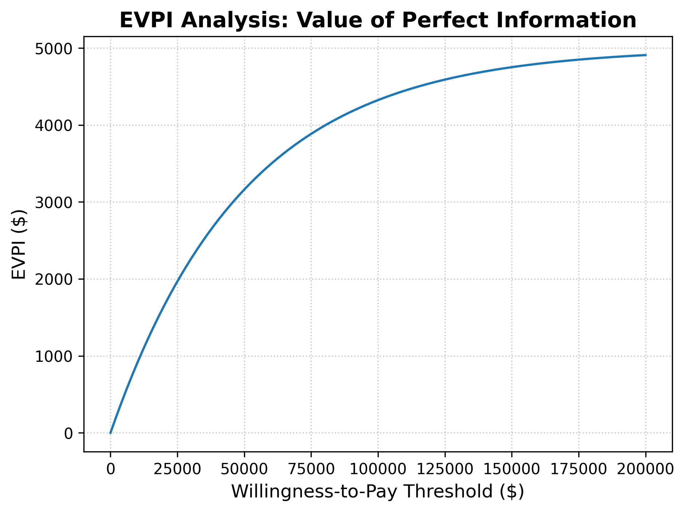

# voiage: Value of Information Analysis

[](https://pypi.org/project/voiage/)
[](https://pypi.org/project/voiage/)
[](https://github.com/edithatogo/voiage/actions/workflows/ci.yml)
[](https://codecov.io/gh/edithatogo/voiage)
[](https://github.com/edithatogo/voiage/actions/workflows/codeql.yml)
[](https://securityscorecards.dev/viewer/?uri=github.com/edithatogo/voiage)
[](https://edithatogo.github.io/voiage/)
[](LICENSE)

`voiage` provides Value of Information (VOI) methods for comparing decisions
under uncertainty and assessing whether additional evidence may be worth
collecting. The v1.0 release combines:

- a Python API and command-line interface (CLI);
- binding-independent Rust domain, diagnostics, numerical, and serialization
  crates;
- selected Rust-backed aggregation kernels exposed to Python through PyO3;
- an R package and Julia package that call the versioned Rust C application
  binary interface (ABI) for Expected Value of Perfect Information (EVPI);
- labelled data structures, diagnostics, plotting, reporting, and
  provenance-aware interchange.

Python currently retains the broader model orchestration, validation, labelled
data, plotting, and reporting paths. The R and Julia packages do not yet expose
the full Python method surface. See [Architecture](#architecture) and
[Language support](#language-support) for the precise boundary.

## When voiage is useful

VOI analysis asks whether uncertainty could change a decision and whether the
expected benefit of resolving some uncertainty justifies further research.
`voiage` supports analyses including:

- EVPI for the expected cost of current decision uncertainty;
- Expected Value of Partial Perfect Information (EVPPI) for selected
  parameters;
- Expected Value of Sample Information (EVSI) and Expected Net Benefit of
  Sampling (ENBS) for proposed studies;
- cost-effectiveness acceptability and frontier analysis;
- structural, network meta-analysis, subgroup, sequential, adaptive, and
  portfolio-oriented VOI workflows;
- fixture-backed experimental work on perspective, equity, implementation,
  and adjacent VOI questions.

Stable and experimental surfaces are distinguished in the
[method documentation](https://edithatogo.github.io/voiage/methods/) and
[frontier roadmap](https://edithatogo.github.io/voiage/sota-voi-frontier/).
An implemented method is not, by itself, evidence that it is appropriate for a
particular decision problem; users remain responsible for model structure,
inputs, assumptions, and interpretation.

## Installation

Install the released Python package:

```bash
python -m pip install voiage
```

Python 3.12, 3.13, and 3.14 are supported. Wheels use the CPython 3.12 stable
ABI and are published for the platforms listed in the
[v1.0.0 release](https://github.com/edithatogo/voiage/releases/tag/v1.0.0).

Optional features are installed explicitly:

```bash
python -m pip install "voiage[plotting]"       # Matplotlib and Seaborn
python -m pip install "voiage[jax]"            # experimental JAX backend
python -m pip install "voiage[experimental]"   # experimental serializers
```

Development installation and complete verification instructions are in
[CONTRIBUTING.md](CONTRIBUTING.md).

## Quick start

```python
import numpy as np

from voiage.analysis import DecisionAnalysis
from voiage.schema import ValueArray

net_benefit = ValueArray.from_numpy(
    np.array(
        [
            [10.0, 12.0],
            [11.0, 9.0],
            [13.0, 14.0],
        ]
    ),
    strategy_names=["Standard care", "New treatment"],
)

analysis = DecisionAnalysis(net_benefit)
print(f"EVPI: {analysis.evpi():.3f}")
```

The rows are uncertainty draws and the columns are decision strategies. For
real analyses, preserve the units, population scaling, time horizon, discount
rate, and strategy labels needed to interpret the result.

## Command-line interface

The CLI supports batch workflows over CSV inputs:

```bash
voiage calculate-evpi examples/cli_samples/evpi_net_benefit.csv

voiage calculate-evpi examples/cli_samples/evpi_net_benefit.csv \
  --population 100000 \
  --time-horizon 10 \
  --discount-rate 0.03 \
  --output evpi-result.txt

voiage calculate-evppi \
  examples/cli_samples/evpi_net_benefit.csv \
  examples/cli_samples/evppi_parameters.csv

voiage --help
```

See the [CLI reference](https://edithatogo.github.io/voiage/cli-reference/)
for input schemas, output formats, logging controls, and additional commands.

## Capability status

| Capability | Status | Scope |
| --- | --- | --- |
| EVPI, EVPPI, EVSI, ENBS | Stable | Python API and CLI, with selected Rust-backed aggregation |
| Acceptability, frontier, dominance, heterogeneity | Stable | Analysis and plotting helpers |
| Structural and network meta-analysis VOI | Stable | Python method surface |
| Adaptive, calibration, observational, sequential VOI | Stable | Python study-design workflows |
| Portfolio VOI | Stable | Budget-constrained portfolio analysis |
| Diagnostics and data interchange | Stable | Versioned contracts; Arrow/Parquet is the canonical tabular interchange |
| R and Julia EVPI | Released binding source | Direct versioned Rust C ABI |
| Broader R and Julia method parity | Partial | Advanced R paths retain the documented Python bridge; Julia is EVPI-focused |
| Perspective and frontier extensions | Experimental | Fixture-backed contracts; not represented as stable |
| Mojo binding | Not released | No publishable Mojo package is claimed |
| FPGA and ASIC execution | Evidence only | Simulation and pre-silicon evidence do not establish production hardware support |

## Architecture

The repository is moving towards a binding-independent Rust core, but v1.0 is
still a hybrid implementation:

```text
Python API / CLI / orchestration / labelled data / plots / reports
                              |
                         PyO3 adapter
                              |
Rust domain + diagnostics + selected numerical kernels + serialization
                              |
                    versioned C ABI adapter
                         /             \
                  R package        Julia package
```

The publishable Rust workspace crates live under [`rust/crates/`](rust/crates/):

- `voiage-domain`: validated binding-independent domain contracts;
- `voiage-diagnostics`: structured diagnostics and error contracts;
- `voiage-numerics`: binding-independent numerical kernels;
- `voiage-serialization`: canonical serialization adapters.

The `voiage-ffi`, `voiage-python`, and `voiage-test-support` crates are private
adapters or test infrastructure. Python remains responsible for wider method
orchestration and user-facing analytical features not yet migrated to Rust.
The [polyglot release documentation](docs/release/polyglot-bindings.md)
records the supported boundary and migration policy.

## Language support

| Surface | Source | Current use | Distribution status |
| --- | --- | --- | --- |
| Python | [`voiage/`](voiage/) | Primary API, CLI, orchestration, plots, reports | [PyPI v1.0.0](https://pypi.org/project/voiage/1.0.0/) and TestPyPI |
| Rust | [`rust/`](rust/) | Domain contracts, diagnostics, selected kernels, serialization | Crates are package-ready; consult the [release checklist](docs/release/binding-submission-checklist.md) for verified registry state |
| R | [`r-package/voiageR/`](r-package/voiageR/) | Direct C-ABI EVPI; documented bridge for wider Python methods | [r-universe](https://edithatogo.r-universe.dev/voiageR); CRAN review remains external |
| Julia | [`bindings/julia/`](bindings/julia/) | Direct C-ABI EVPI | Prepared for Julia General; registry entry is not yet verified |

Registry readiness and actual registry publication are reported separately.
The [binding submission checklist](docs/release/binding-submission-checklist.md)
is the maintained evidence record for conda-forge, CRAN, Julia General,
crates.io, and other external channels.

## Documentation and examples

- [Documentation home](https://edithatogo.github.io/voiage/)
- [Getting started](https://edithatogo.github.io/voiage/getting-started/)
- [Examples and tutorials](https://edithatogo.github.io/voiage/examples/)
- [Method reference](https://edithatogo.github.io/voiage/methods/)
- [Data structures](https://edithatogo.github.io/voiage/data-structures/)
- [Plotting](https://edithatogo.github.io/voiage/user-guide/plotting/)
- [Backends](https://edithatogo.github.io/voiage/backends/)
- [R package guide](r-package/voiageR/README.md)
- [Julia package guide](bindings/julia/README.md)
- [Developer guide](https://edithatogo.github.io/voiage/developer-guide/)

Example plots generated by the maintained documentation fixtures:

| Acceptability curve | EVSI and ENBS | EVPI by threshold |
| --- | --- | --- |
|  |  |  |

## Quality, testing, and security

The repository applies different forms of evidence to different failure modes:

| Area | Repository controls |
| --- | --- |
| Style and prose | Ruff formatting/linting, Vale, ChkTeX, LaCheck |
| Static analysis | `ty`, BasedPyright, Bandit, Vulture, Clippy, CodeQL |
| Unit and contract testing | Pytest and Cargo tests across APIs, schemas, versions, provenance, and registries |
| Integration and end-to-end testing | CLI, package, clean-install, workflow, FFI, and cross-language paths |
| Generative testing | Hypothesis, proptest, metamorphic, differential, and parity checks |
| Mutation testing | Ratcheted Python mutation cohorts and critical-kernel policy |
| Coverage | Branch coverage, changed-line policy, critical-module checks, Codecov, and a 90% Python threshold |
| Rust-specific assurance | MSRV, Clippy, Miri, fuzzing, sanitizer jobs, advisory and license policy |
| Supply chain | Pinned Actions, Dependency Review, OpenSSF Scorecard, Zizmor, SBOMs, checksums, provenance attestations, and release signatures |
| Platform assurance | Linux, macOS, Windows, UTF-8/LF, Python 3.12–3.14, minimum and maximum dependencies |
| Documentation and papers | Astro/Starlight builds, link/semantic checks, arXiv source and PDF audits, deterministic readability evidence |

Dependabot manages Python, Cargo, npm, and GitHub Actions updates. Renovate is
not also enabled because running two update bots over the same manifests would
create duplicate pull requests. Full commands and control boundaries are in
the [quality and security guide](https://edithatogo.github.io/voiage/developer-guide/quality-and-security/)
and [SECURITY.md](SECURITY.md).

## Releases, citation, and archival

- Latest software release:
  [v1.0.0](https://github.com/edithatogo/voiage/releases/tag/v1.0.0)
- Python package: [PyPI](https://pypi.org/project/voiage/)
- Citation metadata: [`CITATION.cff`](CITATION.cff)
- Software metadata: [`codemeta.json`](codemeta.json)
- Software Heritage snapshot:
  [`swh:1:snp:767efde24c97d9f6d730764c1b3bc1a91ba20c32`](https://archive.softwareheritage.org/swh:1:snp:767efde24c97d9f6d730764c1b3bc1a91ba20c32)

The canonical preprint source is [`paper/main.tex`](paper/main.tex). Repository
automation builds, lints, audits, and packages the manuscript. Authenticated
arXiv submission `7861466` is verified as submitted, but a permanent arXiv
identifier and announcement have not yet been assigned. The separate
[`paper.md`](paper.md) adaptation passes repository-owned JOSS preflight; no
JOSS submission, review, or acceptance is claimed.

## Project status and roadmap

The repository-owned v1 programme is implemented and archived. That does not
mean every proposed extension or external publication is complete. Current
boundaries include:

- migration of wider Python orchestration into the Rust core;
- broader native R and Julia API parity;
- experimental frontier-method validation and promotion;
- external registry review or indexing where not yet evidenced;
- SciCrunch/RRID curation and later arXiv/JOSS author-led submissions;
- physical FPGA or fabricated-silicon evidence.

See [`roadmap.md`](roadmap.md), [`todo.md`](todo.md), and the
[Conductor registry](conductor/tracks.md) for evidence-backed status.

## Contributing and support

This is currently a solo-maintainer repository. Pull requests remain the
auditable change boundary, with automated quality and security checks required
but no independent approval requirement. See:

- [Contributing guide](CONTRIBUTING.md)
- [Support](SUPPORT.md)
- [Code of conduct](CODE_OF_CONDUCT.md)
- [Security policy](SECURITY.md)
- [Changelog](changelog.md)

Use [GitHub Issues](https://github.com/edithatogo/voiage/issues) for reproducible
bugs and feature requests, and
[GitHub Discussions](https://github.com/edithatogo/voiage/discussions) for
design or usage questions.

## License

`voiage` is licensed under the [Apache License 2.0](LICENSE).
