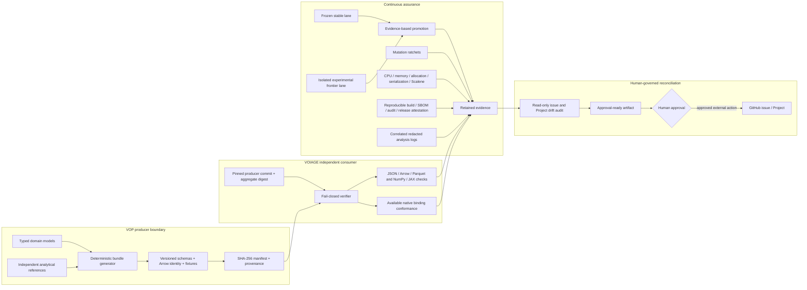

# C14 design: Assurance Frontier

## Architecture

## Trust boundaries and invariants

1. Bundle identity is content-addressed; paths, symlinks, inventory and producer
   provenance are verified before data is parsed.
2. VOIAGE consumes copied, pinned artifacts only. It never imports VOP runtime
   code, so producer and consumer tests remain genuinely differential.
3. Experimental dependencies and optional accelerators are isolated from the
   frozen stable lane and cannot convert missing capability into a false pass.
4. Pull requests use read-only permissions. OIDC and artifact attestation exist
   only on the release path, which remains human-triggered by a signed tag or an
   explicitly selected existing release tag.
5. Logging context owns reserved correlation fields and recursively redacts
   credential-shaped values before human or JSON output.
6. Governance audits never issue mutations. Missing Project credentials produce
   `not_checked`, not `clean`; reconciliation remains a human decision.

## Failure model

Contract mismatch, unsupported provenance, budget regression, mutation debt,
non-reproducible artifacts, unsafe log fields and governance ambiguity all fail
closed. Optional toolchain absence is recorded as a capability gate and cannot
satisfy a required test.

