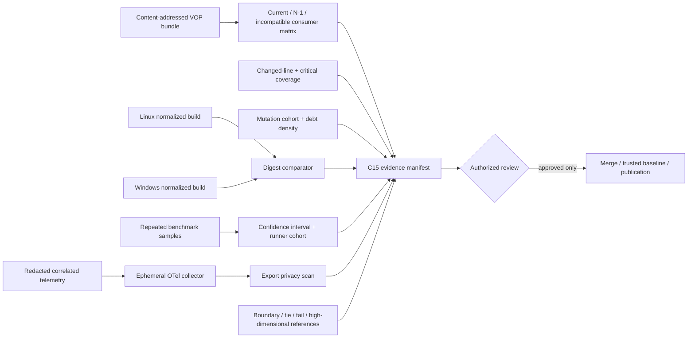

# C15 design: Operational Assurance Excellence

## Invariants

Evidence is schema-validated and content-addressed; missing evidence fails closed.
VOIAGE never imports VOP runtime code. Stable dependencies remain frozen, and
approval-bearing operations are staged but not executed by pull-request CI.
