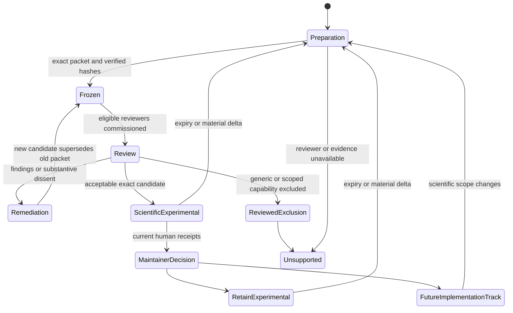

# Human-confirmation gates — planned v1.3.0

This plan governs H8 and issue
[#853](https://github.com/edithatogo/voiage/issues/853). It turns the existing
fail-closed scientific-review protocol into a candidate-specific decision
process for sampling-acquisition harm. Automated reviewers and an orchestrating
agent prepare challenge evidence; they never provide the named human
confirmation.

## Owner-approved agent-only mode

For this single-person project, the owner may accept `agent_only` assurance as
the operational route for repository-owned preparation. The representative
panel may retrieve public source representations, observe rights notices,
produce provisional applicability analysis, preserve disagreement and draft a
replacement packet. This is explicitly not independent human review. Human
review is recorded as `not_performed`; unresolved rights remain unresolved;
and no agent, panel or orchestrator may grant scientific, legal, ethics,
regulatory, runtime, real-study, publication or release authority. The original
H8-D-F human gate and every downstream human gate remain unsatisfied.

## Current entry state

H8 is not ready to solicit a human verdict. H8-C binds a historical
#850-specific packet and H8-D-A/H8-E-A retain five automated role-shaped
reports plus a separate synthesis, but the packet has been substantively
affected by post-freeze remediation and governance drift. All nineteen
findings remain pending; source review is blocked and the automated reviewers
are not eligible humans. No complete eligible reviewer attestations,
adjudication or scientific approval exists. Runtime discovery therefore
remains `unsupported_research_scoping`.

The accountable maintainer subsequently selected the generic-kernel exclusion
path—option 1 in #873 and option B below—through the owner-authored #873
receipt. It seeks independent review of the proposed exclusion for any
universal automatic-scalar or study-authorizing kernel while preserving
narrower non-authorizing research. The immutable unset preflight remains
historical evidence; the separate decision receipt advances only the candidate
choice. Issue #876 now owns the still-blocked source, eligible-reviewer and
replacement-packet prerequisites.

The evidence contract now distinguishes Git object identifiers from SHA-256
content digests, verifies frozen-tree bytes, enforces role separation and
limits administrative deltas. The next repository-owned step is to repair the
machine findings, retain a complete remediation register and prepare
fail-closed source and reviewer intake. A fresh packet must then supersede the
affected H8-C packet before qualified reviewers are commissioned.

## Decision rights

| Actor | May do | Must not do |
| --- | --- | --- |
| Role-specific subagents | Challenge assumptions, reproduce evidence, raise findings and propose options. | Satisfy a human gate, vote away dissent or authorize implementation. |
| Orchestrating agent | Freeze the candidate, commission independent reports, normalize findings, preserve disagreement and synthesize options, contingencies, rationale and a recommendation. | Review its own synthesis, remediate findings, adjudicate dissent or approve science, maturity or deployment. |
| Independent scientific human | Confirm the scientific estimand and evidence for the exact packet. | Approve work they authored or remediated, or authorize a real study. |
| Domain/ethics-qualified human | Confirm domain, affected-party, safety and ethics-model adequacy for the exact packet. | Substitute for an IRB, REC, regulator, custodian or participant authority. |
| Independent chair | Adjudicate disputed findings or scientific dissent when needed. | Act as routine approver when no adjudication is required, or adjudicate their own work. |
| Sole maintainer | Merge ordinary PRs without another code reviewer and separately decide retain-experimental, implement, promote, release or close. | Claim scientific independence, remediation verification or ethics/regulatory authorization. |
| External accountable authority | Authorize a specified real study where its jurisdiction and role apply. | Be inferred from mathematical feasibility, scientific approval or maintainer intent. |

This Critical-risk family requires distinct scientific and domain/ethics
humans. A combined-role exception is recorded below only as a rejected option
unless a future independently reviewed protocol amendment explicitly changes
that rule. A chair is mandatory for unresolved disagreement, disputed findings
or reviewer remediation, but not for an uncontested review.

## Panel and synthesis workflow

1. **Choose a reviewable scope.** Select one narrow domain, jurisdiction,
   population, sampling activity, affected-party set, comparator and
   applicable-authority profile. If no defensible narrow candidate exists,
   seek a reviewed exclusion of a generic executable kernel instead.
2. **Harden the evidence boundary.** Add canonical hashing, Git-object-format,
   manifest-byte verification, signed-receipt, contribution/remediation,
   expiry/supersession, complete finding-inventory and fail-closed transition
   validation before treating any artifact as review evidence.
3. **Freeze a family packet.** Bind the clean commit and tree, #850/#853,
   C18/M32, all track artifacts, primary sources and retrieval evidence,
   capability boundary, claims, fixtures, estimator thresholds, uncertainty
   rules, issue/Project state, known limitations and prior findings. Preparation
   templates must be named and validated separately from normative evidence.
4. **Pre-screen humans.** Record identity, role, qualifications, relevant
   experience, prior contribution, remediation history, conflicts,
   independence, signed-payload mechanism and expiry. Recuse and replace an
   ineligible person before reports are commissioned.
5. **Commission the panel.** Obtain independent estimand/domain,
   estimator-assurance, cross-language/API and governance/publication reports;
   add the required domain/ethics specialist. Reviewers submit before seeing
   the orchestrator synthesis.
6. **Synthesize without deciding.** The orchestrator publishes every report,
   finding and disagreement, then presents the allowed options, contingencies,
   rationale and evidence-backed recommendation. It cannot use a score or
   majority vote to mask a failed required dimension.
7. **Remediate and re-review.** Critical/High findings close only as an
   independently verified fix or reviewed exclusion. Every Medium finding has
   an explicit disposition and affected-role re-review. Any substantive change
   produces a new packet and supersedes affected evidence.
8. **Obtain human confirmation.** The scientific and domain/ethics humans
   confirm the exact candidate, conditions, dissent references, decision date,
   expiry and supersession. An independent chair adjudicates when required.
9. **Record the separate maintainer decision.** The maintainer chooses the
   product disposition only after current human receipts exist. Scientific
   acceptability alone does not authorize runtime, a real study, parity,
   promotion, release, publication, registry acceptance or closure.
10. **Synchronize last.** Update issue #853, #850, Project 28, roadmap, todo,
    canonical projections and metadata; read them back before appending the
    transition receipt. Any partial mutation sets Sync State to `Conflict` and
    leaves the gate pending.

## Human confirmation rubric

The named humans confirm, with rationale and evidence references:

- the estimand, `d0` comparator, filtration, population, affected parties,
  harm law, identification limits and reporting process;
- the declared expected, chance, tail or lexicographic risk functional,
  sign, units, confidence level, atom convention and constraint semantics;
- the scalar separability, commensurability and mutually exclusive ledger, or
  the explicit exclusion of scalarization in favor of constrained/vector
  results;
- the exact zero-harm reduction to #571 EVSI/ENBS;
- counterexamples, sensitivity, rare-event performance, bias, RMSE, coverage,
  false-safe and false-infeasible rates, tail effective sample size,
  uncertainty thresholds and `indeterminate` behavior;
- the distinction between mathematical feasibility, scientific acceptability
  and accountable ethics/regulatory authorization.

Affected-party or community input should be sought when justice or safety
claims materially affect them. That input is evidence for the domain review,
not a substitute scientific or regulatory approval.

## Options, rationale and contingencies

### Option A — narrow candidate and distinct human reviewers (future contingency)

Freeze one domain- and jurisdiction-specific candidate, use distinct
scientific and domain/ethics humans, and commission a chair only if needed.
This gives the clearest accountability and smallest re-review blast radius,
while preserving the possibility of a future runtime.

### Option B — generic-kernel exclusion review (selected for H8-A)

Freeze only the generic automatic-scalar or study-authorizing kernel as the
review target for a proposed `reviewed_exclusion`. A parameterized,
non-authorizing constrained or vector research contract remains a possible
future candidate class. Selection is not completion: H8-C–H8-H must still bind
and review the exclusion, obtain the two named human confirmations and record
the separate maintainer disposition. Runtime remains prohibited throughout.

### Option C — umbrella root with family-specific leaf packets

Share toolchain, lock and governance snapshots through an umbrella root while
giving #850 its own manifest, reports, findings, approval and expiry. This can
reduce duplication across #318, but requires scope-aware binding and creates a
larger invalidation surface than Option A.

### Option D — one dual-qualified external reviewer (not recommended)

This would reduce coordination but weaken segregation. The current plan does
not permit it for #850; adopting it would require a separately reviewed
protocol amendment before any reviewer is commissioned.

Contingencies are fail-closed:

- no eligible reviewer, insufficient rare-harm evidence or expired receipt:
  retain `unsupported_research_scoping`;
- conflict, contribution or remediation discovered: recuse, supersede and
  commission a fresh eligible reviewer;
- substantive candidate, contract, fixture, estimator or claim change:
  invalidate affected reports and freeze a new packet;
- unresolved scientific dissent: require an independent chair and prohibit a
  positive approval until resolved;
- unavailable lawfully retained source bytes: record stable identifiers,
  precise locators, retrieval metadata, observation hashes and independent
  re-retrieval/drift evidence;
- partial GitHub/Project/Conductor synchronization: mark `Conflict`, preserve
  the previous authoritative state and do not close issues.

## State transitions

`Scientifically acceptable experimental` satisfies only the candidate-bound
scientific gate. Issue closure is the final synchronized transition, after its
own prerequisites and readback; it is never inferred from another state.
