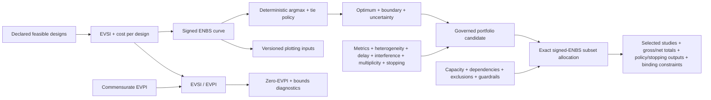

# Mermaid design — planned v1.2.0

```mermaid
flowchart LR
    Designs["Declared feasible designs"] --> Evaluate["EVSI + cost per design"]
    Evaluate --> Curve["Signed ENBS curve"]
    Curve --> Select["Deterministic argmax + tie policy"]
    Select --> Optimum["Optimum + boundary + uncertainty"]
    Curve --> Plot["Versioned plotting inputs"]
    EVPI["Commensurate EVPI"] --> Ratio["EVSI / EVPI"]
    Evaluate --> Ratio
    Ratio --> Guard["Zero-EVPI + bounds diagnostics"]
    Optimum --> Candidate["Governed portfolio candidate"]
    Semantics["Metrics + heterogeneity + delay + interference + multiplicity + stopping"] --> Candidate
    Candidate --> Portfolio["Exact signed-ENBS subset allocation"]
    Constraints["Capacity + dependencies + exclusions + guardrails"] --> Portfolio
    Portfolio --> Allocation["Selected studies + gross/net totals + policy/stopping outputs + binding constraints"]
```
