# Mermaid design — planned v1.2.0 and v1.3.0

## Orchestrated scientific review

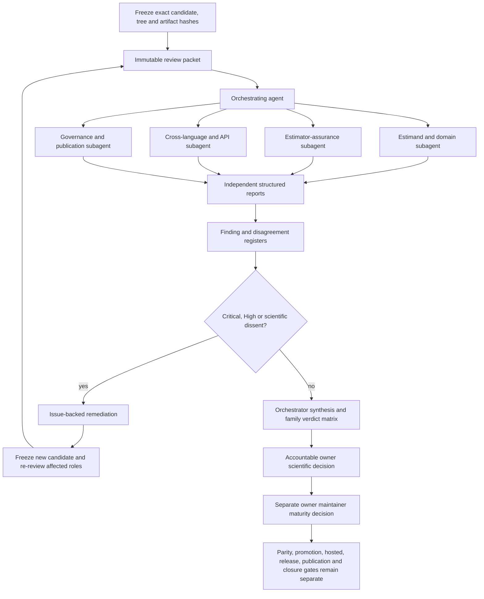

## Risk-sensitive and constrained information value

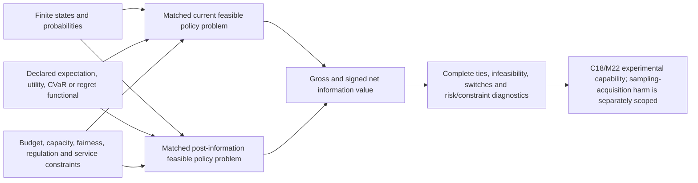

## Static and dynamic heterogeneity value

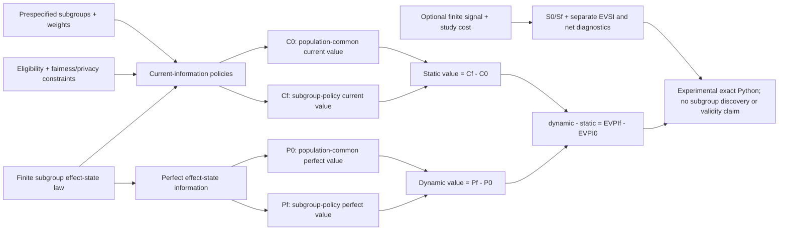

## Implementation-information decomposition

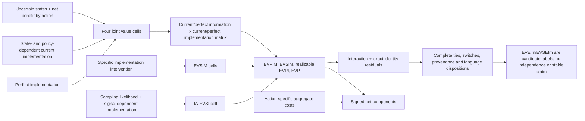

## Forecast and signal information value

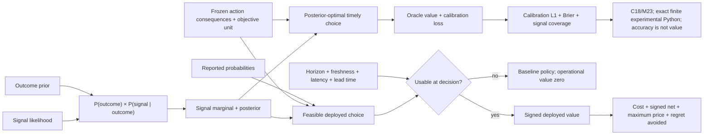

## Additive MCDA information value

## Signed and social information value

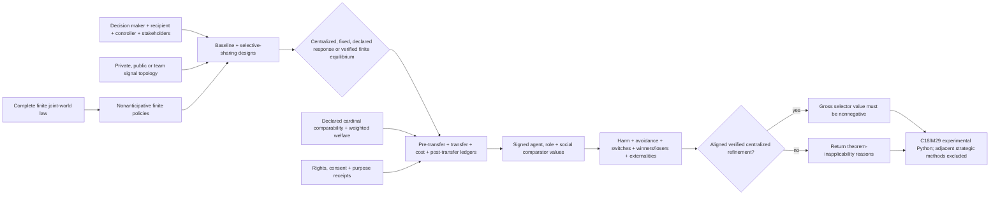

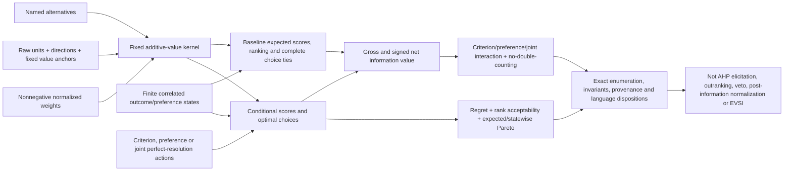

## Qualitative value of information

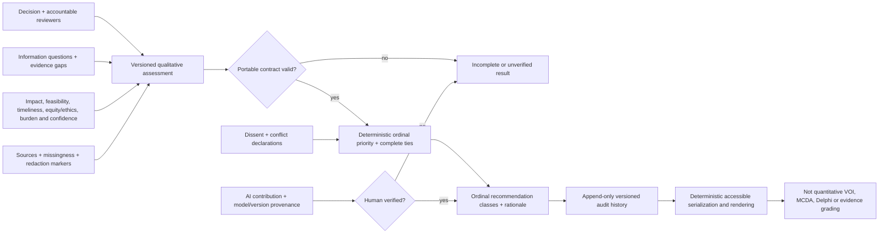

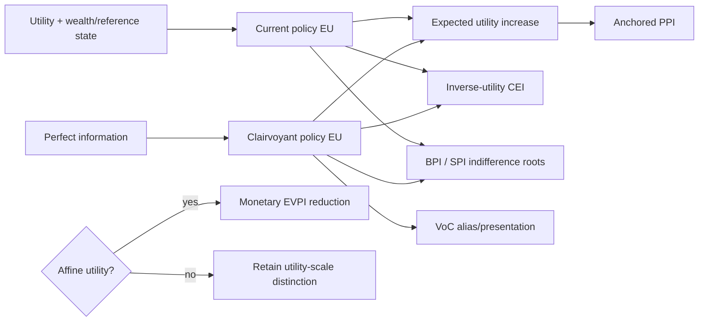

## Deterministic sensitivity analysis

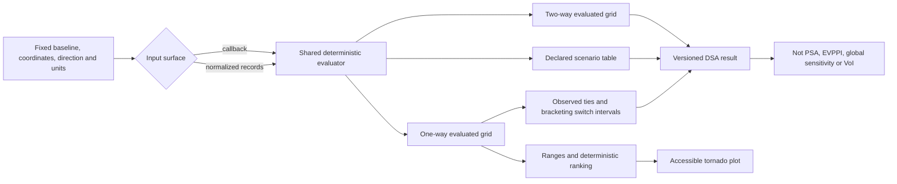

## Event-localized information value

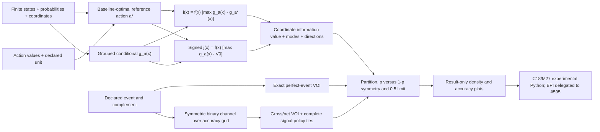

## Outcome-conditional sample-information value

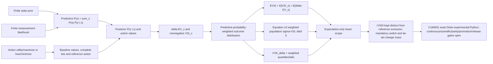

## Value of Distribution-Family Information

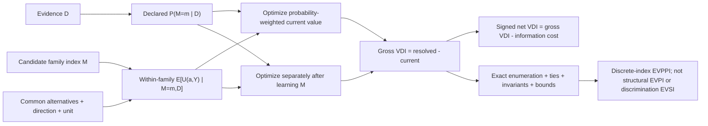
