# VOIAGE design

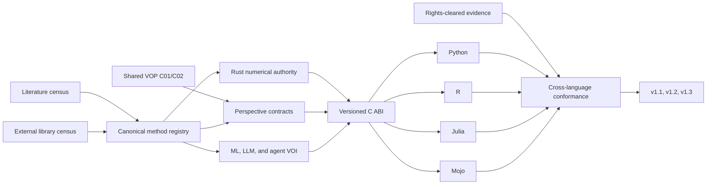

GitHub issue #313 is the public programme record. Native subissues #314--#323
map one-to-one to active Conductor child tracks. Local specifications,
versioned registries, fixtures, and evidence remain authoritative for technical
completion; Project 28 is the synchronized public projection.

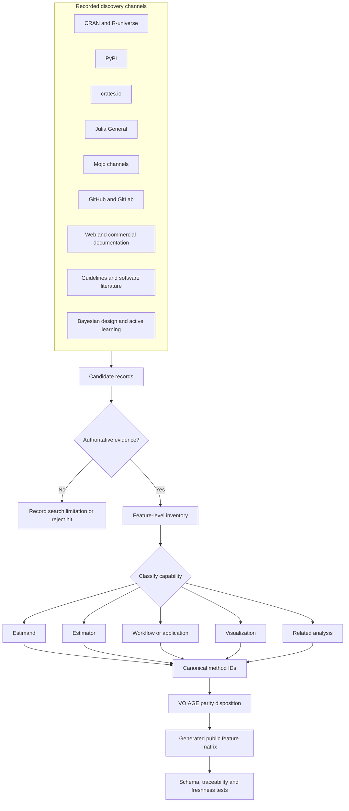

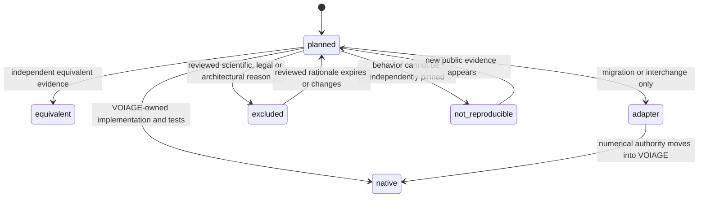

The source registry is authoritative. The Markdown matrix is deterministic
derived output. Refresh automation may update machine-readable registry
metadata, but feature interpretation, exclusions, scientific maturity, and
license decisions remain reviewed changes.

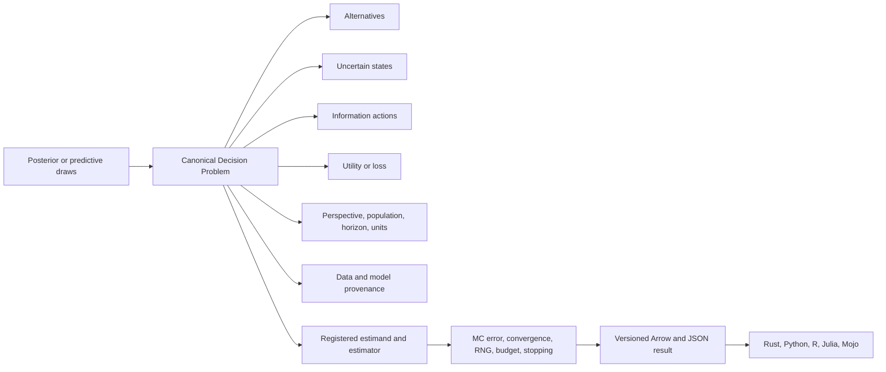

The Decision Problem is the portable semantic boundary. Inference systems may
produce draws, but stable VOI calculations do not require their runtimes. Each
result carries estimator assurance rather than presenting a point estimate
without its numerical uncertainty.

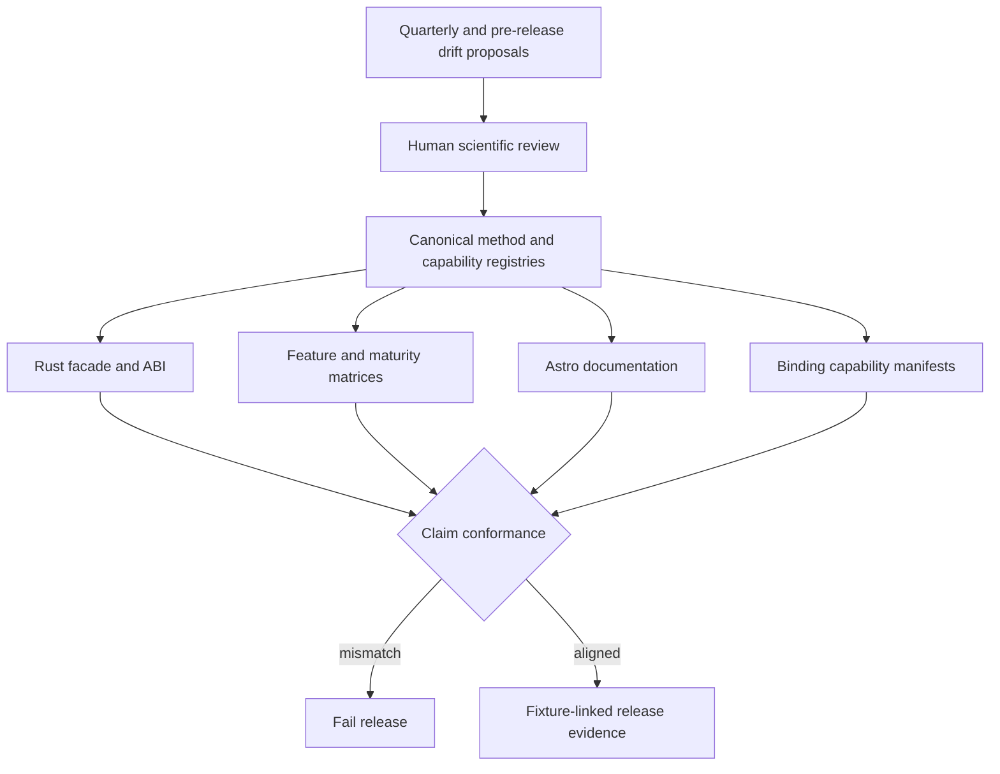

Machine updates may propose dependency and landscape changes. They do not
approve a method, exclusion, maturity promotion, or architecture decision.

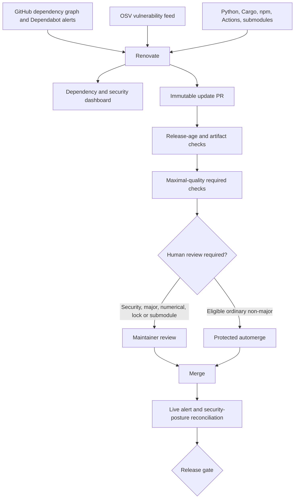

Deleting `dependabot.yml` disables duplicate Dependabot version updates, not
GitHub's advisory alerts. Dependabot security updates remain a temporary
fallback until the Renovate App demonstrates a dashboard and checked PR; only
then are they disabled to ensure one update owner without a coverage gap.

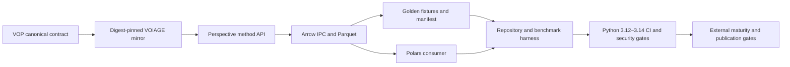

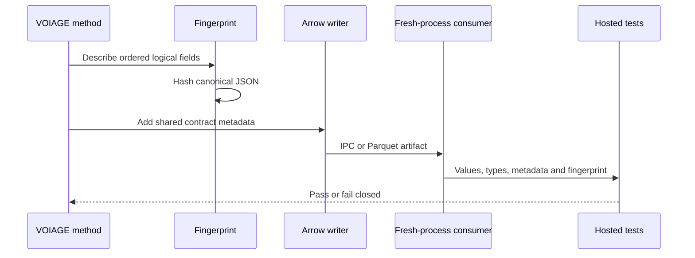

The archived Conductor registry documents historical implementation. GitHub
issues and the shared project provide the public ledger; local specifications,
fixtures, and CI evidence remain authoritative for technical completion.

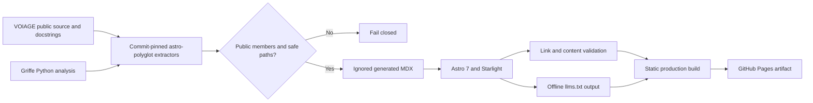

The initial production extractor is Python because it has a deterministic,
CPU-only Griffe path in the repository docs environment. Rust, R, Julia, and
Mojo enter the same pipeline only after their native toolchains, public-symbol
filtering, generated-page contracts, and failure semantics have fixture-backed
evidence. The plugin is a source-pinned submodule until it has a reviewed
registry release; this prevents a local workspace link from being mistaken for
an independently installable package.

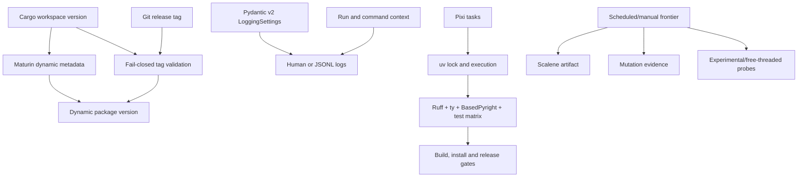

Pixi delegates Python environment resolution to uv, so the repository retains
one dependency lock. Expensive evidence is scheduled or manually requested;
stable pull requests keep deterministic correctness, typing, security,
interchange, coverage, and package gates.

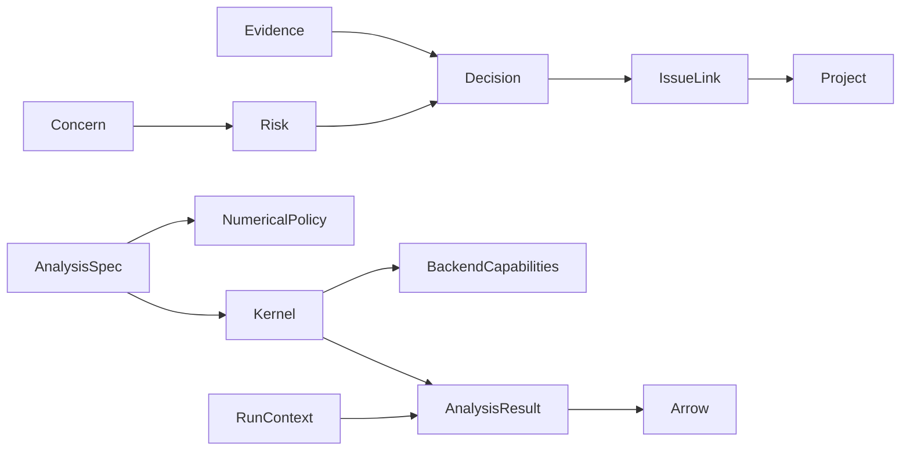

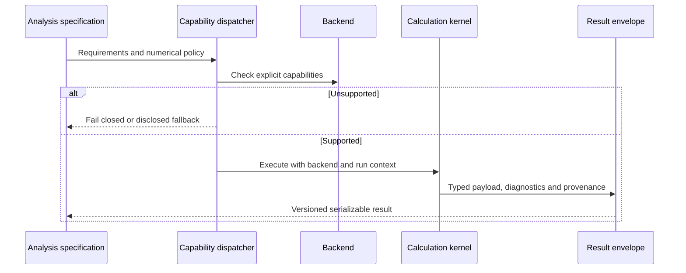
