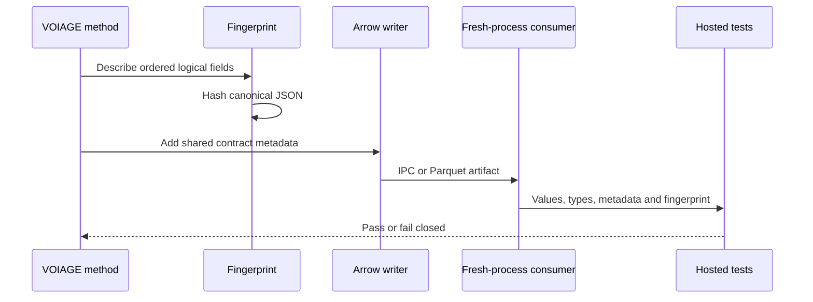
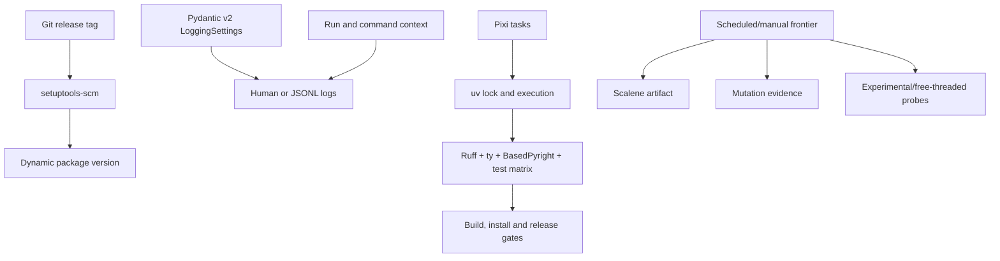

# VOIAGE design

The archived Conductor registry documents historical implementation. GitHub
issues and the shared project provide the public ledger; local specifications,
fixtures, and CI evidence remain authoritative for technical completion.

Pixi delegates Python environment resolution to uv, so the repository retains
one dependency lock. Expensive evidence is scheduled or manually requested;
stable pull requests keep deterministic correctness, typing, security,
interchange, coverage, and package gates.
