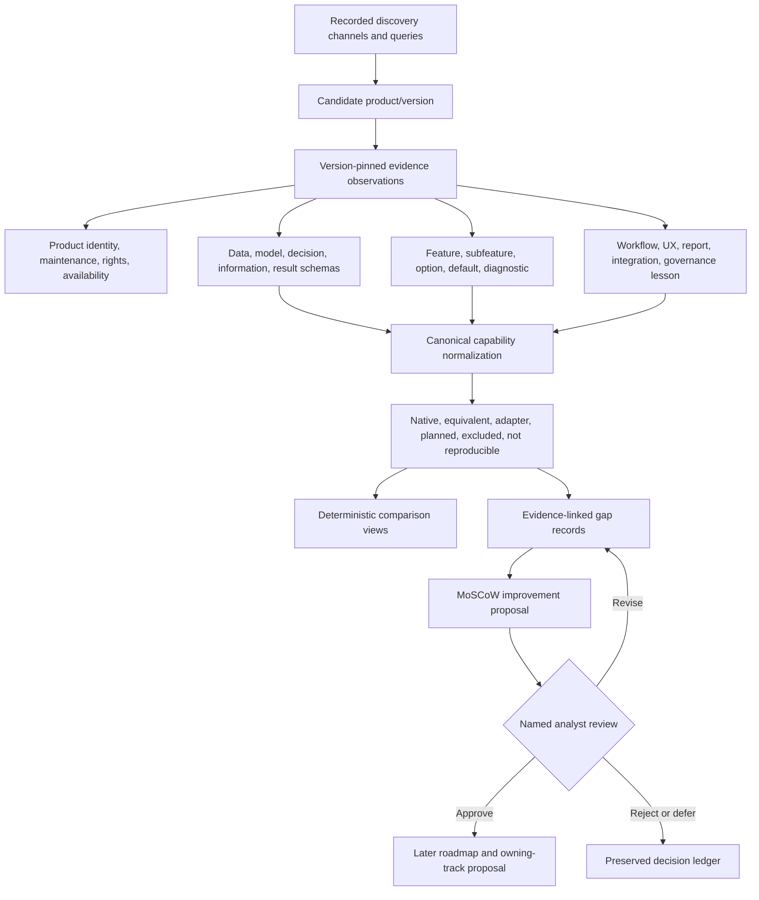
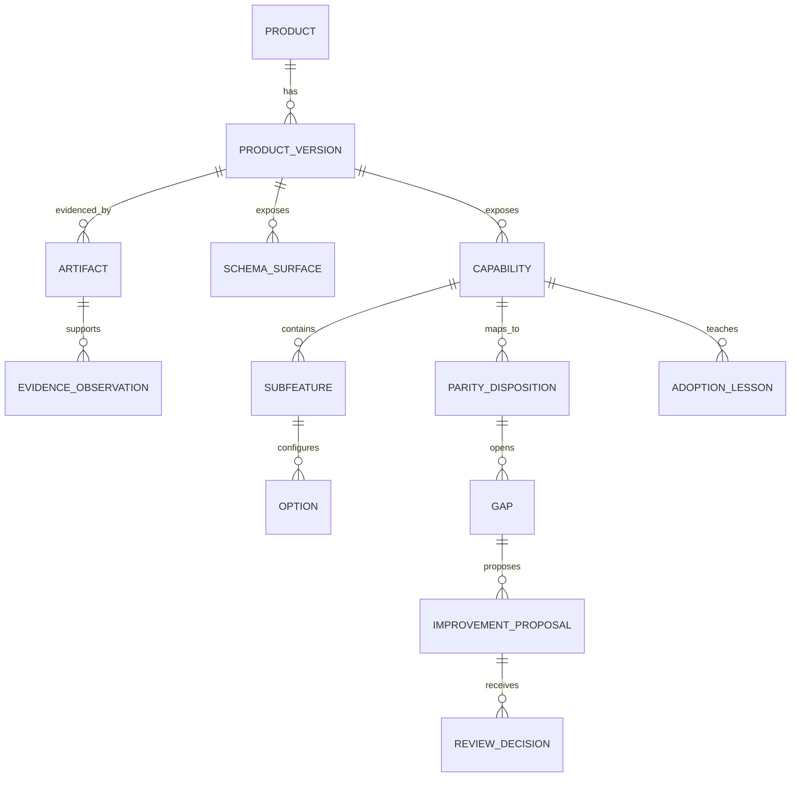

# Comprehensive VOI software landscape design

The source observations are append-only evidence. Generated matrices and
proposals may be regenerated; analyst scientific notes and review decisions are
preserved separately and cannot be overwritten by refresh automation.
