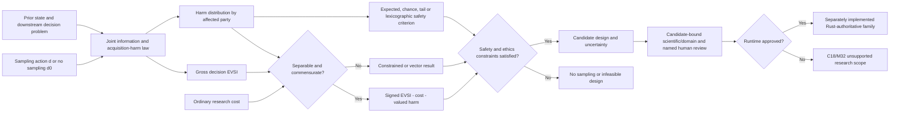

# Mermaid design — planned v1.3.0

```mermaid
flowchart LR
    Design["Sampling action d or no sampling d0"] --> Joint["Joint information and acquisition-harm law"]
    State["Prior state and downstream decision problem"] --> Joint
    Joint --> EVSI["Gross decision EVSI"]
    Joint --> Harm["Harm distribution by affected party"]
    Cost["Ordinary research cost"] --> Gate{"Separable and commensurate?"}
    EVSI --> Gate
    Harm --> Gate
    Gate -->|"Yes"| Net["Signed EVSI - cost - valued harm"]
    Gate -->|"No"| Constrained["Constrained or vector result"]
    Harm --> Safety["Expected, chance, tail or lexicographic safety criterion"]
    Safety --> Feasible{"Safety and ethics constraints satisfied?"}
    Net --> Feasible
    Constrained --> Feasible
    Feasible -->|"No"| NoSample["No sampling or infeasible design"]
    Feasible -->|"Yes"| Candidate["Candidate design and uncertainty"]
    Candidate --> Human["Candidate-bound scientific/domain and named human review"]
    Human --> Runtime{"Runtime approved?"}
    Runtime -->|"No"| Unsupported["C18/M32 unsupported research scope"]
    Runtime -->|"Yes"| Future["Separately implemented Rust-authoritative family"]
```
