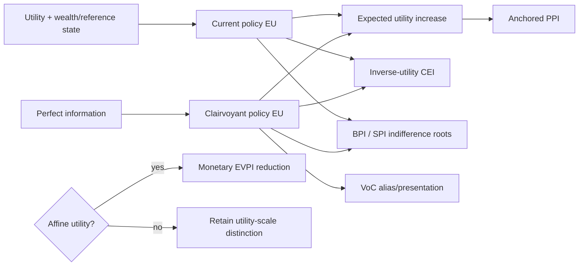
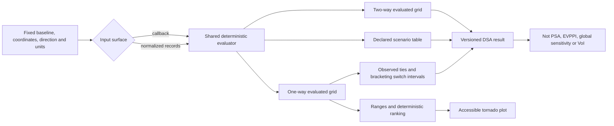
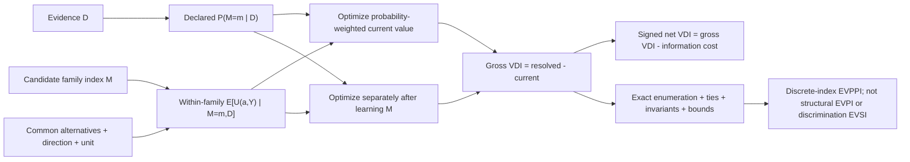

# Mermaid design — planned v1.2.0

```mermaid
flowchart LR
    Utility["Utility + wealth/reference state"] --> Current["Current policy EU"]
    Information["Perfect information"] --> Clairvoyant["Clairvoyant policy EU"]
    Current --> Delta["Expected utility increase"]
    Clairvoyant --> Delta
    Current --> CEI["Inverse-utility CEI"]
    Clairvoyant --> CEI
    Current --> Prices["BPI / SPI indifference roots"]
    Clairvoyant --> Prices
    Delta --> PPI["Anchored PPI"]
    Clairvoyant --> VoC["VoC alias/presentation"]
    Affine{"Affine utility?"} -->|yes| EVPI["Monetary EVPI reduction"]
    Affine -->|no| Distinct["Retain utility-scale distinction"]
```

## Deterministic sensitivity analysis

```mermaid
flowchart LR
    Contract["Fixed baseline, coordinates, direction and units"] --> Adapter{"Input surface"}
    Adapter -->|callback| Evaluator["Shared deterministic evaluator"]
    Adapter -->|normalized records| Evaluator
    Evaluator --> OneWay["One-way evaluated grid"]
    Evaluator --> TwoWay["Two-way evaluated grid"]
    Evaluator --> Scenarios["Declared scenario table"]
    OneWay --> Switches["Observed ties and bracketing switch intervals"]
    OneWay --> Ranking["Ranges and deterministic ranking"]
    TwoWay --> Result["Versioned DSA result"]
    Scenarios --> Result
    Switches --> Result
    Ranking --> Tornado["Accessible tornado plot"]
    Result --> Boundary["Not PSA, EVPPI, global sensitivity or VoI"]
```

## Value of Distribution-Family Information

```mermaid
flowchart LR
    Evidence["Evidence D"] --> Probabilities["Declared P(M=m | D)"]
    Families["Candidate family index M"] --> Conditional["Within-family E[U(a,Y) | M=m,D]"]
    Alternatives["Common alternatives + direction + unit"] --> Conditional
    Probabilities --> Current["Optimize probability-weighted current value"]
    Conditional --> Current
    Conditional --> Resolved["Optimize separately after learning M"]
    Probabilities --> Resolved
    Current --> VDI["Gross VDI = resolved - current"]
    Resolved --> VDI
    VDI --> Net["Signed net VDI = gross VDI - information cost"]
    VDI --> Assurance["Exact enumeration + ties + invariants + bounds"]
    Assurance --> Boundary["Discrete-index EVPPI; not structural EVPI or discrimination EVSI"]
```
