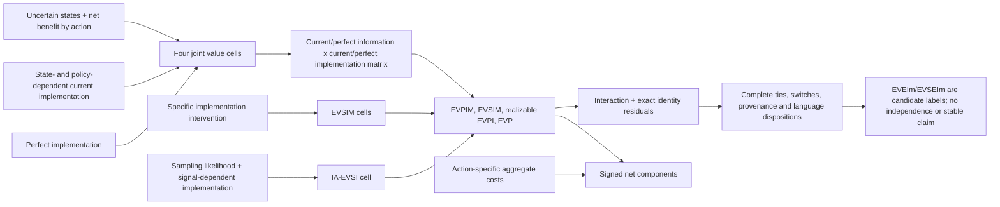
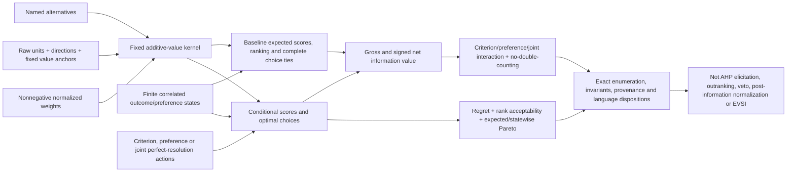
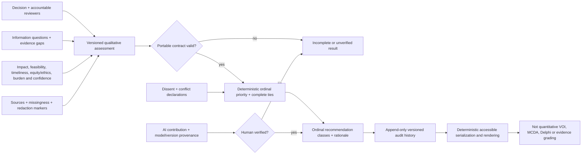
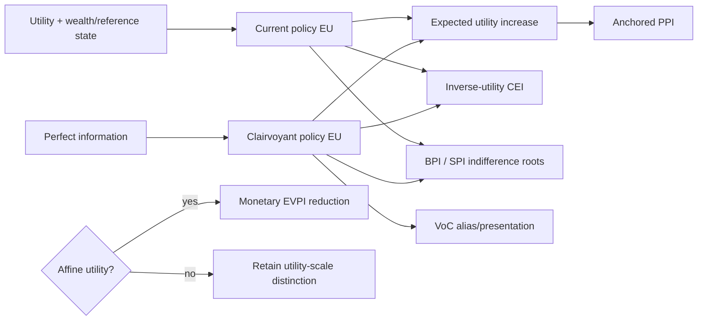
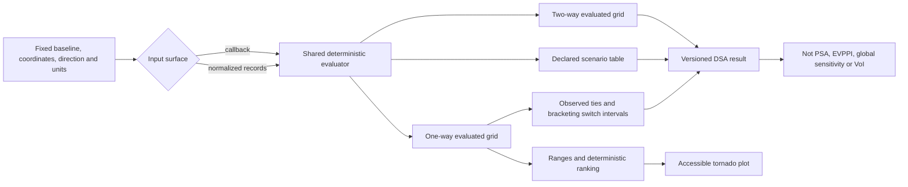
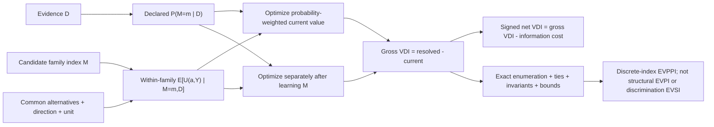

# Mermaid design — planned v1.2.0 and v1.3.0

## Implementation-information decomposition

## Additive MCDA information value

## Qualitative value of information

## Deterministic sensitivity analysis

## Value of Distribution-Family Information

