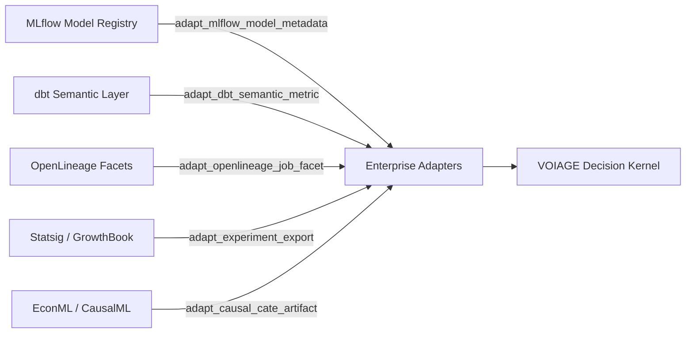

`voiage.enterprise_adapters` integrates VOIAGE as decision-value middleware across modern analytics, experimentation, and ML infrastructure without forcing heavy enterprise SDKs as hard dependencies.

## Overview



## Example Usage

```python
from voiage.enterprise_adapters import (
    adapt_mlflow_model_metadata,
    adapt_openlineage_job_facet,
    adapt_dbt_semantic_metric,
    adapt_experiment_export,
    adapt_causal_cate_artifact,
    validate_enterprise_adapter_record,
)

# Adapt an MLflow model run
mlflow_rec = adapt_mlflow_model_metadata(
    source_system="mlflow://production.registry/models/churn_risk_xgb",
    run_id="run_98234abcf",
    experiment_id="exp_retention_q3",
    metrics={"auc_roc": 0.884, "brier_score": 0.112},
    parameters={"max_depth": 6, "learning_rate": 0.05},
    target_variable="is_churned",
)
assert validate_enterprise_adapter_record(mlflow_rec.to_dict()) is True

# Adapt a dbt Semantic Layer metric
dbt_rec = adapt_dbt_semantic_metric(
    source_system="dbt://analytics_warehouse/metrics/net_customer_revenue",
    metric_name="net_customer_revenue",
    grain="month",
    expression="sum(revenue) - sum(discounts)",
    dimensions=["region", "customer_tier"],
)

# Adapt an A/B experimentation platform payload (Statsig / GrowthBook)
ab_rec = adapt_experiment_export(
    source_system="statsig://experiments/checkout_redesign_v2",
    experiment_id="exp_checkout_02",
    variations=["control", "treatment_1"],
    sample_sizes={"control": 12500, "treatment_1": 12480},
    conversion_rates={"control": 0.042, "treatment_1": 0.049},
    lift_mean=0.007,
    lift_ci_95=[0.002, 0.012],
)
```

## Envelope Schema & Provenance
Every adapter outputs an `EnterpriseAdapterRecord` conforming to `specs/integrations/enterprise/schemas/v1/enterprise-adapters.schema.json`.
