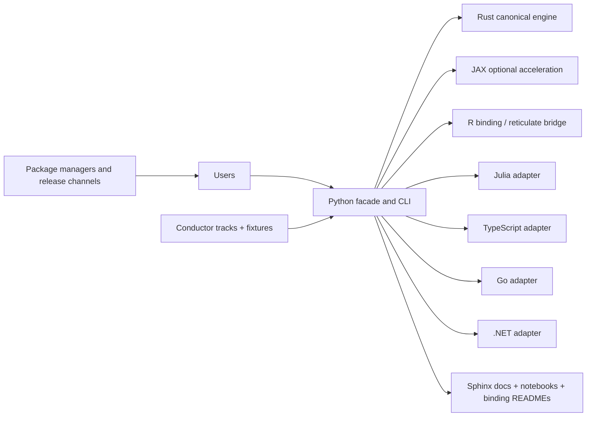
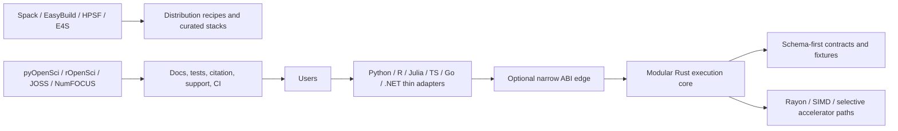

# voiage Project Roadmap (v3)

## Vision

To establish `voiage` as the premier, cross-domain, high-performance library for Value of Information analysis. It will be distinguished by its analytical rigor, computational performance, and exceptional user experience.

## Current Status (As of May 2026)

The project has a solid foundation with core VOI methods implemented, modern CI/CD, and automated publishing pipelines.

*   **Phase 1 (Foundation & API Refactoring):** ✅ **Complete** - Core OO API, data structures, CI/CD, and documentation are all in place.
*   **Phase 2 (Health Economics Core):** ✅ **Complete** - EVPI, EVPPI, EVSI (two-loop), NMA VOI, structural VOI, and plotting are implemented.
*   **Phase 3 (Advanced Methods & Cross-Domain):** ✅ **Complete** - Structural VOI, NMA VOI, JAX JIT compilation, and cross-domain support implemented.
*   **HPC Native Enablement:** ✅/🔄 **Setup Complete, Speedup Evidence-Gated** - the `hpc-capability-implementation-program_20260511` track family is complete and archived for CPU cluster parallelism, scheduler adapters, Apple Metal, discrete GPU, TPU, FPGA, and ASIC lane setup. Remaining work is evidence-gated production speedup, Apple Silicon device capture, and real FPGA/ASIC hardware validation.

---

### Phase 1: Foundation & API Refactoring ✅ **COMPLETE**

**Goal:** Solidify the library's foundation by implementing a more robust, extensible, and user-friendly API.

1.  **Object-Oriented API Redesign & Functional Wrappers:**
    *   **Status: `✅ Done`**
    *   `DecisionAnalysis` class encapsulates core logic with functional wrappers.
2.  **Domain-Agnostic Data Structures:**
    *   **Status: `✅ Done`**
    *   `ParameterSet`, `ValueArray`, `TrialDesign`, and other structures in `voiage/schema.py` using xarray backend.
3.  **CI/CD & Documentation Website:**
    *   **Status: `✅ Done`**
    *   Full CI/CD pipeline: uv, Ruff, CodeQL, Benchmarks, Sphinx docs, GitHub Pages, automated publishing to PyPI/TestPyPI, plus conda-forge feedstock recipe updates with external feedstock approval.
4.  **Community Guidelines:**
    *   **Status: `✅ Done`**
    *   `CONTRIBUTING.md`, `AGENTS.md`, Renovate for dependency updates.

---

### Phase 2: State-of-the-Art Health Economics Core ✅ **COMPLETE**

**Goal:** Implement the most critical features for health economists.

1.  **Robust EVSI Implementation:**
    *   **Status: `✅ Done`**
    *   Two-loop Monte Carlo method implemented in `sample_information.py`.
    *   Regression-based EVSI with metamodel support (GAM, RandomForest, BART via metamodels module).
2.  **Network Meta-Analysis (NMA) VOI:**
    *   **Status: `✅ Done`**
    *   `calculate_nma_evpi()` and `calculate_nma_evppi()` in `voiage/methods/network_meta_analysis.py`.
    *   CLI command: `voiage calculate-nma-voi`.
3.  **Structural Uncertainty VOI:**
    *   **Status: `✅ Done`**
    *   `structural_evpi()` and `structural_evppi()` with JAX JIT compilation in `voiage/methods/structural.py`.
    *   CLI commands: `voiage calculate-structural-evpi`, `voiage calculate-structural-evppi`.
4.  **Validation & Benchmarking:**
    *   **Status: `✅ Done`**
    *   Integration tests with realistic health economics and diabetes NMA scenarios.
    *   Performance benchmarks comparing NumPy vs JAX implementations.
5.  **Advanced Plotting Module & Core Examples:**
    *   **Status: `✅ Done`**
    *   CEAC plotting in `voiage/plot/ceac.py`.
    *   VOI curves in `voiage/plot/voi_curves.py`.
    *   CLI example generation and documentation.

---

### Phase 3: Advanced Methods & Cross-Domain Expansion ✅ **COMPLETE**

**Goal:** Broaden capabilities to advanced VOI methods and cross-domain support.

1.  **Structural VOI:**
    *   **Status: `✅ Done`**
    *   Full implementation with JAX JIT acceleration.
2.  **Calibration VOI:**
    *   **Status: `✅ Done`**
    *   `voi_calibration()` in `voiage/methods/calibration.py`.
3.  **Adaptive Trial VOI:**
    *   **Status: `✅ Done`**
    *   `adaptive_evsi()` and sophisticated trial simulator in `voiage/methods/adaptive.py`.
4.  **Cross-Domain Support:**
    *   **Status: `✅ Done`**
    *   Multi-domain module (`voiage/multi_domain.py`) with healthcare, financial, environmental, and engineering support.
    *   Domain-specific analysis classes and utilities.
5.  **XArray Integration:**
    *   **Status: `✅ Done`**
    *   All core data structures built on xarray Dataset backend.
6.  **High-Performance JAX Backend:**
    *   **Status: `✅ Done`**
    *   JIT-compiled versions of structural EVPI/EVPPI.
    *   JAX backend in `voiage/main_backends.py` with GPU acceleration support.

---

### Phase 4: Ecosystem, Community & Future Ports (Ongoing) 🚧 **IN PROGRESS**

**Goal:** Grow the user and contributor community and lay the groundwork for R and Julia versions.

1.  **Automated Publishing Pipeline:**
    *   **Status: `✅ Done`**
    *   TestPyPI → PyPI publishing on `v*` tags, plus conda-forge feedstock recipe updates with the external feedstock merge remaining outside this repository.
    *   Polyglot release workflows now publish npm, crates.io, and NuGet packages and attach GitHub release artifacts for Go, Julia, and R bindings. The R package currently ships source archives on GitHub Releases, while CRAN remains the maturity target and r-universe remains an optional external indexing path; registry-side indexing or approval still depends on the external ecosystem for conda-forge, CRAN/r-universe, and the Julia General registry.
    *   Repository versioning is now explicit policy: `pyproject.toml` is the canonical source of truth for the current release line, the external binding manifests must stay in lockstep, and the version-sync validator is enforced in CI and local tox automation.
2.  **Dependency Management:**
    *   **Status: `✅ Done`**
    *   uv for package management, Renovate for automated updates.
3.  **Security & Quality:**
    *   **Status: `✅ Done`**
    *   CodeQL security scanning, Ruff linting/security rules, ty type checking, and mutation testing support.
4.  **Community Engagement:**
    *   **Status: `✅ Done`**
    *   Repository structured for contributions, Conductor workflow for AI-assisted development, and repository-level support, security, and community-health documents now provide a clear help path for users and contributors.
5.  **Language-Agnostic API Specification:**
    *   **Status: `📋 Planned`**
    *   Define a stable core contract around `ValueArray`, `ParameterSet`, `TrialDesign`, and method outputs.
    *   Use spec-first development with conformance fixtures before expanding bindings.
    *   Target a core API that can be surfaced consistently from Python first, then R, Julia, TypeScript, Go, and Rust.
    *   Prioritize deterministic validation, explicit schemas, and backend-agnostic behavior over language-specific convenience wrappers.
6.  **Planning for R/Julia Ports:**
    *   **Status: `📋 Planned`**
    *   Treat R and Julia as the first external ports of the shared core API.
    *   Keep the Python implementation as the reference binding, with additional bindings generated or hand-wrapped from the same canonical spec.
    *   Treat each external binding as a releasable package with a registry target, automated CI, conformance-fixture validation, and release automation before it is considered complete.
    *   Keep the R binding documentation track explicit: the package help pages, a narrative vignette, and a deterministic PDF reference manual are part of the package docs surface, and the completed track is archived with the build/verification guidance centered on `tools/build-manual.R` and the non-interactive `R CMD check --as-cran --no-manual` flow.
    *   Keep the polyglot tutorial surface explicit so the Python notebooks, the R vignette/manual, and the non-Python binding walkthroughs stay aligned around the same canonical use cases; the track is now complete and archived, with the repo-level smoke checks covering the binding walkthrough READMEs.

---

### Phase 5: Spec, Fixtures & Polyglot Bindings 📋 **PLANNED**

**Goal:** Mature the library into a broadly usable core analysis engine with stable cross-language contracts.

1.  **Core API Specification:**
    *   Define method signatures, schema invariants, and error behavior for the public VOI surface.
    *   Covered by Conductor tracks: `core-api-spec-foundation`, `canonical-schemas-core-contracts`.
2.  **Conformance Fixtures:**
    *   Build canonical input/output fixtures that every binding must pass before release.
    *   Covered by Conductor tracks: `cross-language-conformance-fixtures`, `python-cleanup-against-spec`.
3.  **Python Cleanup and Stabilization:**
    *   Finish the Python-side normalization needed to make the canonical API implementation simple and durable.
    *   Covered by Conductor track: `python-cleanup-against-spec`.
4.  **First External Bindings:**
    *   Deliver R and Julia bindings against the same contract, then extend to TypeScript, Go, and Rust if adoption warrants it.
    *   Publishing targets must be planned with the implementation:
        - Python: PyPI, TestPyPI, and conda-forge feedstock recipe updates, with the feedstock PR/merge remaining external.
        - R: GitHub Releases for early source distribution, CRAN when mature, and optional r-universe indexing; the package docs story includes a deterministic vignette and PDF manual built from the same source tree, while external registry approval remains outside the repository.
        - Julia: Julia General registry with TagBot sync and external registry registration.
        - TypeScript: npm with provenance.
        - Go: tagged Go modules consumable through the Go module proxy, with GitHub Releases for release notes/artifacts.
        - Rust: crates.io.
        - .NET: NuGet, targeting .NET 11 (`net11.0`).
    *   CI/CD must be language-specific and release-aware for every binding:
        - Build, lint/format, type/static checks, unit tests, docs checks, and shared conformance fixtures.
        - Package dry-run validation on pull requests.
        - Trusted or token-scoped publishing on version tags/releases.
        - Registry-specific provenance and changelog generation where supported.
    *   Covered by Conductor tracks: `cross-language-conformance-fixtures`, `first-external-bindings_20260430`, and future binding-specific tracks as they are added.
    *   Contract semantics, maturity metadata, and extension rules are covered by `numerics-diagnostics-extension-model`.

---

### Phase 6: Ecosystem Integrations 📋 **PLANNED**

**Goal:** Make `voiage` useful as a stable VOI engine for upstream modelling
packages while preserving a clean dependency boundary.

1.  **lifecourse Integration Contract:**
    *   **Status: `📋 Planned`**
    *   Define a `lifecourse` VOI artifact profile covering net benefits,
        parameter samples, strategy names, WTP thresholds, scaling metadata,
        provenance, method settings, and diagnostics.
    *   Align the artifact profile with HEOML as the candidate shared
        health-economic interchange profile.
    *   Use portable artifacts rather than pickle or internal Python objects.
    *   Keep `voiage` independent of `lifecourse` runtime internals.
    *   Support optional adapter use from `lifecourse` once version,
        dependency, and fixture compatibility are stable.
    *   Use shared conformance fixtures so both repositories can validate EVPI,
        EVPPI, EVSI, and ENBS behavior consistently.
    *   Covered by Conductor track: `lifecourse-integration-contract_20260429`.
2.  **Ecosystem Module Incubation:**
    *   **Status: `📋 Planned`**
    *   Define `voiage` as the VOI engine in the HEOR ecosystem spanning
        `lifecourse`, `innovate`, `mars`, HEOML, and future sibling modules.
    *   Keep the ecosystem scope focused on health economics, outcomes
        research, HTA, reimbursement, implementation uncertainty, and
        health-policy evaluation.
    *   Keep integrations optional, artifact-first, versioned, and fixture-tested.
    *   Reserve HEOML extension alignment for VOI handoff and VOI result metadata.
    *   Treat `mars` as a fixed-API optional metamodel backend rather than a
        package whose core API should change for VOI-specific needs.
    *   Maintain the local contract outline under `docs/ecosystem/` and
        `specs/ecosystem/` so each sibling module can align against the same
        portable VOI boundary before adapter work begins.
    *   Covered by Conductor track: `ecosystem-module-incubation_20260429`.
3.  **HEOR Module Naming Brainstorm:**
    *   **Status: `📋 Planned`**
    *   Keep the candidate sibling module names short and consistent:
        `calibrate`, `evidence`, `process`, `report`, `registry`, `workflow`,
        `quality`, `engines`, and `heoml`.
    *   Treat PM4Py as an ecosystem-only process-mining capability.
    *   Require CLI support for every future module and decide whether MCP adds
        value on a module-by-module basis.
    *   Keep the naming discussion as brainstorming, not a commitment to add
        every module now.
    *   Covered by Conductor track: `heor_module_naming_brainstorm_20260429`.
    *   CLI and docs implementation support for the ecosystem-facing surface is
        covered by `cli-integration-testing` and `docs-developer-experience`.

---

### Phase 7: SOTA VOI Frontier 📋 **PLANNED**

**Goal:** Move `voiage` beyond parity with existing VOI packages by adding
frontier methods that are rarely or not at all available in general-purpose
VOI tooling.

1.  **Value of Perspective:**
    *   **Status: `🚧 Experimental`**
    *   Treat decision perspective as an explicit analysis dimension rather than
        a hidden modelling assumption.
    *   Compare payer, societal, patient, provider, regulator, equity-weighted,
        and custom stakeholder perspectives side by side.
    *   Compute perspective-specific optimal strategies, cross-perspective
        regret, value of switching perspective, robust consensus strategies,
        and Pareto/non-dominated strategies across perspectives.
    *   Experimental Python API, CLI, plotting helper, and v1 contract scaffold
        are available; deterministic screening-program fixtures now anchor the
        contract, and stable status still requires cross-language conformance.
2.  **Distributional, Equity, and Implementation-Adjusted VOI:**
    *   **Status: `🚧 Experimental`**
    *   Extend Value of Heterogeneity toward distributional and equity-weighted
        VOI.
    *   Add implementation-adjusted VOI for uptake, adherence, coverage,
        implementation delay, and implementation uncertainty.
    *   Experimental Python APIs now exist for both families; deterministic
        fixture sets now anchor both contracts, and cross-language parity is
        the next gate.
3.  **Preference, Validation, Threshold, and Robust VOI:**
    *   **Status: `🔄 In Progress`**
    *   Implement value of preference information and value of individualized care.
    *   The preference heterogeneity contract scaffold now lives under
        `specs/frontier/preference/v1/` and mirrors the multi-profile analysis
        shape used by Value of Perspective; the runtime surface, CLI
        entrypoint, docs wiring, and fixture-backed conformance are
        implemented, and the remaining work is any cross-language parity
        follow-through.
    *   Add value of external validation and model-discrepancy reduction.
    *   The model-validation contract scaffold now lives under
        `specs/frontier/validation/v1/` and mirrors the multi-profile analysis
        shape used by Value of Perspective. The runtime slice, fixture-backed
        conformance slice, CLI entrypoint, and docs wiring are implemented in
        `model-validation-voi_20260506`.
    *   Add threshold/tipping-point VOI and robust or ambiguity-aware VOI.
    *   The threshold contract scaffold now lives under
        `specs/frontier/threshold/v1/` and mirrors the multi-profile analysis
        shape used by Value of Perspective. The runtime slice,
        fixture-backed conformance slice, CLI entrypoint, and docs wiring are
        implemented in `threshold-robust-voi_20260506`.
    *   Extend sequential VOI toward dynamic real-options style decisions where
        delay, irreversibility, and policy lock-in affect value.
    *   Dynamic real-options VOI is now tracked as a dedicated frontier phase
        in `dynamic-real-options-voi_20260430` and mirrored in the frontier
        umbrella track with staged-evidence and policy-lock-in subphases. The
        contract scaffold now lives under `specs/frontier/dynamic-real-options/v1/`.
4.  **Adjacent Frontier Extensions:**
    *   **Status: `📋 Planned`**
    *   Triage causal-identification, transportability, and external-validity
        VOI for target-population decision problems.
    *   Triage data-quality, measurement-error, data-acquisition, privacy, and
        linkage VOI where the information source has operational constraints.
    *   Triage computational VOI, value of model refinement, expert-elicitation
        VOI, and evidence-synthesis design VOI as possible extension tracks.
    *   These families are now split into explicit follow-on phases in
        `adjacent-frontier-extensions_20260430` and mirrored in the frontier
        umbrella track so they can be implemented and fixture-backed
        independently. The causal-identification, transportability, and
        external-validity family now has a contract scaffold under
        `specs/frontier/causal-transportability/v1/`, and the data-quality,
        measurement-error, privacy, and linkage family now has a contract
        scaffold under `specs/frontier/data-quality/v1/`. The computational
        and model-refinement family now has a contract scaffold under
        `specs/frontier/computational/v1/`, and the expert-elicitation and
        evidence-synthesis design family now has a contract scaffold under
        `specs/frontier/expert-synthesis/v1/`. The shared maturity and handoff
        conventions for all adjacent families now live under
        `specs/frontier/shared-maturity/v1/`, and deterministic normative
        fixtures are now committed for the causal, data-quality,
        computational, and expert-synthesis adjacent families.
5.  **Documentation and Evidence:**
    *   **Status: `📋 Planned`**
    *   Maintain the frontier-method rationale in `docs/sota_voi_frontier.md`.
    *   Add CHEERS-VOI reporting metadata, schemas, deterministic fixtures,
        examples, CLI coverage, and method maturity metadata before marking
        frontier methods stable.
    *   The current docs now reflect the fixture-backed Value of Perspective,
        validation, threshold, distributional/equity, and implementation-
        adjusted slices, and the experimental result payloads now carry shared
        CHEERS-VOI reporting objects. The reporting envelope also now covers
        the standard scalar CLI outputs (EVPI, EVPPI, EVSI, ENBS) and adjacent
        summary outputs such as CEAF, dominance, and Value of Heterogeneity.
        The remaining work is to expand those fields to the rest of the
        frontier families. Value of Perspective, validation, threshold,
        distributional/equity, and implementation-adjusted VOI now each have
        deterministic fixture sets anchoring their contracts.
    *   Covered by Conductor track: `sota-voi-frontier_20260429`.

### Phase 8: Rust Core Migration Program 📋 **PLANNED**

**Goal:** Move `voiage` toward a Rust execution core with Python as the primary
façade, thin language bindings/adapters over the same contract, and
scalar-first profiling while keeping the cross-language contract stable and the
binding story explicit.

1.  **Migration Foundation:**
    *   Decide the Rust-core boundary, workspace policy, and compatibility model.
    *   Rust is the authoritative execution core for deterministic VOI kernels,
        shared result contracts, and serialization behavior; Python remains the
        façade for CLI, orchestration, plotting, and compatibility wrappers.
    *   Covered by Conductor track: `rust-core-migration-foundation_20260504`.
2.  **Domain Model Port:**
    *   Port the stable data model, result envelopes, diagnostics, and reporting metadata into Rust.
    *   Covered by Conductor track: `rust-core-domain-model_20260504`.
3.  **Numerics Engine Port:**
    *   Port the deterministic VOI methods and fixture-backed kernels into Rust.
    *   Completed by Conductor track: `rust-core-numerics-engine_20260504` (archived).
4.  **Scalar-First Profiling And Backend Strategy:**
    *   Establish scalar-first CPU, memory, throughput, SIMD, GPU, and accelerator feasibility baselines.
    *   Covered by Conductor track: `rust-core-performance-and-profiling_20260504`.
5.  **Bindings And Release Adaptation:**
    *   Recast Python as the façade and R, Julia, TypeScript, Go, and .NET as
        thin bindings/adapters over the Rust core, then update the release
        matrix accordingly.
    *   Covered by Conductor track: `rust-core-bindings-and-release_20260504`.

### Phase 9: Rust EVSI Stochastic Kernel Follow-On ✅ **COMPLETED**

**Goal:** Promote the EVSI sample-information computation from a Rust summary
contract into a Rust-owned stochastic kernel while preserving the existing
contract, diagnostics, and reporting envelope. The summary envelope is already
owned by Rust core; this phase is kernel-only.

1.  **Kernel Contract And Fixture Harness:**
    *   Define the Rust EVSI kernel inputs, output shape, and fixture-backed
        parity harness.
*   Completed by Conductor track: `rust-evsi-stochastic-kernel_20260506` (archived).

### Phase 10: Starlight Documentation Platform ✅ **COMPLETED**

**Goal:** Define a Starlight-based documentation platform with explicit
versioning, plugin baseline, and migration boundaries so a future docs-site
implementation can proceed without reopening the stack decision.

1.  **Starlight Versioning And Release Policy:**
    *   Record the Starlight version pin strategy and the upgrade/update path.
    *   Decide how versioned documentation pages and release-aligned docs groups
        should be represented.
2.  **Plugin Baseline And Docs UX:**
    *   Choose the required plugin baseline, starting with `starlight-versions`
        and `starlight-links-validator`.
    *   Record any conditional plugins that are justified for voiage docs, such
        as image zoom, heading badges, sidebar topics, or shared utilities.
    *   Keep search integration explicit and avoid adding a non-default search
        provider unless the docs use case needs it.
3.  **Migration Boundary And Future Validation:**
    *   Define the handoff boundary between the current Sphinx docs and a
        future Starlight site.
    *   Record the build, link-check, version-navigation, and content-smoke
        gates that a later implementation track must satisfy.
    *   Completed by Conductor track: `starlight-docs-platform_20260506` (archived).
2.  **Two-Loop Kernel Port:**
    *   Port the stochastic EVSI kernel into Rust and validate it against the
        Python reference and deterministic fixtures.
    *   Completed by Conductor track: `rust-evsi-stochastic-kernel_20260506` (archived).
3.  **Approximation Policy And Optional Kernel Variants:**
    *   Decide which EVSI approximation variants belong in Rust core versus a
        façade-side implementation.
    *   Completed by Conductor track: `rust-evsi-stochastic-kernel_20260506` (archived).
4.  **Benchmark Baseline And Handoff:**
    *   Record representative EVSI kernel baselines and document the handoff
        contract for future optimization work.
    *   Completed by Conductor track: `rust-evsi-stochastic-kernel_20260506` (archived).

### Phase 11: SOTA Packaging, HPC Distribution, And Rust-Core Governance ✅ **COMPLETED**

**Goal:** Make the repo credible to higher-bar scientific software communities,
clarify the HPC distribution story, and define a Rust-core migration path
that preserves the public API while keeping the repo and docs easy to navigate.

A completed orchestration guide in `docs/developer_guide/sota_strategy_orchestration.rst`
defines the dependency graph, shared gates, and parallel lanes that the
remaining strategy work should follow.

The strategy tracks are now complete and this phase serves as the compact
summary for the current-state / future-state architecture, packaging and
release ecosystem, Rust ABI and migration boundary, and repo/docs structure.

1.  **Packaging And Review Readiness:**
    *   Assess the repo against pyOpenSci, rOpenSci, JOSS, scikit-learn-contrib,
        and NumFOCUS expectations.
    *   Distinguish direct-fit review targets from stretch-fit or not-recommended
        communities.
    *   Covered by Conductor track: `sota-packaging-review-readiness_20260507`.
    *   Depends on the shared release playbook and community-review checklist
        from the orchestration guide.
2.  **HPC Distribution And Acceleration Strategy:**
    *   Define what HPC-deployable, HPC-friendly, and HPC-native mean for the
        library.
    *   Map the distribution and recipe options for Spack, EasyBuild, HPSF, and
        E4S.
    *   Rank CPU parallelism, SIMD, GPU, TPU, and custom-circuit options by
        plausibility and benchmark evidence.
    *   Covered by Conductor track:
        `hpc-distribution-acceleration-strategy_20260507`.
    *   Depends on the shared release artifact policy and benchmark gates from
        the orchestration guide.
3.  **Rust-Core ABI And Migration Strategy:**
    *   Decide whether a narrow C ABI is warranted as an optional edge.
    *   Preserve the current Python, R, Julia, TypeScript, Go, and .NET public
        APIs while migrating the execution core toward Rust.
    *   Covered by Conductor track:
        `rust-core-abi-migration-strategy_20260507`.
    *   Depends on the stable contract boundary and compatibility matrix in the
        orchestration guide.
4.  **Polyglot Repo And Documentation Architecture:**
    *   Decide whether the repo and docs should be reorganized around core,
        bindings, tutorials, release, and governance concerns.
    *   Preserve the current docs as authoritative until a later migration track
        explicitly changes the primary site.
    *   Covered by Conductor track:
        `polyglot-repo-docs-architecture_20260507`.
    *   Depends on the docs navigation and versioning rules in the
        orchestration guide.

### Phase 12: Registry Deployment Completion ✅/🔄 **READINESS COMPLETE, LIVE CHECKS REFRESHABLE**

**Goal:** Finish the remaining language release submission work and make the
repository explicit about what is automated here versus what still depends on
external registry-side action.

Completion decision: repository-side submission workflows and HPC readiness
handoffs are complete. Live registry status remains a refreshable evidence
artifact because external registry indexing, approvals, and propagation are not
owned by this repository.

1.  **Release And HPC Registry Program:**
    *   Complete the Python, R, Julia, TypeScript, Go, Rust, and .NET release
        submission tracks.
    *   Keep the HPC distribution contract separate but complete the registry
        and submission baseline first.
    *   Covered by Conductor track:
        `release-and-hpc-registry-program_20260511`.
2.  **HPC Registry Readiness Program:**
    *   Make Spack, EasyBuild, HPSF, and E4S submission-readiness requirements
        explicit and maintainable in one track.
    *   Add concrete external-action checklists for each target ecosystem and keep
        the boundary against direct in-repo publishing clear.
    *   The readiness packet is now explicit and the corresponding Conductor
        tracks are completed.
    *   Covered by Conductor tracks:
        `hpc-registry-readiness_20260511`,
        `spack-registry-readiness_20260511`,
        `easybuild-registry-readiness_20260511`,
        `hpsf-curation-readiness_20260511`,
        `e4s-curation-readiness_20260511`.
3.  **Binding Registry Live Verification:**
    *   Maintain a live status snapshot for every language package in the target
        registries and keep external/manual actions explicit.
    *   Keep evidence links current so the release matrix remains reviewable
        without guessing.
    *   Covered by Conductor track:
        `binding-registry-live-verification_20260511`.
4.  **HPC Distribution Contract:**
    *   Keep the HPC-facing contract explicit about Spack, EasyBuild, HPSF,
        E4S, and the current non-native boundary.
    *   Covered by Conductor track:
        `hpc-distribution-contract_20260511`.

### Phase 13: HPC Native Enablement Roadmap ✅/🔄 **SETUP COMPLETE, SPEEDUP EVIDENCE-GATED**

**Goal:** Move the project from HPC-friendly to evidence-backed HPC-native by
starting with Apple integrated GPU optimization and then widening to broader
GPU, TPU, FPGA, and ASIC feasibility.

1.  **Apple Integrated GPU Optimization:**
    *   Use Metal-backed acceleration on Apple Silicon as the first
        accelerator stage.
    *   Prove that representative VOI workloads can benefit from integrated
        GPU execution without changing the public contract.
    *   Completion decision (current): prototype comparison path is defined and
      CPU-reference proof is present (`phase_3_cpu_reference.json`,
      `phase_3_handoff_bundle.json` in the prototype handoff dir). Device-backed
      speedup evidence is deferred until Apple Silicon/MPS hardware is available.
    *   Treat the committed `scalar_cpu_baseline` and
        `memory_throughput_baseline` artifacts in `bindings/rust/benches/`
        as the initial CPU comparison set.
    *   The benchmark comparison is now staged behind the
        `apple-metal-backend-prototype_20260510` implementation track, which
        creates the device-backed path needed for an actual comparison.
    *   Covered by Conductor track:
        `apple-metal-integrated-gpu-optimization_20260511`.
2.  **Discrete GPU Acceleration:**
    *   Expand beyond Apple integrated GPUs only after the Metal path has
        benchmark-backed evidence.
    *   Use the shared abstraction contract defined in
        `hpc-acceleration-abstraction-contract_20260511` before implementation.
    *   Track decision: feasibility hold pending confirmed Apple-integrated
        comparison evidence suitable for repeatable transfer to discrete backends.
    *   Covered by Conductor track:
        `discrete-gpu-acceleration_20260511`.
3.  **TPU Feasibility:**
    *   Treat TPU as a follow-on feasibility question for large, dense, and
        contract-stable workloads.
    *   Use the same abstraction contract and transition criteria as other accelerator
      stages.
    *   Track decision: compact Colab v5e runtime validation has passed for
        TPU visibility and EVPI parity, but production-scale TPU speedup remains
        gated by contract-safe workload and benchmark evidence.
    *   Covered by Conductor track:
        `tpu-acceleration-feasibility_20260511`.
4.  **ASIC / Custom-Circuit Feasibility:**
    *   Treat ASIC-style acceleration as the last-stage feasibility question.
    *   Require the shared contract gate before considering non-CPU production slices.
    *   Track decision: hold at feasibility level until upstream GPU/TPU phases
        produce durable evidence.
    *   Covered by Conductor track:
        `asic-acceleration-feasibility_20260511`.

### Phase 14: HPC Capability Implementation Program ✅ **SETUP COMPLETE**

**Goal:** Turn the HPC roadmap into an implementation program that is no longer
limited to feasibility holds. This phase covers CPU-cluster parallelism,
scheduler-backed distributed execution, Apple Metal hardening, discrete GPU
enablement, TPU implementation, FPGA implementation, and ASIC implementation
under the shared Rust/Python contract.

Completion decision: the umbrella setup program is complete and archived.
CPU/distributed lanes, Apple/GPU/TPU setup, and explicit FPGA/ASIC placeholder
lanes are tracked. Production accelerator speedup and real FPGA/ASIC hardware
validation remain future evidence-gated work.

1.  **CPU Cluster Parallelism Implementation:**
    *   Extend the Rust execution core to use multi-core CPU parallelism as the default HPC lane.
    *   Preserve scalar reference behavior while making Rayon-style batching and SIMD the implementation detail.
    *   Covered by Conductor track:
        `cpu-cluster-parallelism-implementation_20260511`.
2.  **Distributed Scheduler Backend Implementation:**
    *   Add scheduler-facing adapters for cluster-oriented execution without changing the stable analysis contract.
    *   Keep Dask, Ray, and similar runtimes optional so the core remains runnable in a local CPU-only environment.
    *   Covered by Conductor track:
        `distributed-scheduler-backend-implementation_20260511`.
3.  **Apple Metal Implementation:**
    *   Promote the Apple Silicon path from prototype optimization into a durable implementation lane.
    *   Keep the public contract stable while refining device-aware scheduling and backend selection.
    *   Covered by Conductor track:
        `apple-metal-implementation_20260511`.
4.  **Discrete GPU Implementation:**
    *   Implement the discrete GPU backend path against the shared accelerator abstraction.
    *   Treat this as an execution lane rather than a feasibility question, but keep contract-safe fallbacks intact.
    *   Covered by Conductor track:
        `discrete-gpu-implementation_20260511`.
5.  **TPU Implementation:**
    *   Implement the TPU path where the contract and workload shape justify it.
    *   Keep compilation/runtime boundaries explicit and verify they remain transparent to users.
    *   Covered by Conductor track:
        `tpu-implementation_20260511`.
6.  **FPGA Implementation:**
    *   Status: free CI pre-silicon evidence path complete with explicit adapter placeholder behavior preserved.
    *   Keep physical FPGA board runtime and production speedup claims as future external evidence gates.
    *   Covered by Conductor track:
        `fpga-implementation_20260511`.
7.  **ASIC Implementation:**
    *   Status: free CI pre-silicon evidence path complete with explicit adapter placeholder behavior preserved.
    *   Keep Tiny Tapeout, SkyWater MPW, fabricated-silicon runtime, and production ASIC speedup claims as future external evidence gates.
    *   Covered by Conductor track:
        `asic-implementation_20260511`.

#### Current State

#### Future State

