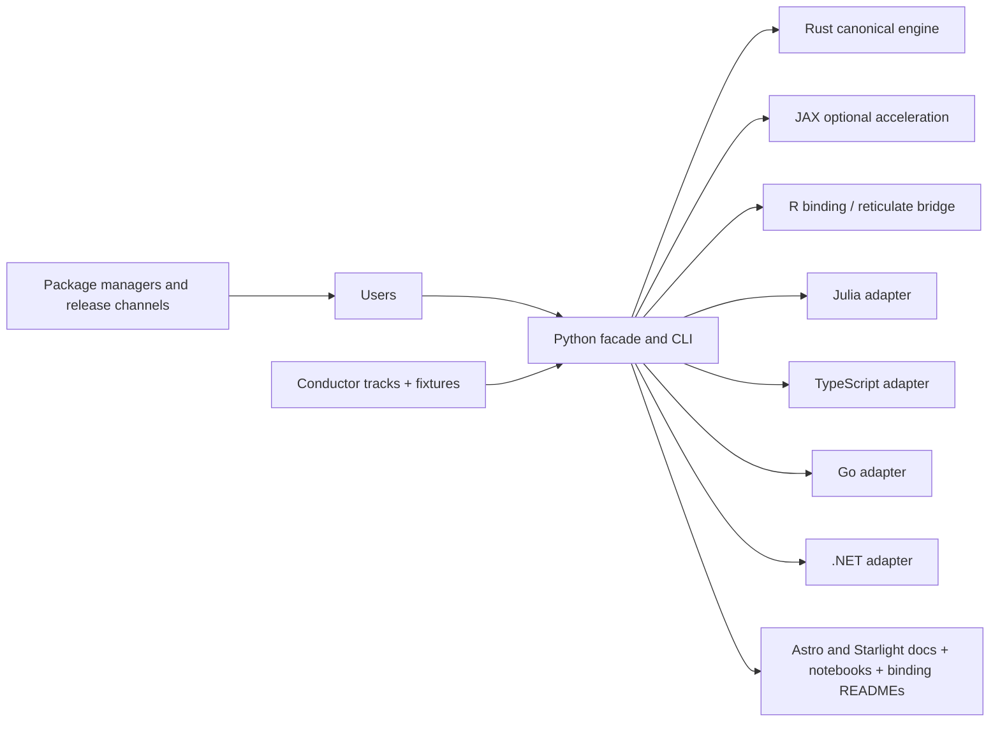
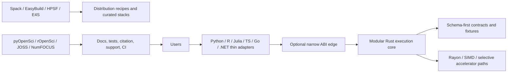

# voiage Project Roadmap (v3)

## Vision

To establish `voiage` as the premier, cross-domain, high-performance library for Value of Information analysis. It will be distinguished by its analytical rigor, computational performance, and exceptional user experience.

## Comprehensive Rust-First Polyglot Programme

GitHub issue #1033 and archived Conductor track
`pre_submission_comprehensive_hardening_20260829` record the programme completed
on 2026-08-30. The repository-owned hardening scope is closed; a future release
containing the hardened source and all venue submissions remain separate gates.
The former #313 workstream and the other previously active tracks are retained
under `conductor/archive/` with their unfinished tasks migrated through the
canonical track's hash-bound manifest:

1. **v1.1:** canonical method/external-library registries, complete stable Rust
   core, contribution transparency, and stable binding contracts.
2. **v1.2:** complete Value of Perspective and supported-method evidence.
3. **v1.3:** experimental frontier plus ML/LLM/agent parity and comprehensive
   Rust, Python, R, Julia, and Mojo conformance.

Feature parity means independently implemented equivalent capability or a
reviewed exclusion, not an imitation of another package API. Literature,
software, data, model, and maturity claims remain evidence-gated.

The initial reproducible landscape snapshot covers direct R and Python VOI/VOP
software, broader decision-modeling packages, public web tools, commercial
documentation, Bayesian experimental-design and active-learning libraries,
and the current Rust/Julia/Mojo ecosystem boundary. Its generated matrix is
evidence-linked and deliberately records planned and non-reproducible
capabilities rather than turning search hits into parity claims. Quarterly and
pre-minor-release refreshes remain required.

### Cross-cutting programme refinements

The programme also treats the following as release requirements rather than
optional follow-up:

1. A canonical Decision Problem interchange model carries alternatives,
   uncertain states, information actions, utility or loss, perspective,
   population, horizon, units, provenance, and posterior/predictive draws
   across Rust, Python, R, Julia, and Mojo.
2. Estimator assurance includes Monte Carlo error or uncertainty, convergence,
   effective sample size where meaningful, RNG identity, replication,
   computational budget, stopping reason, and numerical error—not point
   estimates alone.
3. The literature census explicitly reviews information ordering and adjacent
   methods such as Blackwell informativeness, value of signals, control,
   flexibility, rational inattention, strategic information design, causal
   discovery, model discrimination, and value of measurement.
4. Capability matrices, binding manifests, Astro documentation, and release
   claims are generated or validated against the canonical registries.
5. Stable scalability claims require deterministic parallelism, recorded RNG
   streams, streaming/out-of-core behavior, CPU fallback, and bounded memory,
   latency, and energy evidence.
6. ML, LLM, retrieval, verifier, and agent VOI accounts for adversarial and
   dependent failures, evaluation contamination, provider drift, safety and
   privacy constraints, and human override.
7. Material method, backend, ABI, exclusion, and deprecation decisions receive
   versioned architecture decision records; ecosystem drift automation
   proposes reviewed changes but cannot approve scientific dispositions.
8. Worked examples include reproducibility cards, assumptions, estimator
   uncertainty, sensitivity, failure cases, accessibility, and deterministic
   offline execution.
9. Renovate owns version updates across Python, Rust, npm, GitHub Actions and
   submodules; GitHub's dependency graph and Dependabot alerts remain advisory
   inputs. Security, major, numerical, lockfile and executable-source changes
   remain human-reviewed.
10. Release posture reconciles live GitHub settings, required checks, CodeQL,
    dependency review, Scorecard, workflow audit, secrets, SBOM, provenance and
    open alerts. Critical/high findings block release; moderate findings need a
    bounded reviewed disposition.

These refinements now remain within the single canonical pre-submission track;
new work is added there rather than reactivating or duplicating its archived
source tracks.

## Current Status (As of August 2026)

The project has a solid foundation with core VOI methods implemented, modern
CI/CD, and automated publishing pipelines. The canonical pre-submission
hardening programme has completed its requirements and whole-product gap
analysis, accepted repository repairs, standalone R/polyglot assurance,
measured CI optimization, and repository-controlled venue alignment. Final
closeout is binding the post-merge observation evidence and archive state. The
published v2.1.0 release predates this hardening, so a separately authorized
future release remains necessary before any submission candidate is frozen.

*   **Phase 1 (Foundation & API Refactoring):** ✅ **Complete** - Core OO API, data structures, CI/CD, and documentation are all in place.
*   **Phase 2 (Health Economics Core):** ✅/🔄 **Stable analytical core complete; generic simulation developing** - EVPI, EVPPI, an analytical two-arm normal EVSI model, a coherent joint normal two-loop model with custom callback support, NMA VOI, structural VOI, and plotting are implemented. Generic two-loop and compatibility EVSI estimators remain non-stable pending method-specific convergence and parity evidence.
*   **Phase 3 (Advanced Methods & Cross-Domain):** ✅ **Complete** - Structural VOI, NMA VOI, JAX JIT compilation, and cross-domain support implemented.
*   **Spec, Fixture, Polyglot, And Ecosystem Tracks:** 🔄 **Truthfulness Repairs In Progress, External Gates Explicit** - the immutable release packaging matrix is now separated from the current method-level capability matrix; dataset, ecosystem, example, and workflow evidence has been narrowed to executed repository contracts. Standalone R/Julia installed-package assurance and registry approval remain open gates.
*   **Rust Core Migration:** 🔄 **Production Workspace Established, Stable Kernels Rust-Backed** - the production Rust workspace enforces core dependency direction, leaf FFI/PyO3 adapters, a Rust 1.85 MSRV, and cross-platform CI. Stable EVPI, EVPPI, analytical normal--normal EVSI, ENBS, CEAF, dominance, heterogeneity, and structural aggregation kernels are Rust-backed; Python retains declared two-loop orchestration and explicitly non-stable compatibility paths. R exposes the shared EVPI kernel while Julia exposes shared EVPI and signed ENBS through a separately supplied native library; both still require hosted and registry evidence.
*   **HPC Native Enablement:** ✅/🔄 **Setup Complete, Speedup Evidence-Gated** - the `hpc-capability-implementation-program_20260511` track family is complete and archived for CPU cluster parallelism, scheduler adapters, Apple Metal, discrete GPU, TPU, FPGA, and ASIC lane setup. Remaining work is evidence-gated production speedup, Apple Silicon device capture, and real FPGA/ASIC hardware validation.

Across the completed lanes, external registry, hardware, and speedup evidence gates remain explicit rather than treated as repository-owned completion criteria.

Issue #318 repository-owned programme reconciliation is complete at source
revision `163825d8`: all 18 accepted families map to merged experimental
delivery and the programme's G5–G14 tests, contracts, independent engineering
reviews, dispositions, documentation, governance state and exact-head hosted
assurance; G15 is recorded by the separate repository-completion receipt. PR
#836 exact head `8f1d70cb` completed 42
terminal checks (38 successes, three governed skips and one neutral
conclusion), had zero review threads, and merged as `163825d8`. Project 28 is
normalized for the governed closed issues while open parents remain
In Progress/Mitigating. External
scientific/design/classification review, #599
sparse-subgroup validity, #600 continuous/fitted-estimator and risk-composition
evidence, #619 vector covariance scalarization, Rust/R/Julia parity, stable
promotion, release/publication and family-parent/#318 closure remain open.

The next #318 stage is the fail-closed scientific review programme governed by
umbrella issue #841 and Phase 5 SR1–SR10. Evidence-contract work is tracked by
#842; review waves by #843–#847; installed/parity assurance by #848; synthesis
and adjudication by #849; and sampling-acquisition harm scoping by #850. A
separate orchestrating agent freezes each content-addressed
candidate and synthesizes independent estimand/domain, estimator-assurance,
cross-language/API and governance/publication subagent reports. Wave A covers
#619, #571 and #595; Wave B covers #570 and #597–#600; Wave C covers the
remaining C17/C18 families; a cross-cutting wave covers installed artifacts,
portable fixtures, capability discovery, reproducibility and parity. Findings
are remediated in nested issue-backed slices and rebound to fresh review
packets. Subagent evidence informs, but does not itself make, the accountable
scientific decision. In this single-maintainer repository the owner records
that decision without claiming independent review. Scientific acceptance
remains separate from maturity promotion, hosted assurance, release execution,
publication, registry acceptance and issue closure.

Sampling-acquisition harm is now materialized as the planned v1.3.0 Must
C18/M32 family in
`conductor/archive/sampling_acquisition_harm_voi_20260802/`. Issue #850 owns
native children #851–#853 for the fail-closed capability contract, primary-
source/estimand packet and candidate-bound accountable review. The automated
Phase 1 advisory panel closed all Critical/High repository findings for the
scoped estimand, including explicit `d0` increments, observable filtration,
upper-tail positive-loss CVaR, mutually exclusive outcome accounting and tri-
state mathematical feasibility. This is governed research scoping only: no
sampling-harm runtime exists. The amended H8 plan first repairs canonical
hashing, Git-object, role-separation, finding-closure and transition evidence,
then chooses a narrow domain/jurisdiction candidate or reviewed exclusion and
freezes a #850-specific packet. H8-A now selects the generic automatic-scalar
or study-authorizing kernel as the review target for a proposed exclusion
because no narrow candidate is evidenced; this does not complete the
exclusion. Independent role
subagents report to a separate non-deciding orchestrator, which preserves findings, dissent, options,
contingencies, rationale and recommendation. Completing either scientific
disposition, including `reviewed_exclusion`, requires two distinct humans for
scientific and domain/ethics confirmation, with a chair
only for dispute, dissent or reviewer remediation, followed by a separate
maintainer product decision. Real-study authorization, parity, promotion,
release, publication, registry acceptance and closure remain pending.

The first H8-D/H8-E automated challenge pass is now retained as preparation:
five role-shaped reports and a separate synthesis bind the frozen candidate and
preserve nineteen pending findings (one Critical, fifteen High and three
Medium). This panel is non-human and non-authorizing; estimator-assurance
independence is disqualifying and independent source review remains blocked.
Consequently H8-D through H8-H remain open, and a new candidate packet is
required after substantive remediation.

PR #863 exact head `13456c7a` completed 38 successful checks, three governed
skips, one neutral summary and zero unresolved review threads before squash
merge `0c3f4314`. PR #865 exact head `973a79dc` then completed the bounded
H8-D-B repository preparation—four-issue adjacent-method non-alias enforcement,
the post-#863 administrative delta, the nineteen-finding remediation register
and fail-closed source and qualified-reviewer intake—before squash merge
`03277fef` after 38 successful checks, three governed skips, one neutral result
and zero failures, pending checks or unresolved threads. Closing native child
#864 does not close any scientific finding or satisfy H8-D through H8-H.
Native child #867 completed the next bounded preparation through PR #868 exact
head `ee9da9ba`, squash-merged as `b60d6ee9` after 38 successful checks, three
governed skips, one neutral result and zero failures, pending checks or
unresolved review threads. It records a separately dated
six-source automated observation refresh and a machine-validated, disjoint
partition of all nineteen pending findings. It preserves the immutable H8-C
packet, retains zero source bytes and grants no rights, applicability,
independent-review or finding-disposition authority. A replacement packet
remains unready until candidate context, independent source evidence and
eligible human review exist.

Native child #870 completed the next repository-only slice through PR #871
exact head `305bdad5`, squash-merged as `8c710245` after 38 successful checks,
four governed skips and zero failures, pending checks or unresolved review
threads: a deterministic,
fail-closed human commissioning preflight and role-specific handoff. It records
the recommended generic-kernel reviewed-exclusion path alongside bounded-
candidate and deferral alternatives, but leaves the accountable choice unset.
It binds all nineteen findings, five source prerequisites and seven separated
H8-D/H8-G roles, and prohibits ready, reviewer-eligibility, source-authority or
scientific claims. A merged implementation may make the handoff usable; it
cannot itself satisfy H8-D or select the candidate. Issue #870 and Project 28
read back Closed, Done, Resolved, Verified and Clean while retaining the Human
and Critical boundary.

Native child #873 completed the accountable option-1 transition through the
owner-authored comment `5166647873`: seek independent review of a proposed
exclusion for any universal automatic-scalar or study-authorizing kernel while
preserving narrower non-authorizing research. Issue #873 and Project 28 read
back Closed/Done/Resolved/Verified/Clean while retaining Human/Critical. The
separate receipt preserves the historical unset preflight and advances only
candidate selection. Native child #876 is now the first remaining accountable
gate and reads Open/In Progress/Blocked/Human/Critical/Clean for independent
source retrieval, rights/applicability review, eligible human assignments and
a replacement packet. All nineteen findings, H8-D through H8-H, runtime,
study, release and publication remain pending or false.
PR #877 exact head `8de3a40a` completed 38 successful checks and four governed
skips or neutral outcomes with no failures, pending checks or review threads
before squash merge `b3138ae7`; this is H8-D-E repository evidence only.

Canonical C18/M32 planning is synchronized through VOP PR #71, squash-merged
as `e0ff1d2ce3361d52ee22bb01e105b92653ed606c` after 16 terminal successful
checks and one governed scheduled-only skip. That cross-repository merge is
planning evidence only; it does not satisfy H8 or authorize a runtime.

VOIAGE PR #855 delivered this repository scope at exact head
`14b9f6d836c831eb62cad41f589133d83ddd9493`, with 60 successful checks, four
governed skips, one neutral result and zero unresolved review threads before
squash merge `62d22743b1547266bd554b215f957934bf577234`. Repository hosted assurance is
therefore satisfied; H8 and every runtime, real-study, parity, promotion,
release, publication, registry and closure gate remain pending.

The v1.3 residual frontier programme is governed canonically by VOP C18. Issue
#599 completed its governed experimental repository delivery. Its exact finite
Python contract preserves the existing stable descriptive helper while adding
the four policy values `C0`/`Cf`/`P0`/`Pf`, population and subgroup EVPI, an
optional separately reported EVSI extension, strict subgroup selection,
eligibility, fairness and privacy declarations, and exact decomposition
assurance. PR #809 exact head `b0fc8db7` completed all 42 terminal-allowed
checks with 38 successes, three governed skips and one neutral CodeQL
aggregation; it had zero review threads before squash merge `1a37526a`.
Delivery subissues #786, #788 and #789 may close. Scientific validity,
selection-bias and sparse-subgroup review, Rust/R/Julia parity, stable
promotion, release, parent #599 closure and umbrella #318 closure remain open.

#597 completed its governed experimental repository delivery. PR #807 exact
head `35cfe522` completed all 42 terminal-allowed hosted checks with 38
successes, three governed skips and one neutral CodeQL aggregation. All three
review threads were resolved before squash merge `39de9c6a`. The exact finite
belief MDP retains control-transition-observe-update chronology, matched
closed-loop/no-information comparators and intervention-dependent learning
diagnostics. Scientific review, Rust/R/Julia parity, stable promotion, release,
parent #597 closure and umbrella #318 closure remain separate gates.

#596 now has a test-first experimental Python delivery for C18/M27. It evaluates
perfect event information, a symmetric imperfect binary channel and the
policy-relative expected-utility density
`f(x) [max_a g_a(x) - g_a*(x)]` on exact finite probability-mass supports,
with complete ties, signed centered diagnostics, integral assurance and
result-only plots. Monetary BPI remains delegated to #595. Independent review,
hosted exact-head checks, scientific approval, Rust/R/Julia parity, stable
promotion and release remain separate gates.

#593 now has an experimental Python-only joint information/implementation
contract and exact finite evaluator. PR #787 exact head `de31458b` passed all
42 hosted checks (38 successes, one neutral aggregation and three governed
skips), both review threads were evidence-resolved, and the implementation was
squash-merged as `20e0c606`. The repository-delivery subissues may therefore
close, while named scientific review, Rust/R/Julia parity, stable promotion,
release, parent #593 closure and umbrella #318 closure remain open. The existing
implementation multiplier is retained as a
compatibility helper and is not described as EVPIM/EVSIM/IA-EVSI.

C18/M29 issue #598 has completed its governed experimental Python repository
delivery. The exact finite contract covers signed, social and strategic
information value. It freezes the
joint-world law, roles, topology, selective-sharing designs, nonanticipative
bounded catalogs, welfare comparability, transfers, costs and rights receipts;
retains negative values; and returns harm, avoidance, switches,
winners/losers, externalities and strictly scoped Blackwell checks. Independent
implementation re-review passed without an unresolved Critical, High or Medium
finding. PR #808 exact head `4d121b29` completed all 42 terminal-allowed checks,
all 10 review threads were resolved, and the experimental delivery
squash-merged as `d649c344`. Delivery subissues #783–#785 may close. Scientific
review, Rust/R/Julia parity, stable promotion, release, parent #598 closure and
umbrella #318 closure remain open.

Outcome-conditional sample-information value (#600, C18/M31) completed its
governed exact finite experimental Python repository delivery under native
subissues #790–#792.
The contract reports predictive-probability-weighted `delta-EV_x` and `VSI_x`,
EVSI, Equation 10's weighted population `sigma-VSI`, `rVSI_delta` and
quantiles/tails with complete policies and result reconstruction. It treats the
tower equalities as expectation-linear only, distinguishes `rVSI0` from
policy-switch mass under ties, and explicitly rejects the source paper's
unweighted MATLAB/Table 3 standard-deviation calculation as a normative
implementation. PR #831 exact implementation head `eb5a201d` completed all 42
terminal-allowed checks with 38 successes, three governed skips and one neutral
CodeQL aggregation. All five CodeQL review threads were resolved before squash
merge `ac1d31bf`. Delivery subissues #790, #791 and #792 may close. Continuous
outcomes, fitted estimators, independent scientific review, risk-sensitive
composition, Rust/R/Julia parity, stable promotion, release, parent #600
closure and umbrella #318 closure remain open.

**June 25 follow-through closeout:** ✅ **ARCHIVED** - The June 25 follow-through queue is complete and archived for its repository-owned implementation and
evidence slices. Registry approval, external indexing, production accelerator
speedup, cloud quota, physical FPGA runtime, and fabricated-silicon evidence
remain external gates and are not represented as completed live outcomes.

Mature Hardened v1.0 Programme: ✅ **ARCHIVED** - The repository-owned
programme completed the Rust runtime takeover, legacy numerical-core retirement,
thin binding consolidation, Astro documentation migration, hardened release
gates, and signed public `v1.0.0` release. Remaining registry review/indexing
and external archival outcomes are tracked separately in
`conductor/archive/research_software_registry_readiness_20260721/`. The
machine-readable baseline is `conductor/v1-programme-baseline.json`; the
archived implementation plan is in
`conductor/archive/mature-hardened-v1-release-programme_20260719/`.

Research-software registry readiness follows that release in
`conductor/archive/research_software_registry_readiness_20260721/`. Issues
#296--#299 track Software Heritage, RRID, and JOSS outcomes without promoting
local preparation into external archival, identifier, submission, review, or
acceptance evidence.

The same track now owns a versioned cross-venue submission contract covering
all retained package registries and archives plus potential pyOpenSci,
rOpenSci, R Journal, Journal of Statistical Software, NumFOCUS, HPSF, and
related routes. Issues #614--#617 own the contract and future decision lanes.
The repository validates evidence paths, unresolved gates, and authority
boundaries in tox and hosted CI. Passing that gate means the repository is
prepared to evaluate a route; it does not authorize an inquiry or submission.
The next execution sequence is issue-backed: #614 maintains all contract
evidence; #616 closes Python community-review evidence; #615 closes the R
installation/API/statistical-standards evidence; #622 prepares portable HPC
recipes; and #617 makes explicit non-duplication decisions for distinct future
routes. Author and external decisions remain outside these repository tasks.

Conductor-to-GitHub traceability is complete and archived in
`conductor/archive/conductor-github-cross-reference-reconciliation_20260724/`.
Every completed track has an individual issue, native parent, Project 28 item,
and evidence-based PR links (or an explicit no-PR-evidence boundary). PRs #465
and #810 merged after hosted validation, and track issue #462 is closed.

Historical Conductor schema normalization is complete and archived in
`conductor/archive/conductor-registry-normalization_20260727/`. It repaired the
exact 223-error legacy validator baseline mechanically while preserving
superseded and external follow-ups as non-acceptance history rather than
completed work.

The preprint is now authored in canonical semantic LaTeX using the hardened
`arxiv-paper-template` architecture. Repository automation provides
deterministic source packaging, TeX Live 2023/2025 compatibility, LaTeX and PDF
assurance, semantic HTML, and provenance-tool boundaries. Author confirmation,
arXiv category/license/endorsement, authenticated upload, moderation, and
announcement remain explicit human or external gates. GitHub issue #312 is the
native arXiv-readiness subissue of JOSS-readiness issue #299, with both linked
to Conductor track `research_software_registry_readiness_20260721`. The
synthetic health example now reports simulation uncertainty, prespecified
study-value sensitivity scenarios, and machine-readable numerical results.

The authenticated arXiv account was rechecked on 26 July 2026. Submission
`7861466` is no longer present in the active-submission table. Replacement
submission `7870358` exists only as an incomplete start-stage draft expiring
9 August 2026; it has no files, metadata, category, or licence recorded and is
not evidence of completed resubmission. The JOSS adaptation follows the current 2026
screening and paper requirements, including design trade-offs, specific
reproducible material supporting credible near-term significance, transparent
AI-use disclosure, Software Heritage citation, a fail-closed local validator,
an exact 1,600 ±2% article contract, SourceRight citation reconciliation,
selected Authentext pattern evidence, and a pinned Open Journals draft build.
Direct JOSS review is selected for the
Rust-centred polyglot package. Issue #471 tracks demonstrated research use and
attributable human community engagement, external use, or collaborative input.
The former is a hard pre-review gate; the latter remains a detailed-review
criterion, strong positive pre-review signal, and author-selected prerequisite.
The signed v2.0.0 release, PyPI/TestPyPI packages, four crates.io crates,
mixed-language SBOM, provenance, clean-install evidence, and Software Heritage
snapshot are complete. Conda-forge PR #34308 is under external review.
Its linter and Linux, macOS, and Windows builds are green.
Author-confirmed AI attestation, final human source verification,
authenticated submission, editorial review, acceptance, and DOI assignment
remain explicit human or external gates. The round-nine JOSS source has passed its local article,
SourceRight, Authentext, Open Journals, and page-by-page visual checks. The
decision-maker wording retained for the release-bound source passed a fresh
exact-revision Open Journals build and six-page visual review in PR #529. The
permanent arXiv identifier is the author's requested sequencing gate, not a
JOSS eligibility requirement.

Three completed-in-repository assurance tracks remain archived with their
explicit human gates visible: Domain Abstraction Excellence
(`abstraction-excellence_20260719`), Assurance Frontier
(`assurance-frontier_20260720`), and Operational Assurance Excellence
(`operational-assurance-excellence_20260720`). Their archived directories make
review evidence and approval boundaries visible; they are not reopened work.

Standardized dataset ingestion is the next cross-domain input programme. Track
`standardized-dataset-ingestion_20260723` defines a versioned, Arrow-backed
`NormalizedInputBundle`, an existing-runtime preparation boundary, and lazy
optional Croissant ML and Frictionless Data providers. GitHub issue #325 is the
parent, native sub-issues #326–#333 own the implementation slices, and all
items are represented in Project 28. Source-format parsing remains decoupled
from calculation kernels, and scientific VOI semantics require explicit
bindings rather than column-name inference. The binding profile evolves
independently from package releases, and remote or live inputs require verified
materialization receipts, explicit selection, data-quality evidence, and
preserved citation/licence/usage metadata.

The approved repository-owned endpoint is now its strict-local, offline-first
profile. Controlled live interoperability is separately tracked in
`controlled_live_dataset_interoperability_20260801` (issue #752), pending
approved rights-cleared, hash-pinned source packets. General remote transport
security is separately tracked in `remote_dataset_ingestion_security_20260801`
(issue #753), pending a threat model and explicit security-policy approval.

Follow-on sub-issues #467 and #468 extend the same programme only after the
canonical contract and conformance matrix stabilize: #467 publishes a provider
SDK and generic DataFrame-interchange adapter, while #468 supplies reproducible
ML, engineering/operations, and business reference cases. Neither follow-on
creates a second preparation path or domain-specific numerical kernel.

Three additive frontier delivery plans target the governed v1.2.0 contract and cover the
specialized gaps identified on 27 July 2026 without changing the released
stable core. Canonical MoSCoW requirements M14–M17 and cross-repository track
C16 own the shared projection:

Canonical C18 extends the planned v1.3.0 frontier. Requirement M26 and GitHub
issue #594 are delivered in `uncertainty_modelling_value_20260801` as an
experimental exact finite Python contract for EV-problem/solution, EEV,
recourse, wait-and-see, VSS/EVIU and EVPI. Two- and three-stage fixtures encode
shared-history nonanticipativity, minimization/maximization, nonlinear
point-estimate behavior and infeasible induced recourse. DVSS/VMS, scientific
approval, polyglot parity, stable promotion and release remain pending. PR #798
exact head `aa5d9fd8` completed all 42 hosted checks with 38 successes and four
governed skips, including every installed-wheel contract, aggregate coverage,
CodeQL and security assurance, with all four review threads resolved before
squash merge `c5adca8f`. Repository-delivery subissues #774–#776 may close;
parent #594 and umbrella #318 remain open.

*   `estimation_focused_variance_voi_20260727` and GitHub issue #619 define
    estimation-focused `EVPPI_var` and `EVSI_var` with declared scalar/vector
    target shape, component units, variance or covariance functional,
    conditioning and sampling models, and estimator assurance. They remain
    explicitly separate from decision-focused EVPPI/EVSI, sensitivity indices,
    and estimator uncertainty. The repository now contains an experimental
    scalar Rust implementation with a PyO3/Python façade, versioned schemas,
    independent references, deterministic bootstrap assurance, CLI/report/plot
    surfaces and explicit polyglot dispositions. PR #676 exact head
    `5e2c097f` completed 65 terminal hosted contexts (60 successes, four
    governed skips and one neutral CodeQL aggregation), with both review
    threads resolved, before squash merge `9495fc3f`. Canonical sync PR #64
    completed 16 terminal contexts and merged as `cedc6fbb` with zero review
    threads. Delivery subissues #671--#674 are closed. E17 scientific
    classification and vector covariance scalarization review, vector
    execution, stable promotion, release, parent #619 closure and umbrella
    #318 closure remain open. A post-merge independent review subsequently
    found that the EVSI outer expectation required explicit prior-predictive
    weighting, replay provenance did not bind runtime values and scalar result
    consistency was under-validated. PR #837 exact head
    `076a29075e839e3cad49d0487dff0c4e2639845f` remediated
    those boundaries and completed 65 terminal checks (60 successes, four
    governed skips and one neutral conclusion) with zero review threads before
    squash merge `366186b358abd775bea5fd2440d7e0ececb3ebaa`. The umbrella was
    then resynchronized; scientific,
    vector, parity, promotion, release and closure gates remain open.
*   `study_design_efficiency_20260727` and refined GitHub issue #571 define a
    governed Curve of Optimal Sample Size result containing evaluated designs,
    feasible range/set, the signed ENBS curve, deterministic tie policy,
    optimum, uncertainty around the optimum and plotting inputs, plus the
    dimensionless EVSI/EVPI study-efficiency diagnostic with zero-EVPI and
    bounds behavior. They must reconcile the existing plotting and legacy
    clinical-optimizer helpers rather than treating adjacent or misnamed
    behavior as implementation evidence. Merged implementation PR #679 now
    supplies the Rust-owned kernels, strict Python contracts, exact constrained
    portfolio slice, CLI/reporting/accessible plot, and shared fixture. Native
    sub-issues #680–#682 separate runtime, user/portfolio, and
    binding/governance evidence. PR #679 final exact head `ce5d7127` completed
    65 terminal conclusions (60 successes, four governed skips and one neutral
    conclusion), and both review threads were resolved before squash merge
    `5d059a80`. Delivery subissues #680–#682 are closed. These capabilities
    remain experimental; scientific review, Rust/R/Julia parity, stable
    promotion, release, parent #571 closure and umbrella #318 closure remain
    open. Canonical C16 synchronization PRs in VOP are merged: estimation-
    family PR #64 exact head `6c3fd723` merged as `cedc6fbb`, followed by
    study-design PR #65 exact head `d2b74b4f` merged as `ac61bb9f`.

*   `risk_adjusted_information_pricing_20260731` and GitHub issue #595 define
    one experimental expected-utility information-pricing family in Rust and
    Python spanning EUI, CEI, BPI,
    SPI and anchored PPI with declared utility, wealth/reference, units,
    information/cost location, current and informed policies, stakeholder
    scope, root diagnostics and comparability. VoC is a presentation of its
    clairvoyant-policy result, not a duplicate kernel; monetary EVPI reduction
    is valid only for verified positive-affine utility. Native delivery
    subissues #694–#697 own contracts, runtime, assurance, and user/polyglot
    surfaces respectively. R and Julia remain explicitly unsupported for this
    family, while Mojo remains an external boundary. PR #712 final exact head
    `1048c4bc` completed 65 terminal conclusions (60 successes, four governed
    skips and one neutral conclusion), and both review threads were resolved
    before squash merge `b8395abf`. Delivery subissues #694–#697 are closed.

All three issues are native sub-issues of frontier parent #318 under programme
#313 and are represented in Project 28. Risk-sensitive/constrained VOI (#570)
and outcome-conditional/risk-of-low sample information (#600) remain separate
risk-family plans. The dedicated #595 delivery track is a scoped execution
record for the existing approved method family; it does not create a duplicate
VoC method. Repository evidence remains experimental; scientific review,
Rust/R/Julia parity, stable promotion, release, parent #595 closure and
umbrella #318 closure remain open.

Risk-sensitive and constrained VOI (#570) now has experimental exact finite
Python delivery under C18/M22. PR #769 exact head `f513416f` passed its hosted
matrix and 100% changed coverage before squash merge `c25f3234`. Scientific
review, Rust/R/Julia parity, stable promotion, release and parent closure remain
separate gates.

Value of Flexibility (#559) now has a merged experimental Python timing-
scenario contract from PR #723 exact head `3dddf63a`, squash-merged as
`44e0067a`. It compares a flexible feasible policy set with the
best matched ex-ante commitment, returns both values and policy paths, and
keeps its information-value component explicitly excluded. The implementation
fixes the legacy strategy/stage axis mismatch and reconciles the previously
non-executable dynamic-real-options fixture. Transition-constrained lifecycle
paths, Rust/R/Julia execution, scientific review, stable promotion, release
and issue closure remain separate gates.

Deterministic Sensitivity and Scenario Analysis (#556) now has a merged
experimental Python callback and normalized-record engine from PR #723 exact
head `3dddf63a`, squash-merged as `44e0067a`. Its exact v1
contract preserves complete coordinate vectors, parameter and output units,
frozen-baseline one-way grids, explicitly feasible two-way cells, named
structural scenarios, complete tie sets, and observed exact/plateau/adjacent-
bracket switches. The CLI validates the same contract from an installed wheel,
and the accessible tornado plot uses evaluated grid extrema rather than
inventing interpolation. Rust/R/Julia execution, independent scientific
review, stable promotion, release and issue closure remain separate
gates.

Value of Distribution-Family Information (#557) now has merged experimental
Python delivery from PR #736 and governed closeout #737 under canonical requirement M19 and nested delivery issues
#731–#735. Its strict v1 contract resolves only a declared discrete model-family index
after within-family uncertainty has been integrated out, returning the current
mixture-optimal policy, family-resolved policies, complete ties, gross VDI and
signed net VDI. This is an issue-facing presentation of discrete-index EVPPI,
not distributional-equity VOI, full structural EVPI, model selection or
model-discrimination EVSI. The implementation is exercised by synthetic exact
fixtures, an installed schema/CLI contract, independent review, complete
changed-line/branch coverage and clean hosted exact-head checks. Scientific
terminology/partition review, real probability provenance, polyglot
parity, stable promotion and release remain separate gates.

Qualitative Value of Information (#558) now has merged experimental Python
delivery under canonical requirement M20 and native subissues #738–#742. PRs
#743 and #744 provide a portable executable assessment, audit and accessible-rendering
workflow for ordinal information priorities, complete ties, dissent,
conflicts, missingness, redaction, sources, AI provenance and accountable human
verification. It must not fabricate probabilities, utilities, currency,
weighted pseudo-scores or a quantitative VOI estimand. Practitioner/scientific
approval, stable promotion, polyglot execution, release and parent closure
remain separate gates.

Finite additive MCDA information value (#560) now has merged experimental
Python delivery from PR #751 exact head `60297ba3`, squash-merged as
`e8aaba82`, under planned v1.3.0 canonical requirement M21 and native
subissues #746–#750. Its frozen v1 scope uses fixed ex-ante value functions and
normalization anchors, explicit criterion units/directions, normalized
nonnegative weights and a correlated finite joint uncertainty law. It will
value perfect resolution of criterion-performance, preference or joint latent
variables and returns baseline/conditional choices, complete ties, gross/net
value, interaction, regret, rank acceptability and raw-criterion Pareto
diagnostics. AHP elicitation, outranking/veto/non-compensatory rules,
post-information renormalization and imperfect-sample EVSI are excluded.
Independent scientific review, Rust/R/Julia parity, stable promotion, release
and parent closure remain separate gates; hosted exact-head and installed-wheel
assurance passed before merge.

Forecast and signal information value (#572) now has an experimental finite
Python contract. It consumes a declared forecast artifact, outcome-signal law,
reported probabilities, feasible actions, frozen payoffs, horizon, freshness,
latency, lead time and acquisition cost. It separates timely-oracle value from
signed deployed value, calibration loss, regret avoided and maximum price;
predictive accuracy alone is not value. PR #770 exact head `c110706c` passed
all hosted checks with 100% changed-line and changed-branch coverage before
squash merge `4657f94e`. Independent scientific review, continuous and
multistage methods, Rust/R/Julia parity, stable promotion, release and parent
closure remain separate gates.

The complete Rust-first polyglot programme issue hierarchy is now materialized
in Conductor rather than existing only in GitHub and Project 28:

| Issue | Conductor track | Governed scope |
|---|---|---|
| #313 | `rust_polyglot_voi_completion_20260723` | Root v1.1–v1.3 programme and workstream dependencies |
| #314 | `voi_method_census_contract_reconciliation_20260723` | Method census, classifications and portable Decision Problem |
| #315 | `external_voi_library_feature_parity_20260723` | Reproducible software landscape, parity and improvement review |
| #316 | `stable_voi_rust_core_completion_20260723` | Complete stable Rust numerical authority and compatibility |
| #317 | `value_of_perspective_completion_20260723` | Complete perspective-information family |
| #318 | `supported_frontier_method_completion_20260723` | Frontier implementation or reviewed exclusion, including risk/utility |
| #319 | `ml_llm_agent_voi_20260723` | Decision-focused ML, LLM, policy and agent VOI |
| #320 | `polyglot_abi_binding_parity_20260723` | Rust/C ABI/Python/R/Julia/Mojo capability parity |
| #321 | `datasets_worked_examples_20260723` | Rights-governed datasets, examples and domain templates |
| #322 | `quality_release_automation_20260723` | Decision assurance, adoption surfaces, release and registry automation |
| #323 | `research_contribution_ai_transparency_20260723` | CRediT and accountable AI-assistance provenance |

The workstream tracks own their native child issues: #314 owns #566; #315 owns
#565 and #567–#569 plus #573; #318 owns #556–#560, #570–#572, #582,
#593–#600 and #619; #319 owns #576 and #578; #320 owns #579; #321 owns
#574–#575 and #577; and #322 owns #462, #580–#581 and #583–#584. Child
issue or Project status is not implementation evidence: every new Conductor
plan starts pending until its contracts, tests/review protocol, runtime or
reviewed exclusion, bindings, documentation and hosted evidence are
reconciled. Completed native child #416 remains historical v1.0 programme
evidence and is not reopened by this queue.

Issue #582 is delivered experimentally through
`information_source_portfolio_voi_20260801`, with dependent source sequences,
feasibility constraints, conditional marginals and exact decision-value
Shapley allocation governed under C18/M24 for planned v1.3.0. PR #772 exact
head `f1d6f77d` passed its hosted matrix and 100% changed coverage before
squash merge `55771017`; scientific review and later maturity gates remain.

---

### Phase 1: Foundation & API Refactoring ✅ **COMPLETE**

**Goal:** Solidify the library's foundation by implementing a more robust, extensible, and user-friendly API.

1.  **Object-Oriented API Redesign & Functional Wrappers:**
    *   **Status: `✅ Done`**
    *   `DecisionAnalysis` class encapsulates core logic with functional wrappers.
2.  **Domain-Agnostic Data Structures:**
    *   **Status: `✅ Done`**
    *   `ParameterSet`, `ValueArray`, `TrialDesign`, and other structures in `voiage/schema.py` using xarray backend.
3.  **CI/CD & Documentation Website:**
    *   **Status: `✅ Done`**
    *   Full CI/CD pipeline: uv, Ruff, CodeQL, Benchmarks, Astro/Starlight docs, GitHub Pages, automated publishing to PyPI/TestPyPI, plus conda-forge feedstock recipe updates with external feedstock approval.
4.  **Community Guidelines:**
    *   **Status: `✅ Done`**
    *   `CONTRIBUTING.md`, `AGENTS.md`, Renovate for dependency updates.

---

### Phase 2: State-of-the-Art Health Economics Core ✅ **COMPLETE**

**Goal:** Implement the most critical features for health economists.

1.  **Robust EVSI Implementation:**
    *   **Status: `✅ Done`**
    *   The built-in two-loop model fits one joint normal prior and uses it for
        current value, predictive study results, and posterior value. It
        updates all correlated parameters together, consumes its inner-loop
        draw count, and uses genuine Gaussian draws; custom models use explicit
        trial-simulation and joint-posterior callbacks.
    *   A Rust-owned analytical normal--normal model is tested against a
        prespecified reference.
    *   Regression, efficient, and moment-based compatibility estimators are
        explicitly non-stable until they expose a complete validated study
        model.
2.  **Network Meta-Analysis (NMA) VOI:**
    *   **Status: `✅ Done`**
    *   `calculate_nma_evpi()` and `calculate_nma_evppi()` in `voiage/methods/network_meta_analysis.py`.
    *   CLI command: `voiage calculate-nma-voi`.
3.  **Structural Uncertainty VOI:**
    *   **Status: `✅ Done`**
    *   `structural_evpi()` and `structural_evppi()` with JAX JIT compilation in `voiage/methods/structural.py`.
    *   CLI commands: `voiage calculate-structural-evpi`, `voiage calculate-structural-evppi`.
4.  **Validation & Benchmarking:**
    *   **Status: `✅ Done`**
    *   Integration tests with realistic health economics and diabetes NMA scenarios.
    *   Performance benchmarks comparing NumPy vs JAX implementations.
5.  **Advanced Plotting Module & Core Examples:**
    *   **Status: `✅ Done`**
    *   CEAC plotting in `voiage/plot/ceac.py`.
    *   VOI curves in `voiage/plot/voi_curves.py`.
    *   CLI example generation and documentation.

---

### Phase 3: Advanced Methods & Cross-Domain Expansion ✅ **COMPLETE**

**Goal:** Broaden capabilities to advanced VOI methods and cross-domain support.

1.  **Structural VOI:**
    *   **Status: `✅ Done`**
    *   Full implementation with JAX JIT acceleration.
2.  **Calibration VOI:**
    *   **Status: `✅ Done`**
    *   `voi_calibration()` in `voiage/methods/calibration.py`.
3.  **Adaptive Trial VOI:**
    *   **Status: `✅ Done`**
    *   `adaptive_evsi()` and sophisticated trial simulator in `voiage/methods/adaptive.py`.
4.  **Cross-Domain Support:**
    *   **Status: `✅ Done`**
    *   Multi-domain module (`voiage/multi_domain.py`) with healthcare, financial, environmental, and engineering support.
    *   Domain-specific analysis classes and utilities.
5.  **XArray Integration:**
    *   **Status: `✅ Done`**
    *   All core data structures built on xarray Dataset backend.
6.  **High-Performance JAX Backend:**
    *   **Status: `✅ Done`**
    *   JIT-compiled versions of structural EVPI/EVPPI.
    *   JAX backend in `voiage/main_backends.py` with GPU acceleration support.

---

### Phase 4: Ecosystem, Community & Future Ports ✅/🔄 **REPOSITORY COMPLETE, EXTERNAL GATES EXPLICIT**

**Goal:** Grow the user and contributor community and lay the groundwork for R and Julia versions.

1.  **Automated Publishing Pipeline:**
    *   **Status: `✅ Done`**
    *   TestPyPI → PyPI publishing on `v*` tags, plus conda-forge feedstock recipe updates with the external feedstock merge remaining outside this repository.
    *   Retained release workflows validate Rust workspace, Python, R, and Julia artifacts and attach GitHub release artifacts. Four binding-independent Rust core crates publish through crates.io Trusted Publishing; the FFI, PyO3, and test-support crates remain `publish = false`. No npm package, NuGet package, Go binding, TypeScript binding, .NET binding, or WASM surface is claimed. Registry-side indexing or approval remains external for conda-forge, CRAN/r-universe, and Julia General.
    *   Repository versioning is now tag-derived for Python through
        `setuptools-scm`; external binding manifests stay synchronized to the
        latest released tag, and the version-sync validator is enforced in CI
        and local tox automation.
2.  **Dependency Management:**
    *   **Status: `✅ Done`**
    *   uv for package management, Renovate for automated updates.
    *   Renovate is the sole update-PR producer across supported managers;
        GitHub vulnerability alerts remain an input and Dependabot update PRs
        are not part of the automation architecture.
3.  **Security & Quality:**
    *   **Status: `✅ Done / hosted controls applied`**
    *   CodeQL security scanning, Ruff linting/security rules, ty type checking,
        mutation testing support, a fail-closed repository harness, immutable
        GitHub Action pins, dependency review, OpenSSF Scorecard, Zizmor
        workflow auditing, release provenance attestations, and an active
        protected-main ruleset are in place. Organization-level Actions policy,
        environment approvals, and plan-dependent secret-scanning features
        remain explicit administrator-owned gates. The repository lockfiles
        now carry patched Python and Starlight documentation dependencies for
        the current advisory set; future update follow-up remains Renovate-owned
        follow-up work.
    *   Polyglot CI modernization adds merge-queue event compatibility,
        PEP 740 PyPI/TestPyPI attestations, exact-byte TestPyPI promotion,
        release-bound CycloneDX attestations, a digest-bearing release
        manifest, mixed-language dependency submission, shared numerical
        corpus validation across Python/Rust/C/R/Julia, Astro type checking,
        and a non-required Linux ARM64 observation lane. Hosted merge-queue,
        immutable-release, environment, registry, and Trusted Publisher
        settings remain external gates.
4.  **Community Engagement:**
    *   **Status: `✅ Done`**
    *   Repository structured for contributions, Conductor workflow for AI-assisted development, and repository-level support, security, and community-health documents now provide a clear help path for users and contributors.
5.  **Language-Agnostic API Specification:**
    *   **Status: `✅ Done`**
    *   The stable core contract around `ValueArray`, `ParameterSet`, `TrialDesign`, method outputs, diagnostics, and extension rules is defined under `specs/core-api/`.
    *   Spec-first development is backed by conformance fixtures before binding expansion.
    *   The core API is surfaced from Python/Mojo first, with R, Julia, and Rust contracts aligned to the same release matrix.
    *   Deterministic validation, explicit schemas, and backend-agnostic behavior remain the governing compatibility rules.
6.  **Planning for R/Julia Ports:**
    *   **Status: `✅ Done`**
    *   R and Julia are captured as external ports of the shared Rust core API.
    *   The Python implementation remains the reference binding, with additional bindings generated or hand-wrapped from the same canonical spec.
    *   Each external binding is treated as a releasable package with a registry target, automated CI, conformance-fixture validation, and release automation before it is considered repository-complete.
    *   Keep the R binding documentation track explicit: the package help pages, a narrative vignette, and a deterministic PDF reference manual are part of the package docs surface, and the completed track is archived with the build/verification guidance centered on `tools/build-manual.R` and the non-interactive `R CMD check --as-cran --no-manual` flow.
    *   Keep the polyglot tutorial surface explicit so the Python notebooks, the R vignette/manual, and the non-Python binding walkthroughs stay aligned around the same canonical use cases; the track is now complete and archived, with the repo-level smoke checks covering the binding walkthrough READMEs.

---

### Phase 5: Spec, Fixtures & Polyglot Bindings ✅ **COMPLETE**

**Goal:** Mature the library into a broadly usable core analysis engine with stable cross-language contracts.

1.  **Core API Specification:**
    *   **Status: `✅ Done`**
    *   Define method signatures, schema invariants, and error behavior for the public VOI surface.
    *   Covered by Conductor tracks: `core-api-spec-foundation`, `canonical-schemas-core-contracts`.
2.  **Conformance Fixtures:**
    *   **Status: `✅ Done`**
    *   Build canonical input/output fixtures that every binding must pass before release.
    *   Covered by Conductor tracks: `cross-language-conformance-fixtures`, `python-cleanup-against-spec`.
3.  **Python Cleanup and Stabilization:**
    *   **Status: `✅ Done`**
    *   Finish the Python-side normalization needed to make the canonical API implementation simple and durable.
    *   Covered by Conductor track: `python-cleanup-against-spec`.
4.  **First External Bindings:**
    *   **Status: `✅ Done / external registry gates remain explicit`**
    *   Deliver the retained R and Julia bindings, the Python facade, and the Rust execution core against the same contract; Mojo remains an upstream boundary.
    *   Publishing targets must be planned with the implementation:
        - Python: PyPI, TestPyPI, and conda-forge feedstock recipe updates, with the feedstock PR/merge remaining external.
        - R: GitHub Releases for early source distribution, CRAN when mature, and optional r-universe indexing; the package docs story includes a deterministic vignette and PDF manual built from the same source tree, while external registry approval remains outside the repository.
        - Julia: BinaryBuilder/Yggdrasil supplies the Rust C ABI through a JLL;
          Registrator publishes the `bindings/julia` subpackage to General and
          subpackage-aware TagBot creates collision-free releases. BinaryBuilder
          and General acceptance remain external.
        - Rust: four binding-independent core crates publish to crates.io from
          signed `rust-v*` tags through short-lived Trusted Publishing
          credentials; FFI, PyO3, and test-support crates remain private and
          release through the shared GitHub artifact set.
    *   CI/CD must be language-specific and release-aware for every binding:
        - Build, lint/format, type/static checks, unit tests, docs checks, and shared conformance fixtures.
        - Package dry-run validation on pull requests.
        - Trusted or token-scoped publishing on version tags/releases.
        - Registry-specific provenance and changelog generation where supported.
    *   Covered by Conductor tracks: `cross-language-conformance-fixtures`, `first-external-bindings_20260430`, and future binding-specific tracks as they are added.
    *   Contract semantics, maturity metadata, and extension rules are covered by `numerics-diagnostics-extension-model`.

---

### Phase 6: Ecosystem Integrations ✅ **COMPLETE**

**Goal:** Make `voiage` useful as a stable VOI engine for upstream modelling
packages while preserving a clean dependency boundary.

1.  **lifecourse Integration Contract:**
    *   **Status: `✅ Done`**
    *   Define a `lifecourse` VOI artifact profile covering net benefits,
        parameter samples, strategy names, WTP thresholds, scaling metadata,
        provenance, method settings, and diagnostics.
    *   Align the artifact profile with HEOML as the candidate shared
        health-economic interchange profile.
    *   Use portable artifacts rather than pickle or internal Python objects.
    *   Keep `voiage` independent of `lifecourse` runtime internals.
    *   Support optional adapter use from `lifecourse` once version,
        dependency, and fixture compatibility are stable.
    *   Use shared conformance fixtures so both repositories can validate EVPI,
        EVPPI, EVSI, and ENBS behavior consistently.
    *   Covered by Conductor track: `lifecourse-integration-contract_20260429`.
2.  **Ecosystem Module Incubation:**
    *   **Status: `✅ Done`**
    *   Define `voiage` as the VOI engine in the HEOR ecosystem spanning
        `lifecourse`, `innovate`, `mars`, HEOML, and future sibling modules.
    *   Keep the ecosystem scope focused on health economics, outcomes
        research, HTA, reimbursement, implementation uncertainty, and
        health-policy evaluation.
    *   Keep integrations optional, artifact-first, versioned, and fixture-tested.
    *   Reserve HEOML extension alignment for VOI handoff and VOI result metadata.
    *   Treat `mars` as a fixed-API optional metamodel backend rather than a
        package whose core API should change for VOI-specific needs.
    *   Maintain the public contract outline in the Astro ecosystem-boundaries
        guide and the executable contracts under `specs/ecosystem/` so each
        sibling module can align against the same portable VOI boundary before
        adapter work begins.
    *   Covered by Conductor track: `ecosystem-module-incubation_20260429`.
3.  **HEOR Module Naming Brainstorm:**
    *   **Status: `✅ Done`**
    *   Keep the candidate sibling module names short and consistent:
        `calibrate`, `evidence`, `process`, `report`, `registry`, `workflow`,
        `quality`, `engines`, and `heoml`.
    *   Treat PM4Py as an ecosystem-only process-mining capability.
    *   Require CLI support for every future module and decide whether MCP adds
        value on a module-by-module basis.
    *   Keep the naming discussion as brainstorming, not a commitment to add
        every module now.
    *   Covered by Conductor track: `heor_module_naming_brainstorm_20260429`.
    *   CLI and docs implementation support for the ecosystem-facing surface is
        covered by `cli-integration-testing` and `docs-developer-experience`.

---

### Phase 7: SOTA VOI Frontier ✅/🔄 **IMPLEMENTED EXPERIMENTAL SURFACE, PARITY GATED**

**Goal:** Move `voiage` beyond parity with existing VOI packages by adding
frontier methods that are rarely or not at all available in general-purpose
VOI tooling.

1.  **Value of Perspective:**
    *   **Status: `🚧 Experimental`**
    *   Treat decision perspective as an explicit analysis dimension rather than
        a hidden modelling assumption.
    *   Compare payer, societal, patient, provider, regulator, equity-weighted,
        and custom stakeholder perspectives side by side.
    *   Compute perspective-specific optimal strategies, cross-perspective
        regret, value of switching perspective, robust consensus strategies,
        and Pareto/non-dominated strategies across perspectives.
    *   Experimental Python API, CLI, plotting helper, and v1 contract scaffold
        are available; deterministic screening-program fixtures now anchor the
        contract, and stable status still requires cross-language conformance.
2.  **Distributional, Equity, and Implementation-Adjusted VOI:**
    *   **Status: `🚧 Experimental`**
    *   Extend Value of Heterogeneity toward distributional and equity-weighted
        VOI.
    *   Add implementation-adjusted VOI for uptake, adherence, coverage,
        implementation delay, and implementation uncertainty.
    *   Experimental Python APIs now exist for both families; deterministic
        fixture sets now anchor both contracts, and cross-language parity is
        the next gate.
3.  **Preference, Validation, Threshold, and Robust VOI:**
    *   **Status: `✅ Implemented / cross-language parity gated`**
    *   Implement value of preference information and value of individualized care.
    *   The preference heterogeneity contract scaffold now lives under
        `specs/frontier/preference/v1/` and mirrors the multi-profile analysis
        shape used by Value of Perspective; the runtime surface, CLI
        entrypoint, docs wiring, and fixture-backed conformance are
        implemented, and the remaining work is any cross-language parity
        follow-through.
    *   Add value of external validation and model-discrepancy reduction.
    *   The model-validation contract scaffold now lives under
        `specs/frontier/validation/v1/` and mirrors the multi-profile analysis
        shape used by Value of Perspective. The runtime slice, fixture-backed
        conformance slice, CLI entrypoint, and docs wiring are implemented in
        `model-validation-voi_20260506`.
    *   Add threshold/tipping-point VOI and robust or ambiguity-aware VOI.
    *   The threshold contract scaffold now lives under
        `specs/frontier/threshold/v1/` and mirrors the multi-profile analysis
        shape used by Value of Perspective. The runtime slice,
        fixture-backed conformance slice, CLI entrypoint, and docs wiring are
        implemented in `threshold-robust-voi_20260506`.
    *   Extend sequential VOI toward dynamic real-options style decisions where
        delay, irreversibility, and policy lock-in affect value.
    *   Dynamic real-options VOI is now tracked as a dedicated frontier phase
        in `dynamic-real-options-voi_20260430` and mirrored in the frontier
        umbrella track with staged-evidence and policy-lock-in subphases. The
        contract scaffold now lives under `specs/frontier/dynamic-real-options/v1/`.
4.  **Adjacent Frontier Extensions:**
    *   **Status: `✅ Contract and fixture scaffolds complete / runtime expansion gated`**
    *   Triage causal-identification, transportability, and external-validity
        VOI for target-population decision problems.
    *   Triage data-quality, measurement-error, data-acquisition, privacy, and
        linkage VOI where the information source has operational constraints.
    *   Triage computational VOI, value of model refinement, expert-elicitation
        VOI, and evidence-synthesis design VOI as possible extension tracks.
    *   These families are now split into explicit follow-on phases in
        `adjacent-frontier-extensions_20260430` and mirrored in the frontier
        umbrella track so they can be implemented and fixture-backed
        independently. The causal-identification, transportability, and
        external-validity family now has a contract scaffold under
        `specs/frontier/causal-transportability/v1/`, and the data-quality,
        measurement-error, privacy, and linkage family now has a contract
        scaffold under `specs/frontier/data-quality/v1/`. The computational
        and model-refinement family now has a contract scaffold under
        `specs/frontier/computational/v1/`, and the expert-elicitation and
        evidence-synthesis design family now has a contract scaffold under
        `specs/frontier/expert-synthesis/v1/`. The shared maturity and handoff
        conventions for all adjacent families now live under
        `specs/frontier/shared-maturity/v1/`, and deterministic normative
        fixtures are now committed for the causal, data-quality,
        computational, and expert-synthesis adjacent families.
5.  **Documentation and Evidence:**
    *   **Status: `✅ Fixture-backed documentation baseline complete / stable-method promotion gated`**
    *   Maintain the frontier-method rationale in the Astro route `sota-voi-frontier/`.
    *   Add CHEERS-VOI reporting metadata, schemas, deterministic fixtures,
        examples, CLI coverage, and method maturity metadata before marking
        frontier methods stable.
    *   The current docs now reflect the fixture-backed Value of Perspective,
        validation, threshold, distributional/equity, and implementation-
        adjusted slices, and the experimental result payloads now carry shared
        CHEERS-VOI reporting objects. The reporting envelope also now covers
        the standard scalar CLI outputs (EVPI, EVPPI, EVSI, ENBS) and adjacent
        summary outputs such as CEAF, dominance, and Value of Heterogeneity.
        The remaining work is to expand those fields to the rest of the
        frontier families. Value of Perspective, validation, threshold,
        distributional/equity, and implementation-adjusted VOI now each have
        deterministic fixture sets anchoring their contracts.
    *   Covered by Conductor track: `sota-voi-frontier_20260429`.

### Phase 8: Rust Core Migration Program ✅/🔄 **FOUNDATION COMPLETE, EXPANSION EVIDENCE-GATED**

**Goal:** Move `voiage` toward a Rust execution core with Python as the primary
façade, thin language bindings/adapters over the same contract, and
scalar-first profiling while keeping the cross-language contract stable and the
binding story explicit.

1.  **Migration Foundation:**
    *   **Status: `✅ Done`**
    *   Decide the Rust-core boundary, workspace policy, and compatibility model.
    *   Rust is the authoritative execution core for deterministic VOI kernels,
        shared result contracts, and serialization behavior; Python remains the
        façade for CLI, orchestration, plotting, and compatibility wrappers.
    *   Covered by Conductor track: `rust-core-migration-foundation_20260504`.
2.  **Domain Model Port:**
    *   **Status: `✅ Done`**
    *   Port the stable data model, result envelopes, diagnostics, and reporting metadata into Rust.
    *   Covered by Conductor track: `rust-core-domain-model_20260504`.
3.  **Numerics Engine Port:**
    *   **Status: `✅ Done`**
    *   Port the deterministic VOI methods and fixture-backed kernels into Rust.
    *   Completed by Conductor track: `rust-core-numerics-engine_20260504` (archived).
4.  **Scalar-First Profiling And Backend Strategy:**
    *   **Status: `✅ Done`**
    *   Establish scalar-first CPU, memory, throughput, SIMD, GPU, and accelerator feasibility baselines.
    *   Covered by Conductor track: `rust-core-performance-and-profiling_20260504`.
5.  **Bindings And Release Adaptation:**
    *   **Status: `✅ Done`**
    *   Recast Python as the façade and R, Julia, TypeScript, Go, and .NET as
        thin bindings/adapters over the Rust core, then update the release
        matrix accordingly.
    *   Covered by Conductor track: `rust-core-bindings-and-release_20260504`.

### Phase 9: Rust EVSI Stochastic Kernel Follow-On ✅ **COMPLETED**

**Goal:** Promote the EVSI sample-information computation from a Rust summary
contract into a Rust-owned stochastic kernel while preserving the existing
contract, diagnostics, and reporting envelope. The summary envelope is already
owned by Rust core; this phase is kernel-only.

1.  **Kernel Contract And Fixture Harness:**
    *   Define the Rust EVSI kernel inputs, output shape, and fixture-backed
        parity harness.
*   Completed by Conductor track: `rust-evsi-stochastic-kernel_20260506` (archived).

### Phase 10: Starlight Documentation Platform ✅ **COMPLETED**

**Goal:** Define a Starlight-based documentation platform with explicit
versioning, plugin baseline, and migration boundaries so a future docs-site
implementation can proceed without reopening the stack decision.

1.  **Starlight Versioning And Release Policy:**
    *   Record the Starlight version pin strategy and the upgrade/update path.
    *   Decide how versioned documentation pages and release-aligned docs groups
        should be represented.
2.  **Plugin Baseline And Docs UX:**
    *   Choose the required plugin baseline, starting with `starlight-versions`
        and `starlight-links-validator`.
    *   Record any conditional plugins that are justified for voiage docs, such
        as image zoom, heading badges, sidebar topics, or shared utilities.
    *   Keep search integration explicit and avoid adding a non-default search
        provider unless the docs use case needs it.
3.  **Migration Boundary And Future Validation:**
    *   Define the content handoff into the authoritative Astro/Starlight site.
    *   Record the build, link-check, version-navigation, and content-smoke
        gates that a later implementation track must satisfy.
    *   Completed by Conductor track: `starlight-docs-platform_20260506` (archived).

The implemented platform now uses Astro 7.1.3, Starlight 0.41.4, and a
commit-pinned `edithatogo/astro-polyglot` source integration. Python public API
pages are generated deterministically during checks and builds. Additional
Rust, R, Julia, and Mojo extraction lanes remain conformance-gated rather than
being inferred complete from plugin availability.
2.  **Two-Loop Kernel Port:**
    *   Port the stochastic EVSI kernel into Rust and validate it against the
        Python reference and deterministic fixtures.
    *   Completed by Conductor track: `rust-evsi-stochastic-kernel_20260506` (archived).
3.  **Approximation Policy And Optional Kernel Variants:**
    *   Decide which EVSI approximation variants belong in Rust core versus a
        façade-side implementation.
    *   Completed by Conductor track: `rust-evsi-stochastic-kernel_20260506` (archived).
4.  **Benchmark Baseline And Handoff:**
    *   Record representative EVSI kernel baselines and document the handoff
        contract for future optimization work.
    *   Completed by Conductor track: `rust-evsi-stochastic-kernel_20260506` (archived).

### Phase 11: SOTA Packaging, HPC Distribution, And Rust-Core Governance ✅ **COMPLETED**

**Goal:** Make the repo credible to higher-bar scientific software communities,
clarify the HPC distribution story, and define a Rust-core migration path
that preserves the public API while keeping the repo and docs easy to navigate.

A completed orchestration guide in the Astro developer guide
defines the dependency graph, shared gates, and parallel lanes that the
remaining strategy work should follow.

The strategy tracks are now complete and this phase serves as the compact
summary for the current-state / future-state architecture, packaging and
release ecosystem, Rust ABI and migration boundary, and repo/docs structure.

1.  **Packaging And Review Readiness:**
    *   Assess the repo against pyOpenSci, rOpenSci, JOSS, scikit-learn-contrib,
        and NumFOCUS expectations.
    *   Distinguish direct-fit review targets from stretch-fit or not-recommended
        communities.
    *   Covered by Conductor track: `sota-packaging-review-readiness_20260507`.
    *   Depends on the shared release playbook and community-review checklist
        from the orchestration guide.
2.  **HPC Distribution And Acceleration Strategy:**
    *   Define what HPC-deployable, HPC-friendly, and HPC-native mean for the
        library.
    *   Map the distribution and recipe options for Spack, EasyBuild, HPSF, and
        E4S.
    *   Rank CPU parallelism, SIMD, GPU, TPU, and custom-circuit options by
        plausibility and benchmark evidence.
    *   Covered by Conductor track:
        `hpc-distribution-acceleration-strategy_20260507`.
    *   Depends on the shared release artifact policy and benchmark gates from
        the orchestration guide.
3.  **Rust-Core ABI And Migration Strategy:**
    *   Decide whether a narrow C ABI is warranted as an optional edge.
    *   Preserve the current Python, R, Julia, TypeScript, Go, and .NET public
        APIs while migrating the execution core toward Rust.
    *   Covered by Conductor track:
        `rust-core-abi-migration-strategy_20260507`.
    *   Depends on the stable contract boundary and compatibility matrix in the
        orchestration guide.
4.  **Polyglot Repo And Documentation Architecture:**
    *   Decide whether the repo and docs should be reorganized around core,
        bindings, tutorials, release, and governance concerns.
    *   Preserve the current docs as authoritative until a later migration track
        explicitly changes the primary site.
    *   Covered by Conductor track:
        `polyglot-repo-docs-architecture_20260507`.
    *   Depends on the docs navigation and versioning rules in the
        orchestration guide.

### Phase 12: Registry Deployment Completion ✅/🔄 **READINESS COMPLETE, LIVE CHECKS REFRESHABLE**

**Goal:** Finish the remaining language release submission work and make the
repository explicit about what is automated here versus what still depends on
external registry-side action.

Completion decision: repository-side submission workflows and HPC readiness
handoffs are complete. Live registry status remains a refreshable evidence
artifact because external registry indexing, approvals, and propagation are not
owned by this repository.

1.  **Release And HPC Registry Program:**
    *   Complete the Python, R, Julia, TypeScript, Go, Rust, and .NET release
        submission tracks.
    *   Keep the HPC distribution contract separate but complete the registry
        and submission baseline first.
    *   Covered by Conductor track:
        `release-and-hpc-registry-program_20260511`.
2.  **HPC Registry Readiness Program:**
    *   Make Spack, EasyBuild, HPSF, and E4S submission-readiness requirements
        explicit and maintainable in one track.
    *   Add concrete external-action checklists for each target ecosystem and keep
        the boundary against direct in-repo publishing clear.
    *   The readiness packet is now explicit and the corresponding Conductor
        tracks are completed.
    *   Covered by Conductor tracks:
        `hpc-registry-readiness_20260511`,
        `spack-registry-readiness_20260511`,
        `easybuild-registry-readiness_20260511`,
        `hpsf-curation-readiness_20260511`,
        `e4s-curation-readiness_20260511`.
3.  **Binding Registry Live Verification:**
    *   Maintain a live status snapshot for every language package in the target
        registries and keep external/manual actions explicit.
    *   Keep evidence links current so the release matrix remains reviewable
        without guessing.
    *   Covered by Conductor track:
        `binding-registry-live-verification_20260511`.
4.  **HPC Distribution Contract:**
    *   Keep the HPC-facing contract explicit about Spack, EasyBuild, HPSF,
        E4S, and the current non-native boundary.
    *   Covered by Conductor track:
        `hpc-distribution-contract_20260511`.

### Phase 13: HPC Native Enablement Roadmap ✅/🔄 **SETUP COMPLETE, SPEEDUP EVIDENCE-GATED**

**Goal:** Move the project from HPC-friendly to evidence-backed HPC-native by
starting with Apple integrated GPU optimization and then widening to broader
GPU, TPU, FPGA, and ASIC feasibility.

1.  **Apple Integrated GPU Optimization:**
    *   Use Metal-backed acceleration on Apple Silicon as the first
        accelerator stage.
    *   Prove that representative VOI workloads can benefit from integrated
        GPU execution without changing the public contract.
    *   Completion decision (current): prototype comparison path is defined and
      CPU-reference proof is present (`phase_3_cpu_reference.json`,
      `phase_3_handoff_bundle.json` in the prototype handoff dir). Device-backed
      speedup evidence is deferred until Apple Silicon/MPS hardware is available.
    *   Treat the committed `scalar_cpu_baseline` and
        `memory_throughput_baseline` artifacts in `bindings/rust/benches/`
        as the initial CPU comparison set.
    *   The benchmark comparison is now staged behind the
        `apple-metal-backend-prototype_20260510` implementation track, which
        creates the device-backed path needed for an actual comparison.
    *   Covered by Conductor track:
        `apple-metal-integrated-gpu-optimization_20260511`.
2.  **Discrete GPU Acceleration:**
    *   Expand beyond Apple integrated GPUs only after the Metal path has
        benchmark-backed evidence.
    *   Use the shared abstraction contract defined in
        `hpc-acceleration-abstraction-contract_20260511` before implementation.
    *   Track decision: feasibility hold pending confirmed Apple-integrated
        comparison evidence suitable for repeatable transfer to discrete backends.
    *   Covered by Conductor track:
        `discrete-gpu-acceleration_20260511`.
3.  **TPU Feasibility:**
    *   Treat TPU as a follow-on feasibility question for large, dense, and
        contract-stable workloads.
    *   Use the same abstraction contract and transition criteria as other accelerator
      stages.
    *   Track decision: compact Colab v5e runtime validation has passed for
        TPU visibility and EVPI parity, but production-scale TPU speedup remains
        gated by contract-safe workload and benchmark evidence.
    *   Covered by Conductor track:
        `tpu-acceleration-feasibility_20260511`.
4.  **ASIC / Custom-Circuit Feasibility:**
    *   Treat ASIC-style acceleration as the last-stage feasibility question.
    *   Require the shared contract gate before considering non-CPU production slices.
    *   Track decision: hold at feasibility level until upstream GPU/TPU phases
        produce durable evidence.
    *   Covered by Conductor track:
        `asic-acceleration-feasibility_20260511`.

### Phase 14: HPC Capability Implementation Program ✅ **SETUP COMPLETE**

**Goal:** Turn the HPC roadmap into an implementation program that is no longer
limited to feasibility holds. This phase covers CPU-cluster parallelism,
scheduler-backed distributed execution, Apple Metal hardening, discrete GPU
enablement, TPU implementation, FPGA implementation, and ASIC implementation
under the shared Rust/Python contract.

Completion decision: the umbrella setup program is complete and archived.
CPU/distributed lanes, Apple/GPU/TPU setup, and explicit FPGA/ASIC placeholder
lanes are tracked. Production accelerator speedup and real FPGA/ASIC hardware
validation remain future evidence-gated work.

1.  **CPU Cluster Parallelism Implementation:**
    *   Extend the Rust execution core to use multi-core CPU parallelism as the default HPC lane.
    *   Preserve scalar reference behavior while making Rayon-style batching and SIMD the implementation detail.
    *   Covered by Conductor track:
        `cpu-cluster-parallelism-implementation_20260511`.
2.  **Distributed Scheduler Backend Implementation:**
    *   Add scheduler-facing adapters for cluster-oriented execution without changing the stable analysis contract.
    *   Keep Dask, Ray, and similar runtimes optional so the core remains runnable in a local CPU-only environment.
    *   Covered by Conductor track:
        `distributed-scheduler-backend-implementation_20260511`.
3.  **Apple Metal Implementation:**
    *   Promote the Apple Silicon path from prototype optimization into a durable implementation lane.
    *   Keep the public contract stable while refining device-aware scheduling and backend selection.
    *   Covered by Conductor track:
        `apple-metal-implementation_20260511`.
4.  **Discrete GPU Implementation:**
    *   Implement the discrete GPU backend path against the shared accelerator abstraction.
    *   Treat this as an execution lane rather than a feasibility question, but keep contract-safe fallbacks intact.
    *   Covered by Conductor track:
        `discrete-gpu-implementation_20260511`.
5.  **TPU Implementation:**
    *   Implement the TPU path where the contract and workload shape justify it.
    *   Keep compilation/runtime boundaries explicit and verify they remain transparent to users.
    *   Covered by Conductor track:
        `tpu-implementation_20260511`.
6.  **FPGA Implementation:**
    *   Status: free CI pre-silicon evidence path complete with explicit adapter placeholder behavior preserved.
    *   Keep physical FPGA board runtime and production speedup claims as future external evidence gates.
    *   Covered by Conductor track:
        `fpga-implementation_20260511`.
7.  **ASIC Implementation:**
    *   Status: free CI pre-silicon evidence path complete with explicit adapter placeholder behavior preserved.
    *   Keep Tiny Tapeout, SkyWater MPW, fabricated-silicon runtime, and production ASIC speedup claims as future external evidence gates.
    *   Covered by Conductor track:
        `asic-implementation_20260511`.

#### Current State

```mermaid
flowchart LR
  Users --> PythonFacade[Python facade and CLI]
  PythonFacade --> RustCore[Rust canonical engine]
  PythonFacade --> JAX[JAX optional acceleration]
  PythonFacade --> R[R binding / reticulate bridge]
  PythonFacade --> Julia[Julia adapter]
  PythonFacade --> TS[TypeScript adapter]
  PythonFacade --> Go[Go adapter]
  PythonFacade --> DotNet[.NET adapter]
  PythonFacade --> Docs[Astro and Starlight docs + notebooks + binding READMEs]
  Specs[Conductor tracks + fixtures] --> PythonFacade
  Registry[Package managers and release channels] --> Users
```

#### Future State

```mermaid
flowchart LR
  Users --> Facades[Python / R / Julia / TS / Go / .NET thin adapters]
  Facades --> ABI[Optional narrow ABI edge]
  ABI --> RustCore[Modular Rust execution core]
  RustCore --> Contracts[Schema-first contracts and fixtures]
  RustCore --> Parallelism[Rayon / SIMD / selective accelerator paths]
  HPC[Spack / EasyBuild / HPSF / E4S] --> Packages[Distribution recipes and curated stacks]
  Review[pyOpenSci / rOpenSci / JOSS / NumFOCUS] --> Docs[Docs, tests, citation, support, CI]
  Docs --> Users
```
