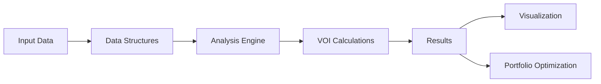

# Repository Map: voiage

## Overview

The `voiage` repository is a Python library for Value of Information Analysis (VOIA) in health economics and decision modeling. It provides tools for calculating various VOI metrics including EVPI (Expected Value of Perfect Information), EVPPI (Expected Value of Partial Perfect Information), and EVSI (Expected Value of Sample Information), as well as portfolio optimization for research prioritization.

## Repository Structure

```
voiage/                    # Repository root
├── voiage/                # Main Python package
│   ├── __init__.py
│   ├── analysis.py          # Core analysis engine
│   ├── backends.py          # Computational backend support
│   ├── cli.py               # Command-line interface
│   ├── config.py            # Global configuration settings
│   ├── exceptions.py        # Custom exception classes
│   ├── metamodels.py        # Metamodeling functions for EVSI
│   ├── schema.py            # Core data structures
│   ├── stats.py             # Statistical utilities
│   ├── core/                # Core utilities and data structures
│   │   ├── __init__.py
│   │   ├── data_structures.py
│   │   ├── io.py            # Input/output functions
│   │   └── utils.py         # Utility functions
│   ├── methods/             # Implementation of VOI methods
│   │   ├── __init__.py
│   │   ├── adaptive.py
│   │   ├── basic.py
│   │   ├── calibration.py
│   │   ├── network_nma.py
│   │   ├── observational.py
│   │   ├── portfolio.py
│   │   ├── sample_information.py
│   │   ├── sequential.py
│   │   └── structural.py
│   └── plot/                # Visualization functions
│       ├── __init__.py
│       ├── ceac.py
│       └── voi_curves.py
├── README.md              # Project overview and usage instructions
├── LICENSE                # License information
├── pyproject.toml         # Project configuration and dependencies
└── .gitignore             # Git ignore patterns
```

## Architecture

The repository follows a modular architecture with clearly separated components:

```mermaid
graph TD
    A[voiage] --> B[core]
    A --> C[methods]
    A --> D[plot]
    A --> E[analysis.py]
    A --> F[config.py]
    A --> G[schema.py]
    A --> H[exceptions.py]
    A --> I[backends.py]
    A --> J[cli.py]
    A --> K[stats.py]
    A --> L[metamodels.py]
    
    B --> B1[data_structures.py]
    B --> B2[io.py]
    B --> B3[utils.py]
    
    C --> C1[basic.py]
    C --> C2[adaptive.py]
    C --> C3[calibration.py]
    C --> C4[network_nma.py]
    C --> C5[observational.py]
    C --> C6[portfolio.py]
    C --> C7[sample_information.py]
    C --> C8[sequential.py]
    C --> C9[structural.py]
    
    D --> D1[ceac.py]
    D --> D2[voi_curves.py]
```



## Core Components

### 1. Data Structures (schema.py, core/data_structures.py)

The library defines several core data structures for representing decision analysis problems:

- `ValueArray`: Container for net benefit values from a Probabilistic Sensitivity Analysis (PSA)
- `ParameterSet`: Container for parameter samples from a PSA
- `DecisionOption`: Represents a single arm in a clinical trial design
- `TrialDesign`: Specifies the design of a proposed trial for EVSI calculations
- `PortfolioStudy`: Represents a single candidate study within a research portfolio
- `PortfolioSpec`: Defines a portfolio of candidate research studies for optimization
- `DynamicSpec`: Specification for dynamic or sequential VOI analyses

### 2. Configuration (config.py)

Global configuration settings that control the default behavior of voiage functions:
- Numerical precision settings
- Backend configuration
- Monte Carlo sampling parameters
- EVSI regression method defaults
- Plotting defaults

### 3. Analysis Engine (analysis.py)

The core `DecisionAnalysis` class provides methods for:
- EVPI calculation: Expected Value of Perfect Information
- EVPPI calculation: Expected Value of Partial Perfect Information

### 4. Methods (methods/)

Implementation of various VOI methods:

- `basic.py`: Basic VOI methods (EVPI, EVPPI)
- `adaptive.py`: Adaptive VOI methods
- `calibration.py`: Calibration methods
- `network_nma.py`: Network meta-analysis methods
- `observational.py`: Observational study methods
- `portfolio.py`: Research portfolio optimization
- `sample_information.py`: Sample information methods
- `sequential.py`: Sequential VOI methods
- `structural.py`: Structural VOI methods

### 5. Visualization (plot/)

Plotting functions for various VOI curves:
- `ceac.py`: Cost-effectiveness acceptability curves
- `voi_curves.py`: Various VOI curve plotting functions

## API Structure

### Core Analysis API

The main interface is through the `DecisionAnalysis` class in `analysis.py`:

```python
class DecisionAnalysis:
    def __init__(self, nb_array, parameter_samples=None)
    def evpi(self, population=None, time_horizon=None, discount_rate=None)
    def evppi(self, population=None, time_horizon=None, discount_rate=None, 
              n_regression_samples=None, regression_model=None)
```

### Functional API

Each method module also provides functional interfaces:
```python
# In methods/basic.py
def evpi(nb_array, population=None, time_horizon=None, discount_rate=None)
def evppi(nb_array, parameter_samples, population=None, time_horizon=None, 
          discount_rate=None, n_regression_samples=None, regression_model=None)
```

### Portfolio Optimization API

The portfolio optimization functionality in `methods/portfolio.py`:
```python
def portfolio_voi(portfolio_specification, study_value_calculator, 
                  optimization_method="greedy", **kwargs)
```

## Data Flow



1. **Input Data**: Net benefit arrays and parameter samples from PSA
2. **Data Structures**: Data is encapsulated in schema-defined structures
3. **Analysis Engine**: Core calculations performed by DecisionAnalysis class
4. **VOI Calculations**: Various VOI metrics computed
5. **Results**: Numerical outputs from VOI analyses
6. **Visualization**: Plotting of VOI curves and CEACs
7. **Portfolio Optimization**: Research portfolio optimization using VOI results

## Dependencies

### Core Dependencies
- Python 3.7+
- NumPy
- xarray

### Optional Dependencies
- scikit-learn (for regression-based EVPPI)
- Matplotlib (for plotting)
- SciPy (for portfolio optimization)

## Testing

The library includes unit tests embedded within modules using `if __name__ == "__main__"` blocks that demonstrate usage and verify correctness.

## CLI Interface

The library provides a command-line interface through `cli.py` for executing common VOI analyses without writing Python code.

## Backend Support

The library is designed to support multiple computational backends through `backends.py`, though currently primarily uses NumPy.

## Key Classes and Functions

### Core Data Structures (schema.py)
- `ValueArray`: Container for net benefit values
- `ParameterSet`: Container for parameter samples
- `DecisionOption`: Represents a trial arm
- `TrialDesign`: Specifies a trial design
- `PortfolioStudy`: Represents a candidate study
- `PortfolioSpec`: Defines a research portfolio
- `DynamicSpec`: Specification for dynamic analyses

### Analysis Engine (analysis.py)
- `DecisionAnalysis`: Main analysis class
  - `evpi()`: Calculate Expected Value of Perfect Information
  - `evppi()`: Calculate Expected Value of Partial Perfect Information

### Basic Methods (methods/basic.py)
- `evpi()`: Functional interface for EVPI calculation
- `evppi()`: Functional interface for EVPPI calculation

### Portfolio Optimization (methods/portfolio.py)
- `portfolio_voi()`: Optimize research portfolio
- `StudyValueCalculator`: Type alias for study value calculation functions

### Visualization (plot/voi_curves.py)
- `plot_evpi_vs_wtp()`: Plot EVPI against WTP thresholds
- `plot_evsi_vs_sample_size()`: Plot EVSI against sample sizes
- `plot_evppi_surface()`: Plot 3D EVPPI surface

### Configuration (config.py)
- `DEFAULT_DTYPE`: Default floating point data type
- `DEFAULT_MC_SAMPLES`: Default Monte Carlo samples
- `DEFAULT_EVSI_REGRESSION_METHOD`: Default EVSI regression method

### Exceptions (exceptions.py)
- `VoiageError`: Base exception class
- `InputError`: Invalid input data
- `CalculationError`: Error during calculation
- `PlottingError`: Error during plotting
- `VoiageNotImplementedError`: Unimplemented feature
- `OptionalDependencyError`: Missing optional dependency

## Usage Examples

### Basic EVPI Calculation
```python
import numpy as np
from voiage.methods.basic import evpi

# Create sample net benefit data (n_samples x n_strategies)
nb_array = np.random.normal(0, 1, (1000, 3))

# Calculate EVPI
evpi_value = evpi(nb_array)
print(f"EVPI: {evpi_value}")
```

### EVPPI Calculation with Population Scaling
```python
from voiage.methods.basic import evppi

# Create parameter samples
params = {"param1": np.random.normal(0, 1, 1000), 
          "param2": np.random.normal(0, 1, 1000)}

# Calculate EVPPI with population scaling
evppi_value = evppi(nb_array, params, population=100000, 
                    time_horizon=10, discount_rate=0.03)
print(f"Population EVPPI: {evppi_value}")
```

### Portfolio Optimization
```python
from voiage.schema import PortfolioSpec, PortfolioStudy, TrialDesign, DecisionOption
from voiage.methods.portfolio import portfolio_voi

# Create dummy studies
studies = [
    PortfolioStudy("Study A", TrialDesign([DecisionOption("Arm1", 50)]), 10000),
    PortfolioStudy("Study B", TrialDesign([DecisionOption("Arm1", 100)]), 25000)
]

# Create portfolio specification
portfolio = PortfolioSpec(studies, budget_constraint=20000)

# Define value calculator function
def value_calculator(study):
    # This would typically calculate EVSI or ENBS for the study
    return 50000 if study.name == "Study A" else 75000

# Optimize portfolio
result = portfolio_voi(portfolio, value_calculator, "greedy")
print(f"Selected studies: {[s.name for s in result['selected_studies']]}")
```

### Plotting VOI Curves
```python
import matplotlib.pyplot as plt
from voiage.plot.voi_curves import plot_evpi_vs_wtp

# Sample data
wtp_values = np.linspace(0, 100000, 50)
evpi_values = 1000 * (1 - np.exp(-wtp_values / 30000))

# Create plot
fig, ax = plt.subplots()
plot_evpi_vs_wtp(evpi_values, wtp_values, ax=ax)
plt.show()
```