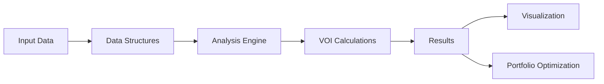

# Repository Map: voiage

## Overview

The `voiage` repository is a Python library for Value of Information Analysis (VOIA) in health economics and decision modeling. It provides tools for calculating various VOI metrics including EVPI (Expected Value of Perfect Information), EVPPI (Expected Value of Partial Perfect Information), and EVSI (Expected Value of Sample Information), as well as portfolio optimization for research prioritization.

## Repository Structure

```
voiage/                    # Repository root
├── .qoder/                # Qoder-specific files
│   └── quests/
│       └── repo-mapping.md  # This file
├── docs/                  # Documentation files
├── examples/              # Example notebooks and scripts
├── tests/                 # Unit and integration tests
│   ├── __init__.py
│   ├── conftest.py
│   ├── test_analysis.py
│   ├── test_basic.py
│   ├── test_data_structures.py
│   ├── test_metamodels.py
│   ├── test_plotting.py
│   ├── test_sample_information.py
│   └── test_stats.py
├── voiage/                # Main Python package
│   ├── __init__.py
│   ├── analysis.py          # Core analysis engine
│   ├── backends.py          # Computational backend support
│   ├── cli.py               # Command-line interface
│   ├── config.py            # Global configuration settings
│   ├── exceptions.py        # Custom exception classes
│   ├── metamodels.py        # Metamodeling functions for EVSI
│   ├── schema.py            # Core data structures
│   ├── stats.py             # Statistical utilities
│   ├── core/                # Core utilities and data structures
│   │   ├── __init__.py
│   │   ├── data_structures.py
│   │   ├── io.py            # Input/output functions
│   │   └── utils.py         # Utility functions
│   ├── methods/             # Implementation of VOI methods
│   │   ├── __init__.py
│   │   ├── adaptive.py
│   │   ├── basic.py
│   │   ├── calibration.py
│   │   ├── network_nma.py
│   │   ├── observational.py
│   │   ├── portfolio.py
│   │   ├── sample_information.py
│   │   ├── sequential.py
│   │   └── structural.py
│   └── plot/                # Visualization functions
│       ├── __init__.py
│       ├── ceac.py
│       └── voi_curves.py
├── README.md              # Project overview and usage instructions
├── LICENSE                # License information
├── pyproject.toml         # Project configuration and dependencies
└── .gitignore             # Git ignore patterns
```

## Architecture

The repository follows a modular architecture with clearly separated components:

```mermaid
graph TD
    A[voiage] --> B[core]
    A --> C[methods]
    A --> D[plot]
    A --> E[analysis.py]
    A --> F[config.py]
    A --> G[schema.py]
    A --> H[exceptions.py]
    A --> I[backends.py]
    A --> J[cli.py]
    A --> K[stats.py]
    A --> L[metamodels.py]
    
    B --> B1[data_structures.py]
    B --> B2[io.py]
    B --> B3[utils.py]
    
    C --> C1[basic.py]
    C --> C2[adaptive.py]
    C --> C3[calibration.py]
    C --> C4[network_nma.py]
    C --> C5[observational.py]
    C --> C6[portfolio.py]
    C --> C7[sample_information.py]
    C --> C8[sequential.py]
    C --> C9[structural.py]
    
    D --> D1[ceac.py]
    D --> D2[voi_curves.py]
```



## Current Status Against Roadmap

### Phase 1: Foundation & API Refactoring (Target: 8 Weeks)
**Status: `Completed`**

1.  **Object-Oriented API Redesign & Functional Wrappers:**
    *   **Status: `Done`**
    *   The library now features a `DecisionAnalysis` class that encapsulates the core logic, with lightweight functional wrappers for convenience.
2.  **Domain-Agnostic Data Structures:**
    *   **Status: `Done`**
    *   The new data structures (`ParameterSet`, `ValueArray`) are defined in `voiage/schema.py`. Backward-compatible wrappers (`PSASample`, `NetBenefitArray`) exist in `voiage/core/data_structures.py` to support legacy code. The transition is complete.
3.  **CI/CD & Documentation Website:**
    *   **Status: `Done`**
    *   A full CI/CD pipeline is established in GitHub Actions, automating tests, linting, and formatting. The basic structure for the documentation website is in place.
4.  **Community Guidelines:**
    *   **Status: `Done`**
    *   The `CONTRIBUTING.md` and `AGENTS.md` files have been created to provide clear guidelines for human and AI contributors.

### Phase 2: State-of-the-Art Health Economics Core (Target: 12 Weeks)
**Status: `In Progress`**

1.  **Robust EVSI Implementation:**
    *   **Status: `In Progress`**
    *   A basic `evsi` function with a two-loop method exists in `voiage/methods/sample_information.py`. This needs to be expanded with a regression-based approach, robust Bayesian updating, and integration of advanced metamodels. The existing tests are incomplete and need to be activated.
2.  **Network Meta-Analysis (NMA) VOI:**
    *   **Status: `Not Started`**
    *   Implement `evsi_nma`, a critical and highly-demanded feature in HTA. This will involve handling multivariate parameter distributions for treatment effects. Placeholder exists in `voiage/methods/network_nma.py`.
3.  **Validation & Benchmarking:**
    *   **Status: `Not Started`**
    *   For each core method, create a validation notebook that replicates the results of a published study or an example from an established R package (e.g., `BCEA`, `voi`).
4.  **Advanced Plotting Module & Core Examples:**
    *   **Status: `In Progress`**
    *   The `voiage/plot` module has been created with basic plotting functions in `voiage/plot/voi_curves.py`, but the core plotting functions (CEACs, VOI curves, etc.) are not yet fully implemented.
    *   A detailed tutorial notebook for a core health economics use case is needed.

### Phase 3: Advanced Methods & Cross-Domain Expansion (Target: 16 Weeks)
**Status: `In Progress`**

1.  **Portfolio Optimization:**
    *   **Status: `Completed`**
    *   Implemented a robust `portfolio_voi` method in `voiage/methods/portfolio.py` with multiple optimization algorithms (greedy, integer programming).
2.  **Structural & Sequential VOI:**
    *   **Status: `Not Started`**
    *   Placeholders implemented for `structural_voi` in `voiage/methods/structural.py` and `sequential_voi` in `voiage/methods/sequential.py`, but full implementation is pending.
3.  **Cross-Domain Example Notebooks:**
    *   **Status: `Not Started`**
    *   Develop at least two detailed tutorial notebooks for non-health problems.
4.  **XArray Integration:**
    *   **Status: `Completed`**
    *   The core data structures in `voiage/schema.py` are already built on `xarray` and fully integrated throughout the library.

### Phase 4: Ecosystem, Community & Future Ports (Ongoing)
**Status: `In Progress`**

1.  **Future High-Performance Backend (JAX/XLA):**
    *   **Status: `In Progress`**
    *   JAX backend implementation started in `voiage/backends.py` and metamodels in `voiage/metamodels.py`.
2.  **Community Engagement:**
    *   **Status: `In Progress`**
    *   The repository is being structured for easier contribution with comprehensive documentation.
3.  **Language-Agnostic API Specification:**
    *   **Status: `Not Started`**
4.  **Planning for R/Julia Ports:**
    *   **Status: `Not Started`**

## Core Components

### 1. Data Structures (schema.py, core/data_structures.py)

The library defines several core data structures for representing decision analysis problems:

- `ValueArray`: Container for net benefit values from a Probabilistic Sensitivity Analysis (PSA)
- `ParameterSet`: Container for parameter samples from a PSA
- `DecisionOption`: Represents a single arm in a clinical trial design
- `TrialDesign`: Specifies the design of a proposed trial for EVSI calculations
- `PortfolioStudy`: Represents a single candidate study within a research portfolio
- `PortfolioSpec`: Defines a portfolio of candidate research studies for optimization
- `DynamicSpec`: Specification for dynamic or sequential VOI analyses

### 2. Configuration (config.py)

Global configuration settings that control the default behavior of voiage functions:
- Numerical precision settings
- Backend configuration
- Monte Carlo sampling parameters
- EVSI regression method defaults
- Plotting defaults

### 3. Analysis Engine (analysis.py)

The core `DecisionAnalysis` class provides methods for:
- EVPI calculation: Expected Value of Perfect Information
- EVPPI calculation: Expected Value of Partial Perfect Information

### 4. Methods (methods/)

Implementation of various VOI methods:

- `basic.py`: Basic VOI methods (EVPI, EVPPI)
- `adaptive.py`: Adaptive VOI methods (placeholder)
- `calibration.py`: Calibration methods (placeholder)
- `network_nma.py`: Network meta-analysis methods (placeholder)
- `observational.py`: Observational study methods (placeholder)
- `portfolio.py`: Research portfolio optimization (completed)
- `sample_information.py`: Sample information methods (in progress)
- `sequential.py`: Sequential VOI methods (placeholder)
- `structural.py`: Structural VOI methods (placeholder)

### 5. Visualization (plot/)

Plotting functions for various VOI curves:
- `ceac.py`: Cost-effectiveness acceptability curves (in progress)
- `voi_curves.py`: Various VOI curve plotting functions (in progress)

## API Structure

### Core Analysis API

The main interface is through the `DecisionAnalysis` class in `analysis.py`:

```python
class DecisionAnalysis:
    def __init__(self, nb_array, parameter_samples=None)
    def evpi(self, population=None, time_horizon=None, discount_rate=None)
    def evppi(self, population=None, time_horizon=None, discount_rate=None, 
              n_regression_samples=None, regression_model=None)
```

### Functional API

Each method module also provides functional interfaces:
```python
# In methods/basic.py
def evpi(nb_array, population=None, time_horizon=None, discount_rate=None)
def evppi(nb_array, parameter_samples, population=None, time_horizon=None, 
          discount_rate=None, n_regression_samples=None, regression_model=None)
```

### Portfolio Optimization API

The portfolio optimization functionality in `methods/portfolio.py`:
```python
def portfolio_voi(portfolio_specification, study_value_calculator, 
                  optimization_method="greedy", **kwargs)
```

## Data Flow



1. **Input Data**: Net benefit arrays and parameter samples from PSA
2. **Data Structures**: Data is encapsulated in schema-defined structures
3. **Analysis Engine**: Core calculations performed by DecisionAnalysis class
4. **VOI Calculations**: Various VOI metrics computed
5. **Results**: Numerical outputs from VOI analyses
6. **Visualization**: Plotting of VOI curves and CEACs
7. **Portfolio Optimization**: Research portfolio optimization using VOI results

## Dependencies

### Core Dependencies
- Python 3.8+
- NumPy
- xarray
- JAX
- NumPyro

### Optional Dependencies
- scikit-learn (for regression-based EVPPI)
- Matplotlib (for plotting)
- SciPy (for portfolio optimization)
- Typer (for CLI)

## Testing

The library includes unit tests in the `tests/` directory that verify correctness of implementations. Tests are run using `pytest` and integrated with `tox` for multi-environment testing.

## CLI Interface

The library provides a command-line interface through `cli.py` for executing common VOI analyses without writing Python code.

## Backend Support

The library is designed to support multiple computational backends through `backends.py`, with implementations for NumPy and JAX.

## Key Classes and Functions

### Core Data Structures (schema.py)
- `ValueArray`: Container for net benefit values
- `ParameterSet`: Container for parameter samples
- `DecisionOption`: Represents a trial arm
- `TrialDesign`: Specifies a trial design
- `PortfolioStudy`: Represents a candidate study
- `PortfolioSpec`: Defines a research portfolio
- `DynamicSpec`: Specification for dynamic analyses

### Analysis Engine (analysis.py)
- `DecisionAnalysis`: Main analysis class
  - `evpi()`: Calculate Expected Value of Perfect Information
  - `evppi()`: Calculate Expected Value of Partial Perfect Information

### Basic Methods (methods/basic.py)
- `evpi()`: Functional interface for EVPI calculation
- `evppi()`: Functional interface for EVPPI calculation

### Portfolio Optimization (methods/portfolio.py)
- `portfolio_voi()`: Optimize research portfolio
- `StudyValueCalculator`: Type alias for study value calculation functions

### Visualization (plot/voi_curves.py)
- `plot_evpi_vs_wtp()`: Plot EVPI against WTP thresholds
- `plot_evsi_vs_sample_size()`: Plot EVSI against sample sizes
- `plot_evppi_surface()`: Plot 3D EVPPI surface

### Configuration (config.py)
- `DEFAULT_DTYPE`: Default floating point data type
- `DEFAULT_MC_SAMPLES`: Default Monte Carlo samples
- `DEFAULT_EVSI_REGRESSION_METHOD`: Default EVSI regression method

### Exceptions (exceptions.py)
- `VoiageError`: Base exception class
- `InputError`: Invalid input data
- `CalculationError`: Error during calculation
- `PlottingError`: Error during plotting
- `VoiageNotImplementedError`: Unimplemented feature
- `OptionalDependencyError`: Missing optional dependency

## Detailed Implementation Plan

### Immediate Priorities (Next 2 Weeks)

1. **Complete EVSI Implementation**
   - Activate and fix tests in `tests/test_sample_information.py`
   - Implement regression-based method for EVSI
   - Add comprehensive documentation and examples

2. **Enhance Plotting Module**
   - Implement CEAC plotting functionality in `voiage/plot/ceac.py`
   - Expand VOI curve plotting capabilities
   - Add comprehensive examples and documentation

3. **Validation & Benchmarking**
   - Create validation notebooks replicating results from established R packages
   - Benchmark performance of current implementations

### Short-term Goals (Next 4 Weeks)

1. **Advanced Method Implementation**
   - Complete implementation of Network Meta-Analysis VOI (`evsi_nma`)
   - Implement Structural VOI methods
   - Develop Sequential VOI functionality

2. **Documentation & Examples**
   - Create detailed tutorial notebooks for health economics use cases
   - Develop cross-domain examples for business and environmental applications
   - Enhance API documentation with comprehensive examples

3. **Performance Optimization**
   - Optimize JAX backend implementation
   - Implement additional metamodels in `voiage/metamodels.py`
   - Profile and optimize core algorithms

### Medium-term Goals (Next 8 Weeks)

1. **Feature Completeness**
   - Implement all placeholder methods (adaptive, calibration, observational)
   - Add support for more complex trial designs
   - Implement advanced portfolio optimization algorithms

2. **Quality Assurance**
   - Achieve 90%+ test coverage
   - Implement comprehensive integration tests
   - Add property-based testing with Hypothesis

3. **Community & Ecosystem**
   - Establish language-agnostic API specification
   - Begin planning for R and Julia ports
   - Create contributor documentation and examples

### Long-term Vision

1. **Cross-Platform Standard**
   - Complete R and Julia implementations
   - Establish voiage as the premier cross-domain VOI library
   - Publish academic papers on the framework

2. **Advanced Capabilities**
   - Implement machine learning-based metamodels
   - Add support for real-time VOI calculations
   - Integrate with cloud computing platforms for large-scale analyses

## Usage Examples

### Basic EVPI Calculation
```python
import numpy as np
from voiage.methods.basic import evpi

# Create sample net benefit data (n_samples x n_strategies)
nb_array = np.random.normal(0, 1, (1000, 3))

# Calculate EVPI
evpi_value = evpi(nb_array)
print(f"EVPI: {evpi_value}")
```

### EVPPI Calculation with Population Scaling
```python
from voiage.methods.basic import evppi

# Create parameter samples
params = {"param1": np.random.normal(0, 1, 1000), 
          "param2": np.random.normal(0, 1, 1000)}

# Calculate EVPPI with population scaling
evppi_value = evppi(nb_array, params, population=100000, 
                    time_horizon=10, discount_rate=0.03)
print(f"Population EVPPI: {evppi_value}")
```

### Portfolio Optimization
```python
from voiage.schema import PortfolioSpec, PortfolioStudy, TrialDesign, DecisionOption
from voiage.methods.portfolio import portfolio_voi

# Create dummy studies
studies = [
    PortfolioStudy("Study A", TrialDesign([DecisionOption("Arm1", 50)]), 10000),
    PortfolioStudy("Study B", TrialDesign([DecisionOption("Arm1", 100)]), 25000)
]

# Create portfolio specification
portfolio = PortfolioSpec(studies, budget_constraint=20000)

# Define value calculator function
def value_calculator(study):
    # This would typically calculate EVSI or ENBS for the study
    return 50000 if study.name == "Study A" else 75000

# Optimize portfolio
result = portfolio_voi(portfolio, value_calculator, "greedy")
print(f"Selected studies: {[s.name for s in result['selected_studies']]}")
```

### Plotting VOI Curves
```python
import matplotlib.pyplot as plt
from voiage.plot.voi_curves import plot_evpi_vs_wtp

# Sample data
wtp_values = np.linspace(0, 100000, 50)
evpi_values = 1000 * (1 - np.exp(-wtp_values / 30000))

# Create plot
fig, ax = plt.subplots()
plot_evpi_vs_wtp(evpi_values, wtp_values, ax=ax)
plt.show()
```